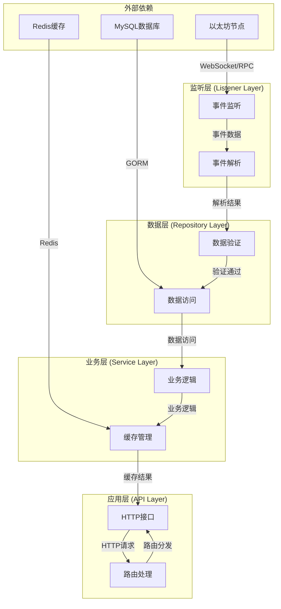
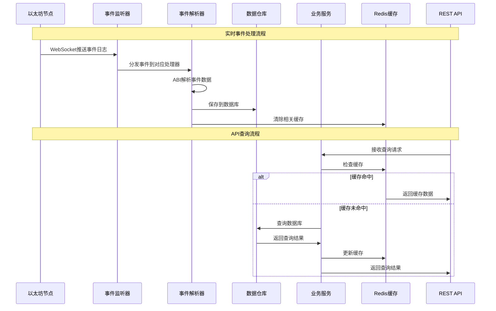

## 项目定位与目标

这是一个**以太坊质押合约事件监听后端服务**，专门用于实时监控和记录以太坊区块链上的质押合约活动。项目通过WebSocket连接以太坊节点，实时监听并回放质押合约的五类核心事件，将数据持久化到MySQL数据库，并提供REST API接口供前端应用查询。

**核心价值**：为DeFi应用提供可靠的链上数据索引服务，让开发者能够快速获取质押合约的历史和实时活动数据，而无需直接与区块链交互。

Sources: [README.md](README.md#L1-L10), [main.go](main.go#L1-L50)

## 核心功能特性

### 1. 实时事件监听
通过WebSocket订阅以太坊节点的合约事件，实时捕获质押合约的五类核心事件：
- **Staked** - 用户质押代币
- **RewardClaimed** - 用户领取奖励
- **Withdrawn** - 用户提取质押
- **MinStakeAmountUpdated** - 最低质押金额变更
- **RewardRateUpdated** - 奖励费率变更

### 2. 历史事件回放
启动时自动从合约部署区块开始，批量回放历史事件，确保数据完整性。支持断点续传，即使服务重启也不会丢失数据。

### 3. REST API查询
基于Gin框架提供完整的REST API接口，每类事件都提供分页列表和按ID查询功能，支持多种过滤条件。

### 4. 缓存优化
使用Redis缓存查询结果，减少数据库压力，提高API响应速度。

### 5. 优雅关机
支持SIGINT/SIGTERM信号，平滑关闭HTTP服务和事件监听，确保数据一致性。

Sources: [README.md](README.md#L12-L25), [internal/listener/contract_event_listener.go](internal/listener/contract_event_listener.go#L100-L150)

## 技术架构设计

项目采用**四层架构设计**，职责清晰，便于维护和扩展：



**架构优势**：
- **分层解耦**：每层职责单一，便于单元测试和维护
- **依赖倒置**：上层依赖下层接口，而非具体实现
- **可扩展性**：新增事件类型只需添加对应处理器，无需修改核心逻辑
- **高可用性**：支持断点续传和优雅关机

Sources: [main.go](main.go#L50-L100), [internal/listener/contract_event_listener.go](internal/listener/contract_event_listener.go#L1-L50)

## 项目结构概览

```
test-stake-backend/
├── main.go                          # 应用入口，初始化依赖并启动服务
├── config.yaml.sample               # 配置文件示例
├── internal/                        # 核心业务代码
│   ├── abi/                         # 合约ABI定义
│   │   ├── abi.go                   # ABI加载和解析
│   │   └── Stake.abi.json           # 质押合约ABI定义
│   ├── api/                         # HTTP接口层
│   │   ├── router.go                # 路由注册和配置
│   │   ├── common.go                # 通用工具函数
│   │   └── *_event_handler.go       # 各事件API处理器
│   ├── config/                      # 配置管理
│   │   └── config.go                # 配置加载和解析
│   ├── cache/                       # 缓存管理
│   │   ├── cache.go                 # Redis缓存操作
│   │   └── cache_test.go            # 缓存单元测试
│   ├── listener/                    # 事件监听层
│   │   ├── contract_event_listener.go  # 核心监听器
│   │   └── *_event_handler.go       # 各事件解析器
│   ├── models/                      # 数据模型
│   │   ├── contract.go              # 合约同步状态
│   │   └── event.go                 # 五类事件模型
│   ├── repository/                  # 数据访问层
│   │   ├── common.go                # 通用查询和验证
│   │   ├── contract_repository.go   # 合约状态管理
│   │   └── *_event_repository.go    # 各事件数据访问
│   └── service/                     # 业务逻辑层
│       └── *_event_service.go       # 各事件业务逻辑
└── store/                           # 存储相关（待扩展）
```

**目录职责说明**：

| 目录 | 职责 | 关键文件 |
|------|------|----------|
| `internal/abi/` | 合约ABI定义和解析 | `Stake.abi.json`, `abi.go` |
| `internal/api/` | HTTP接口和路由处理 | `router.go`, `*_event_handler.go` |
| `internal/config/` | 配置文件加载和管理 | `config.go` |
| `internal/cache/` | Redis缓存操作 | `cache.go` |
| `internal/listener/` | 区块链事件监听和解析 | `contract_event_listener.go` |
| `internal/models/` | 数据库模型定义 | `event.go`, `contract.go` |
| `internal/repository/` | 数据访问和持久化 | `*_event_repository.go` |
| `internal/service/` | 业务逻辑处理 | `*_event_service.go` |

Sources: [目录结构分析](.), [README.md](README.md#L70-L120)

## 数据流处理流程

项目的数据处理遵循**事件驱动的流水线模式**：



**关键处理步骤**：

1. **事件监听**：通过WebSocket订阅合约事件，支持实时监听和历史回放
2. **事件解析**：使用ABI解析器将原始日志数据转换为结构化数据
3. **数据验证**：验证地址格式、交易哈希、金额等字段的合法性
4. **数据持久化**：将验证通过的数据保存到MySQL数据库
5. **缓存管理**：查询时优先检查Redis缓存，提高响应速度

Sources: [internal/listener/contract_event_listener.go](internal/listener/contract_event_listener.go#L100-L200), [internal/listener/staked_event_handler.go](internal/listener/staked_event_handler.go#L50-L100), [internal/service/staked_event_service.go](internal/service/staked_event_service.go#L30-L70)

## 技术栈概览

| 组件 | 技术 | 用途 |
|------|------|------|
| **编程语言** | Go 1.26+ | 高性能、并发支持 |
| **HTTP框架** | Gin | 轻量级Web框架 |
| **ORM框架** | GORM | 数据库操作抽象 |
| **以太坊交互** | go-ethereum | 区块链交互库 |
| **配置管理** | Viper | 灵活的配置加载 |
| **缓存** | Redis | 高性能缓存存储 |
| **数据库** | MySQL 5.7+ | 关系型数据存储 |

Sources: [go.mod](go.mod#L1-L20), [README.md](README.md#L30-L40)

## 核心设计模式

### 1. 事件处理接口模式
所有事件处理器都实现统一的`ContractEventHandler`接口，确保一致性：

```go
type ContractEventHandler interface {
    EventName() string
    EventID() common.Hash
    Handle(ctx context.Context, eventLog types.Log) error
}
```

### 2. 仓库模式 (Repository Pattern)
数据访问层抽象，将业务逻辑与数据存储细节分离：

```go
type StakedEventRepository struct {
    db *gorm.DB
}
```

### 3. 服务层模式 (Service Pattern)
业务逻辑层，处理缓存策略和复杂业务逻辑：

```go
type StakedEventService struct {
    repo     *repository.StakedEventRepository
    rdb      *redis.Client
    cacheTTL time.Duration
}
```

### 4. 分层缓存策略
查询时优先检查Redis缓存，未命中时查询数据库并更新缓存：

```go
// 尝试读缓存
if result, ok, err := cache.Get[StakedEventListResult](ctx, s.rdb, key); err == nil && ok {
    return &result, nil
}
// 查数据库
events, total, err := s.repo.List(ctx, query)
// 写缓存
cache.Set(ctx, s.rdb, key, result, s.cacheTTL)
```

Sources: [internal/listener/staked_event_handler.go](internal/listener/staked_event_handler.go#L30-L50), [internal/repository/staked_event_repository.go](internal/repository/staked_event_repository.go#L30-L50), [internal/service/staked_event_service.go](internal/service/staked_event_service.go#L30-L70)

## API接口概览

项目提供完整的REST API接口，支持多种查询条件：

| 方法 | 路径 | 功能 | 支持参数 |
|------|------|------|----------|
| GET | `/health` | 健康检查 | 无 |
| GET | `/staked-events` | 质押事件列表 | page, page_size, contract_address, user, tx_hash, block_number_from, block_number_to |
| GET | `/staked-events/:id` | 按ID查询质押事件 | 无 |
| GET | `/reward-claimed-events` | 奖励领取事件列表 | 同上 |
| GET | `/reward-claimed-events/:id` | 按ID查询奖励领取事件 | 无 |
| GET | `/withdrawn-events` | 提取事件列表 | 同上 |
| GET | `/withdrawn-events/:id` | 按ID查询提取事件 | 无 |
| GET | `/min-stake-amount-updated-events` | 最低质押金额变更事件列表 | page, page_size, contract_address, tx_hash, block_number_from, block_number_to |
| GET | `/min-stake-amount-updated-events/:id` | 按ID查询最低质押金额变更事件 | 无 |
| GET | `/reward-rate-updated-events` | 奖励费率变更事件列表 | 同上 |
| GET | `/reward-rate-updated-events/:id` | 按ID查询奖励费率变更事件 | 无 |

**通用查询参数**：

| 参数 | 类型 | 默认值 | 说明 |
|------|------|--------|------|
| `page` | int | 1 | 页码 |
| `page_size` | int | 20 | 每页条数，最大100 |
| `contract_address` | string | 无 | 合约地址过滤 |
| `tx_hash` | string | 无 | 交易哈希过滤 |
| `block_number_from` | uint64 | 无 | 起始区块号 |
| `block_number_to` | uint64 | 无 | 结束区块号 |

Sources: [README.md](README.md#L80-L120), [internal/api/router.go](internal/api/router.go#L30-L80)

## 学习路径建议

对于初学者，建议按以下顺序学习项目：

### 第一阶段：快速上手
1. **[快速上手](2-kuai-su-shang-shou)** - 环境准备和项目运行
2. **[环境要求与安装](3-huan-jing-yao-qiu-yu-an-zhuang)** - 详细的环境配置
3. **[配置文件详解](4-pei-zhi-wen-jian-xiang-jie)** - 理解配置项含义

### 第二阶段：基础使用
1. **[启动与运行服务](5-qi-dong-yu-yun-xing-fu-wu)** - 服务启动流程
2. **[API接口测试](6-apijie-kou-ce-shi)** - 接口功能验证

### 第三阶段：深入理解
1. **[四层架构设计](7-si-ceng-jia-gou-she-ji)** - 理解项目架构
2. **[事件监听与回放机制](8-shi-jian-jian-ting-yu-hui-fang-ji-zhi)** - 核心监听逻辑
3. **[数据流处理流程](9-shu-ju-liu-chu-li-liu-cheng)** - 数据处理流程

### 第四阶段：扩展开发
1. **[添加新事件类型指南](22-tian-jia-xin-shi-jian-lei-xing-zhi-nan)** - 学习如何扩展
2. **[测试与调试策略](23-ce-shi-yu-diao-shi-ce-lue)** - 质量保证

## 适用场景

### 1. DeFi应用开发
为DeFi前端提供质押合约数据查询服务，无需直接与区块链交互。

### 2. 数据分析平台
为数据分析工具提供结构化的链上事件数据。

### 3. 监控告警系统
实时监控质押合约活动，为异常情况提供告警数据支持。

### 4. 钱包应用
为钱包应用提供用户质押活动的历史记录。

## 项目优势

1. **高性能**：Go语言编写，支持高并发处理
2. **可靠性**：支持断点续传和优雅关机，确保数据完整性
3. **可扩展性**：模块化设计，易于添加新事件类型
4. **易用性**：完整的REST API，支持多种查询条件
5. **缓存优化**：Redis缓存提高查询性能
6. **代码质量**：清晰的四层架构，职责分离明确

## 下一步行动

现在您已经了解了项目的整体架构和功能，建议从**[快速上手](2-kuai-su-shang-shou)**开始，按照学习路径逐步深入。在实践过程中，如果遇到任何问题，可以参考对应章节的详细文档。