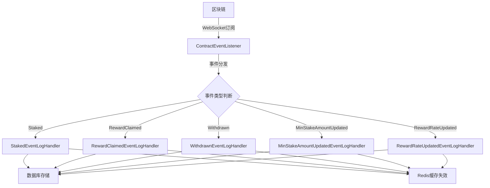
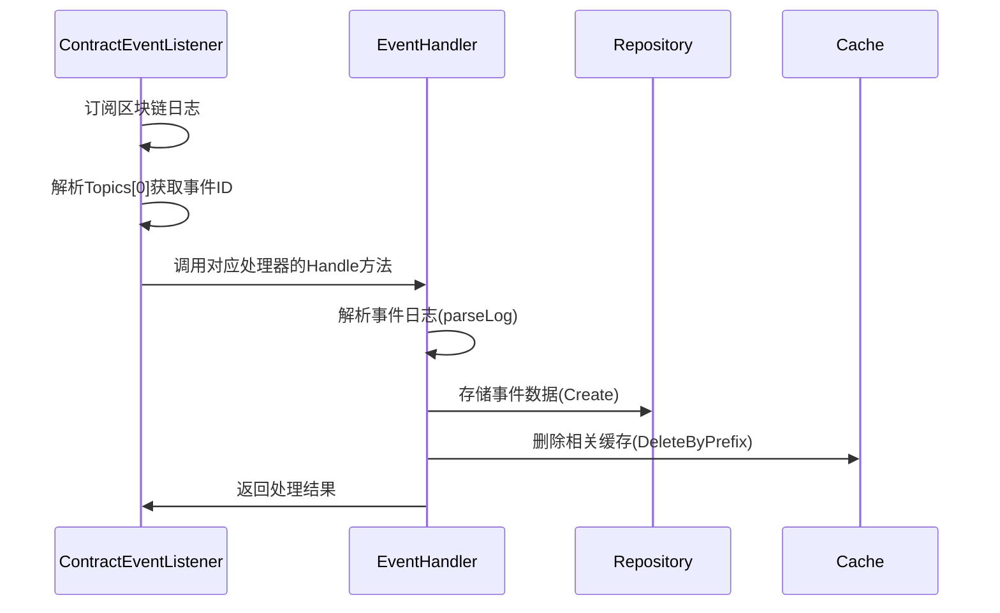
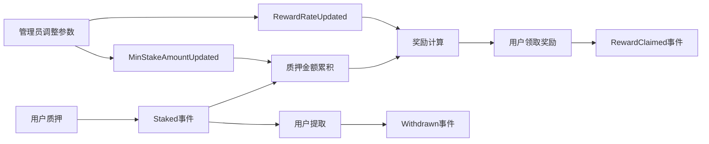

本文档详细解析质押合约（Stake Contract）中的五类核心事件，包括它们的智能合约定义、数据结构、监听处理流程、存储模型以及API接口。这些事件构成了整个质押系统业务逻辑的基础，理解它们对于掌握系统运作机制至关重要。

## 事件架构概览

系统通过事件监听器（ContractEventListener）实时监听区块链上的合约事件，并通过五个专门的处理器分别处理五类事件。每个事件处理器都遵循相同的架构模式：解析日志 → 验证数据 → 持久化存储 → 更新缓存。



Sources: [internal/listener/contract_event_listener.go](internal/listener/contract_event_listener.go#L1-L216)

## 五类事件详解

### 1. Staked 事件 - 用户质押

**合约定义**：当用户向合约质押代币时触发此事件。

**ABI签名**：
```solidity
event Staked(address indexed user, uint256 amount)
```

**参数说明**：
- `user`：质押用户的地址（indexed参数，可被索引查询）
- `amount`：质押的代币数量（uint256类型）

**业务含义**：记录用户的质押操作，包括质押地址和质押金额。这是质押业务的核心事件，用于追踪用户的质押行为和金额。

**数据模型**：
```go
type StakedEvent struct {
    ID              int64     `gorm:"primaryKey;autoIncrement" json:"id"`
    ContractAddress string    `gorm:"type:varchar(42);not null" json:"contract_address"`
    User            string    `gorm:"type:varchar(42);not null" json:"user"`
    Amount          string    `gorm:"type:varchar(78);not null" json:"amount"`
    TxHash          string    `gorm:"type:varchar(66);not null" json:"tx_hash"`
    BlockNumber     uint64    `gorm:"not null" json:"block_number"`
    LogIndex        uint      `gorm:"not null" json:"log_index"`
    BlockHash       string    `gorm:"type:varchar(66);not null" json:"block_hash"`
    InsertedAt      time.Time `gorm:"autoCreateTime" json:"inserted_at"`
}
```

**处理逻辑**：
1. 从日志中解析Topics[1]获取用户地址
2. 从Data字段解包Amount参数
3. 验证数据有效性
4. 存储到数据库
5. 删除缓存前缀为"staked:list:"的所有缓存

Sources: [internal/models/event.go](internal/models/event.go#L18-L30), [internal/listener/staked_event_handler.go](internal/listener/staked_event_handler.go#L1-L104)

### 2. RewardClaimed 事件 - 奖励领取

**合约定义**：当用户领取质押奖励时触发此事件。

**ABI签名**：
```solidity
event RewardClaimed(address indexed user, uint256 amount)
```

**参数说明**：
- `user`：领取奖励的用户地址（indexed参数）
- `amount`：领取的奖励金额（uint256类型）

**业务含义**：记录用户领取奖励的操作，用于追踪奖励分发情况和用户收益。

**数据模型**：
```go
type RewardClaimedEvent struct {
    ID              int64     `gorm:"primaryKey;autoIncrement" json:"id"`
    ContractAddress string    `gorm:"size:42;not null" json:"contract_address"`
    User            string    `gorm:"size:42;not null" json:"user"`
    Amount          string    `gorm:"size:78;not null" json:"amount"`
    TxHash          string    `gorm:"size:66;not null" json:"tx_hash"`
    BlockNumber     uint64    `gorm:"not null" json:"block_number"`
    LogIndex        uint      `gorm:"not null" json:"log_index"`
    BlockHash       string    `gorm:"size:66;not null" json:"block_hash"`
    InsertedAt      time.Time `gorm:"autoCreateTime" json:"inserted_at"`
}
```

**处理逻辑**：
1. 从日志中解析Topics[1]获取用户地址
2. 从Data字段解包Amount参数
3. 存储到数据库
4. 删除缓存前缀为"reward-claimed:list:"的所有缓存

Sources: [internal/models/event.go](internal/models/event.go#L32-L45), [internal/listener/reward_claimed_event_handler.go](internal/listener/reward_claimed_event_handler.go#L1-L104)

### 3. Withdrawn 事件 - 用户提取

**合约定义**：当用户从合约中提取质押代币时触发此事件。

**ABI签名**：
```solidity
event Withdrawn(address indexed user, uint256 amount)
```

**参数说明**：
- `user`：提取代币的用户地址（indexed参数）
- `amount`：提取的代币数量（uint256类型）

**业务含义**：记录用户的提取操作，用于追踪质押解除情况和资金流向。

**数据模型**：
```go
type WithdrawnEvent struct {
    ID              int64     `gorm:"primaryKey;autoIncrement" json:"id"`
    ContractAddress string    `gorm:"size:42;not null" json:"contract_address"`
    User            string    `gorm:"size:42;not null" json:"user"`
    Amount          string    `gorm:"size:78;not null" json:"amount"`
    TxHash          string    `gorm:"size:66;not null" json:"tx_hash"`
    BlockNumber     uint64    `gorm:"not null" json:"block_number"`
    LogIndex        uint      `gorm:"not null" json:"log_index"`
    BlockHash       string    `gorm:"size:66;not null" json:"block_hash"`
    InsertedAt      time.Time `gorm:"autoCreateTime" json:"inserted_at"`
}
```

**处理逻辑**：
1. 从日志中解析Topics[1]获取用户地址
2. 从Data字段解包Amount参数
3. 存储到数据库
4. 删除缓存前缀为"withdrawn:list:"的所有缓存

Sources: [internal/models/event.go](internal/models/event.go#L47-L60), [internal/listener/withdrawn_event_handler.go](internal/listener/withdrawn_event_handler.go#L1-L104)

### 4. MinStakeAmountUpdated 事件 - 最小质押金额更新

**合约定义**：当合约管理员更新最小质押金额时触发此事件。

**ABI签名**：
```solidity
event MinStakeAmountUpdated(uint256 oldAmount, uint256 newAmount)
```

**参数说明**：
- `oldAmount`：更新前的最小质押金额（uint256类型）
- `newAmount`：更新后的最小质押金额（uint256类型）

**业务含义**：记录合约参数变更，用于追踪合约配置的更新历史。

**数据模型**：
```go
type MinStakeAmountUpdatedEvent struct {
    ID              int64     `gorm:"primaryKey;autoIncrement" json:"id"`
    ContractAddress string    `gorm:"size:42;not null" json:"contract_address"`
    OldAmount       string    `gorm:"size:78;not null" json:"old_amount"`
    NewAmount       string    `gorm:"size:78;not null" json:"new_amount"`
    TxHash          string    `gorm:"size:66;not null" json:"tx_hash"`
    BlockNumber     uint64    `gorm:"not null" json:"block_number"`
    LogIndex        uint      `gorm:"not null" json:"log_index"`
    BlockHash       string    `gorm:"size:66;not null" json:"block_hash"`
    InsertedAt      time.Time `gorm:"autoCreateTime" json:"inserted_at"`
}
```

**处理逻辑**：
1. 从Data字段解包OldAmount和NewAmount参数
2. 存储到数据库
3. 删除缓存前缀为"min-stake-amount-updated:list:"的所有缓存

Sources: [internal/models/event.go](internal/models/event.go#L62-L75), [internal/listener/min_stake_amount_updated_event_handler.go](internal/listener/min_stake_amount_updated_event_handler.go#L1-L105)

### 5. RewardRateUpdated 事件 - 奖励率更新

**合约定义**：当合约管理员更新奖励率时触发此事件。

**ABI签名**：
```solidity
event RewardRateUpdated(uint256 oldRate, uint256 newRate)
```

**参数说明**：
- `oldRate`：更新前的奖励率（uint256类型）
- `newRate`：更新后的奖励率（uint256类型）

**业务含义**：记录奖励率参数的变更，用于追踪奖励分发策略的调整。

**数据模型**：
```go
type RewardRateUpdatedEvent struct {
    ID              int64     `gorm:"primaryKey;autoIncrement" json:"id"`
    ContractAddress string    `gorm:"size:42;not null" json:"contract_address"`
    OldRate         string    `gorm:"size:78;not null" json:"old_rate"`
    NewRate         string    `gorm:"size:78;not null" json:"new_rate"`
    TxHash          string    `gorm:"size:66;not null" json:"tx_hash"`
    BlockNumber     uint64    `gorm:"not null" json:"block_number"`
    LogIndex        uint      `gorm:"not null" json:"log_index"`
    BlockHash       string    `gorm:"size:66;not null" json:"block_hash"`
    InsertedAt      time.Time `gorm:"autoCreateTime" json:"inserted_at"`
}
```

**处理逻辑**：
1. 从Data字段解包OldRate和NewRate参数
2. 存储到数据库
3. 删除缓存前缀为"reward-rate-updated:list:"的所有缓存

Sources: [internal/models/event.go](internal/models/event.go#L77-L93), [internal/listener/reward_rate_updated_event_handler.go](internal/listener/reward_rate_updated_event_handler.go#L1-L105)

## 事件处理流程

### 事件监听与分发机制



Sources: [internal/listener/contract_event_listener.go](internal/listener/contract_event_listener.go#L120-L180)

### 数据验证规则

所有事件数据都遵循严格的验证规则：

1. **地址验证**：必须是有效的以太坊地址（42字符，以0x开头）
2. **哈希验证**：必须是有效的32字节十六进制字符串（66字符，以0x开头）
3. **金额验证**：必须是有效的uint256十进制字符串，不能为负数，不能超过256位
4. **唯一性约束**：通过(tx_hash, log_index)组合确保事件唯一性

Sources: [internal/repository/common.go](internal/repository/common.go#L50-L147)

## API接口

每个事件类型都提供两个REST API接口：

### 列表查询接口
```
GET /{event-type}-events
```
支持分页、按合约地址、用户地址、交易哈希、区块范围等条件查询。

### 详情查询接口
```
GET /{event-type}-events/:id
```
根据事件ID查询单个事件详情。

**事件类型对应的API路径**：
- Staked事件：`/staked-events`
- RewardClaimed事件：`/reward-claimed-events`
- Withdrawn事件：`/withdrawn-events`
- MinStakeAmountUpdated事件：`/min-stake-amount-updated-events`
- RewardRateUpdated事件：`/reward-rate-updated-events`

Sources: [internal/api/router.go](internal/api/router.go#L1-L82), [internal/api/staked_event_handler.go](internal/api/staked_event_handler.go#L1-L88)

## 缓存策略

系统采用Redis缓存优化查询性能，缓存策略如下：

1. **缓存键格式**：`{event-type}:list:{md5(查询参数)}`
2. **缓存失效**：当新事件写入时，删除对应事件类型的所有列表缓存
3. **缓存TTL**：通过配置文件设置，默认60秒
4. **缓存穿透保护**：使用MD5哈希确保相同查询条件命中相同缓存

**示例**：当新的Staked事件被处理时，系统会删除所有以`staked:list:`为前缀的缓存键，确保下次查询能获取最新数据。

Sources: [internal/cache/cache.go](internal/cache/cache.go#L1-L82), [internal/service/staked_event_service.go](internal/service/staked_event_service.go#L1-L71)

## 数据库表结构

每个事件类型对应独立的数据库表，表名自动添加前缀`t_`：

| 事件类型 | 表名 | 主要字段 | 索引 |
|---------|------|----------|------|
| Staked | t_staked_events | user, amount | (contract_address, block_number), user |
| RewardClaimed | t_reward_claimed_events | user, amount | (contract_address, block_number), user |
| Withdrawn | t_withdrawn_events | user, amount | (contract_address, block_number), user |
| MinStakeAmountUpdated | t_min_stake_amount_updated_events | old_amount, new_amount | (contract_address, block_number) |
| RewardRateUpdated | t_reward_rate_updated_events | old_rate, new_rate | (contract_address, block_number) |

所有表都包含公共字段：id, contract_address, tx_hash, block_number, log_index, block_hash, inserted_at。

Sources: [main.go](main.go#L50-L70), [internal/models/event.go](internal/models/event.go#L1-L93)

## 事件关系与业务逻辑

五类事件构成了完整的质押业务生命周期：



**业务流程**：
1. 用户质押代币（Staked事件）
2. 系统根据质押金额和奖励率计算奖励
3. 用户领取奖励（RewardClaimed事件）
4. 用户可随时提取质押代币（Withdrawn事件）
5. 管理员可调整最小质押金额和奖励率参数

## 监控与调试

系统通过日志记录关键操作：

**事件处理日志**：
```
staked event inserted: tx=0x... index=0 user=0x... amount=1000000000000000000
```

**缓存操作日志**：
```
cache delete staked list prefix: ...
```

**错误处理**：
- 无效的日志格式会被忽略并记录警告
- 数据库写入失败会记录错误但不中断监听
- 缓存操作失败不会影响主业务流程

Sources: [internal/listener/staked_event_handler.go](internal/listener/staked_event_handler.go#L60-L70)

## 扩展性考虑

当前架构支持以下扩展：

1. **新增事件类型**：只需创建对应的模型、处理器、仓库、服务和API
2. **多链支持**：可通过配置不同的WebSocket端点监听多个区块链
3. **自定义验证**：可在仓库层添加更复杂的业务验证逻辑
4. **缓存策略调整**：可修改缓存键格式或失效策略

Sources: [internal/repository/common.go](internal/repository/common.go#L1-L147)

## 总结

五类合约事件涵盖了质押系统的核心业务场景：用户操作（质押、提取、领取奖励）和管理员参数调整。系统通过统一的监听、处理、存储和缓存架构，确保了事件数据的完整性和查询性能。理解这些事件的结构和处理流程，是掌握整个系统运作的关键。