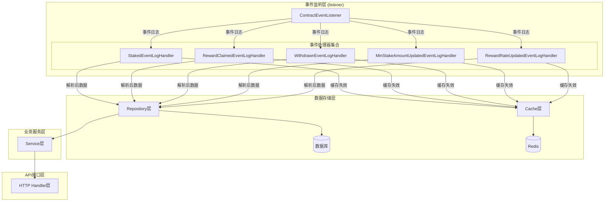

本页面深入解析stake-backend项目中事件处理器的实现模式，展示如何通过统一的接口契约、分层架构和策略模式构建可扩展的区块链事件处理系统。我们将分析从ABI解析到数据持久化的完整处理流程，帮助开发者理解事件处理器的设计哲学和实现细节。

## 事件处理器架构概览

事件处理器系统采用**接口驱动的分层架构**，将事件处理流程分解为多个职责明确的组件。核心设计思想是**关注点分离**：事件监听、数据解析、业务逻辑和数据持久化各自独立，通过接口契约进行协作。



Sources: [internal/listener/contract_event_listener.go](internal/listener/contract_event_listener.go#L24-L30), [internal/listener/staked_event_handler.go](internal/listener/staked_event_handler.go#L1-L104)

## 接口契约模式：ContractEventHandler

所有事件处理器的核心是`ContractEventHandler`接口，它定义了事件处理器必须实现的三个方法。这种**接口契约模式**确保了事件处理器的一致性和可替换性，使得`ContractEventListener`能够以统一的方式处理所有事件类型。

```go
// ContractEventHandler 定义事件处理器的契约
type ContractEventHandler interface {
    EventName() string          // 返回事件名称，用于日志和调试
    EventID() common.Hash       // 返回事件签名哈希，用于事件匹配
    Handle(ctx context.Context, eventLog types.Log) error  // 处理事件日志
}
```

这个接口的设计体现了几个关键原则：

1. **最小接口原则**：只暴露必要的方法，避免接口膨胀
2. **事件标识契约**：`EventName()`和`EventID()`提供事件的唯一标识
3. **处理契约**：`Handle()`方法定义了事件处理的入口点
4. **错误传播**：返回错误允许调用方处理失败情况

每个事件处理器都必须实现这三个方法，确保事件监听器能够统一调度。这种模式的优势在于：新增事件类型时，只需实现新的处理器并注册到监听器，无需修改现有代码。

Sources: [internal/listener/contract_event_listener.go](internal/listener/contract_event_listener.go#L24-L30)

## 具体处理器实现模式

每个事件类型都有对应的处理器实现，它们遵循相同的结构模式。以`StakedEventLogHandler`为例，所有处理器都包含以下核心组件：

```go
type StakedEventLogHandler struct {
    repo          *repository.StakedEventRepository  // 数据仓库
    rdb           *redis.Client                     // Redis客户端
    contractABI   abi.ABI                           // 合约ABI
    stakedEventID common.Hash                       // 事件ID
}
```

### 工厂方法模式

每个处理器都使用**工厂方法模式**进行创建，构造函数负责验证参数和初始化组件：

```go
func NewStakedEventLogHandler(repo *repository.StakedEventRepository, rdb *redis.Client) (*StakedEventLogHandler, error) {
    // 1. 参数验证
    if repo == nil {
        return nil, fmt.Errorf("create staked event handler: repository is nil")
    }
    
    // 2. 加载ABI
    contractABI, err := pkgabi.LoadStakeABI()
    if err != nil {
        return nil, err
    }
    
    // 3. 获取事件定义
    stakedEvent, ok := contractABI.Events[stakedEventName]
    if !ok {
        return nil, fmt.Errorf("create staked event handler: Staked event not found in ABI")
    }
    
    // 4. 返回处理器实例
    return &StakedEventLogHandler{
        repo:          repo,
        rdb:           rdb,
        contractABI:   contractABI,
        stakedEventID: stakedEvent.ID,
    }, nil
}
```

### 模板方法模式

所有处理器的`Handle`方法都遵循**模板方法模式**，执行相同的处理流程：

1. **解析事件日志**：调用`parseLog`方法解析原始日志
2. **数据持久化**：调用仓库的`Create`方法保存数据
3. **缓存失效**：删除相关的缓存前缀
4. **日志记录**：记录处理成功的日志

```go
func (h *StakedEventLogHandler) Handle(ctx context.Context, eventLog types.Log) error {
    // 1. 解析事件日志
    event, err := h.parseLog(eventLog)
    if err != nil {
        return err
    }
    
    // 2. 数据持久化
    if err := h.repo.Create(ctx, event); err != nil {
        return err
    }
    
    // 3. 缓存失效
    if err := cache.DeleteByPrefix(ctx, h.rdb, "staked:list:"); err != nil {
        log.Printf("cache delete staked list prefix: %v", err)
    }
    
    // 4. 日志记录
    log.Printf("staked event inserted: tx=%s index=%d user=%s amount=%s", 
        event.TxHash, event.LogIndex, event.User, event.Amount)
    
    return nil
}
```

这种模式确保了所有事件处理器的行为一致性，同时允许每个处理器在特定步骤中有自己的实现细节。

Sources: [internal/listener/staked_event_handler.go](internal/listener/staked_event_handler.go#L30-L45), [internal/listener/staked_event_handler.go](internal/listener/staked_event_handler.go#L60-L75)

## 数据解析模式：ABI事件解码

事件处理器的核心职责是将原始的以太坊事件日志解析为结构化的数据模型。这个过程遵循**策略模式**，不同事件类型有不同的解析策略。

### 事件日志结构

以太坊事件日志包含以下关键字段：
- `Topics[0]`：事件签名哈希（EventID）
- `Topics[1..n]`：indexed参数（通常是地址、ID等）
- `Data`：非indexed参数（通常是数值、复杂数据结构）

### 解析流程

所有处理器的`parseLog`方法都遵循相同的解析流程：

```go
func (h *StakedEventLogHandler) parseLog(eventLog types.Log) (*models.StakedEvent, error) {
    // 1. 验证Topics长度
    if len(eventLog.Topics) < 2 {
        return nil, fmt.Errorf("Staked log topics length = %d, want at least 2", len(eventLog.Topics))
    }
    
    // 2. 验证事件ID
    if eventLog.Topics[0] != h.stakedEventID {
        return nil, fmt.Errorf("unexpected event topic: %s", eventLog.Topics[0].Hex())
    }
    
    // 3. 解析Data字段
    var unpacked struct {
        Amount *big.Int
    }
    if err := h.contractABI.UnpackIntoInterface(&unpacked, stakedEventName, eventLog.Data); err != nil {
        return nil, fmt.Errorf("unpack Staked log data: %w", err)
    }
    
    // 4. 验证解析结果
    if unpacked.Amount == nil {
        return nil, fmt.Errorf("unpack Staked log data: amount is nil")
    }
    
    // 5. 构建数据模型
    return &models.StakedEvent{
        ContractAddress: eventLog.Address.Hex(),
        User:            common.BytesToAddress(eventLog.Topics[1].Bytes()).Hex(),
        Amount:          unpacked.Amount.String(),
        TxHash:          eventLog.TxHash.Hex(),
        BlockNumber:     eventLog.BlockNumber,
        LogIndex:        eventLog.Index,
        BlockHash:       eventLog.BlockHash.Hex(),
    }, nil
}
```

### 不同事件类型的解析差异

不同事件类型的解析差异主要体现在：

| 事件类型 | Topics数量 | 解析的Data字段 | 特殊处理 |
|---------|-----------|---------------|----------|
| Staked | 2 (EventID + User) | Amount (uint256) | 用户地址从Topics[1]解析 |
| RewardClaimed | 2 (EventID + User) | Amount (uint256) | 用户地址从Topics[1]解析 |
| Withdrawn | 2 (EventID + User) | Amount (uint256) | 用户地址从Topics[1]解析 |
| MinStakeAmountUpdated | 1 (EventID) | OldAmount, NewAmount (uint256) | 无用户地址，只有数值变化 |
| RewardRateUpdated | 1 (EventID) | OldRate, NewRate (uint256) | 无用户地址，只有数值变化 |

这种设计模式使得每个事件处理器都能专注于自己的解析逻辑，同时保持整体结构的一致性。

Sources: [internal/listener/staked_event_handler.go](internal/listener/staked_event_handler.go#L77-L104), [internal/listener/min_stake_amount_updated_event_handler.go](internal/listener/min_stake_amount_updated_event_handler.go#L65-L105)

## 缓存失效模式

事件处理器在数据持久化后立即执行缓存失效操作，这是**缓存-旁路模式**（Cache-Aside Pattern）的关键环节。每个事件处理器都删除与自己相关的缓存前缀，确保数据一致性。

### 缓存键生成策略

缓存键遵循统一的命名规范：`{事件类型}:list:{查询参数哈希}`

```go
// 在cache包中定义的缓存键生成函数
func BuildListKey(eventType string, query any) string {
    data, err := json.Marshal(query)
    if err != nil {
        log.Printf("cache: failed to marshal query for key building: %v", err)
        return fmt.Sprintf("%s:list:error", eventType)
    }
    hash := md5.Sum(data)
    return fmt.Sprintf("%s:list:%x", eventType, hash)
}
```

### 缓存失效实现

每个事件处理器在`Handle`方法中调用`cache.DeleteByPrefix`删除相关缓存：

```go
// Staked事件处理器的缓存失效
if err := cache.DeleteByPrefix(ctx, h.rdb, "staked:list:"); err != nil {
    log.Printf("cache delete staked list prefix: %v", err)
}

// RewardClaimed事件处理器的缓存失效
if err := cache.DeleteByPrefix(ctx, h.rdb, "reward-claimed:list:"); err != nil {
    log.Printf("cache delete reward-claimed list prefix: %v", err)
}
```

### 缓存失效策略分析

这种**前缀删除策略**具有以下特点：

1. **强一致性**：确保所有相关的查询缓存都被清除
2. **简单实现**：使用Redis的SCAN命令批量删除
3. **性能权衡**：删除操作可能影响性能，但保证了数据一致性
4. **容错处理**：缓存删除失败只记录日志，不影响主流程

这种模式在区块链事件处理场景中特别重要，因为事件数据的实时性要求很高，缓存必须及时失效以反映最新的链上状态。

Sources: [internal/listener/staked_event_handler.go](internal/listener/staked_event_handler.go#L68-L70), [internal/cache/cache.go](internal/cache/cache.go#L60-L82)

## 事件处理器注册与分发模式

事件处理器通过**观察者模式**进行注册和分发，`ContractEventListener`作为事件调度中心，管理所有已注册的处理器。

### 注册机制

在`main.go`中，所有事件处理器被创建并注册到监听器：

```go
// 创建事件处理器
for _, newHandler := range []func() (listener.ContractEventHandler, error){
    func() (listener.ContractEventHandler, error) {
        return listener.NewStakedEventLogHandler(stakedEventRepo, redisClient)
    },
    func() (listener.ContractEventHandler, error) {
        return listener.NewRewardClaimedEventLogHandler(rewardClaimedEventRepo, redisClient)
    },
    // ... 其他处理器
} {
    h, err := newHandler()
    if err != nil {
        log.Fatalf("Failed to create event handler: %v", err)
    }
    if err := contractEventListener.Register(h); err != nil {
        log.Fatalf("Failed to register %s event handler: %v", h.EventName(), err)
    }
}
```

### 分发机制

`ContractEventListener`使用**策略模式**进行事件分发：

```go
func (l *ContractEventListener) dispatch(ctx context.Context, eventLog types.Log) {
    if len(eventLog.Topics) == 0 {
        log.Printf("ignore contract log without topics: tx=%s index=%d", eventLog.TxHash.Hex(), eventLog.Index)
        return
    }
    
    // 根据事件ID查找处理器
    handler, ok := l.handlers[eventLog.Topics[0]]
    if !ok {
        log.Printf("ignore unregistered event: topic=%s tx=%s index=%d", 
            eventLog.Topics[0].Hex(), eventLog.TxHash.Hex(), eventLog.Index)
        return
    }
    
    // 调用处理器处理事件
    if err := handler.Handle(ctx, eventLog); err != nil {
        log.Printf("handle %s event failed: tx=%s index=%d err=%v", 
            handler.EventName(), eventLog.TxHash.Hex(), eventLog.Index, err)
    }
}
```

### 事件ID映射

监听器维护一个事件ID到处理器的映射表：

```go
type ContractEventListener struct {
    // ...
    handlers map[common.Hash]ContractEventHandler
}

func (l *ContractEventListener) Register(handler ContractEventHandler) error {
    // ...
    eventID := handler.EventID()
    if _, exists := l.handlers[eventID]; exists {
        return fmt.Errorf("register contract event handler: duplicate event id %s", eventID.Hex())
    }
    
    l.handlers[eventID] = handler
    return nil
}
```

这种设计模式的优势：

1. **松耦合**：处理器之间相互独立，新增处理器不影响现有代码
2. **动态扩展**：可以在运行时注册新的事件处理器
3. **高性能**：基于事件ID的哈希映射，O(1)时间复杂度查找
4. **可维护性**：每个处理器职责单一，易于测试和维护

Sources: [main.go](main.go#L100-L120), [internal/listener/contract_event_listener.go](internal/listener/contract_event_listener.go#L200-L216)

## 五类事件处理器实现对比

通过对比五类事件处理器的实现，我们可以更清晰地看到它们的共性和差异：

| 特征 | StakedEvent | RewardClaimedEvent | WithdrawnEvent | MinStakeAmountUpdatedEvent | RewardRateUpdatedEvent |
|------|-------------|-------------------|----------------|---------------------------|------------------------|
| **事件名称** | Staked | RewardClaimed | Withdrawn | MinStakeAmountUpdated | RewardRateUpdated |
| **Topics数量** | 2 | 2 | 2 | 1 | 1 |
| **Data字段** | Amount | Amount | Amount | OldAmount, NewAmount | OldRate, NewRate |
| **用户地址** | Topics[1] | Topics[1] | Topics[1] | 无 | 无 |
| **缓存前缀** | staked:list: | reward-claimed:list: | withdrawn:list: | min-stake-amount-updated:list: | reward-rate-updated:list: |
| **数据模型** | StakedEvent | RewardClaimedEvent | WithdrawnEvent | MinStakeAmountUpdatedEvent | RewardRateUpdatedEvent |
| **特殊验证** | 用户地址+金额 | 用户地址+金额 | 用户地址+金额 | 双金额验证 | 双速率验证 |

### 实现模式总结

1. **用户事件**（Staked, RewardClaimed, Withdrawn）：
   - 包含用户地址作为indexed参数
   - 解析Topics[1]获取用户地址
   - 解析Data字段获取金额

2. **配置事件**（MinStakeAmountUpdated, RewardRateUpdated）：
   - 不包含用户地址
   - 只有EventID作为Topics[0]
   - 解析Data字段获取新旧值

这种设计体现了**开闭原则**：对扩展开放（新增事件类型），对修改关闭（现有代码无需修改）。

## 最佳实践与扩展指南

### 添加新事件处理器步骤

1. **定义事件模型**：在`internal/models/event.go`中添加新的事件结构体
2. **创建仓库**：在`internal/repository/`中创建对应的仓库
3. **创建服务**：在`internal/service/`中创建对应的服务
4. **创建处理器**：在`internal/listener/`中实现`ContractEventHandler`接口
5. **注册处理器**：在`main.go`中注册新的处理器
6. **创建API处理器**：在`internal/api/`中创建HTTP处理器

### 设计原则

1. **单一职责原则**：每个处理器只处理一种事件类型
2. **依赖倒置原则**：依赖接口而非具体实现
3. **接口隔离原则**：`ContractEventHandler`接口最小化
4. **开闭原则**：易于扩展新事件类型，无需修改现有代码

### 错误处理策略

1. **参数验证失败**：返回错误，阻止无效数据进入系统
2. **ABI解析失败**：返回错误，可能是合约ABI不匹配
3. **数据持久化失败**：返回错误，可能是数据库问题
4. **缓存失效失败**：只记录日志，不影响主流程（最终一致性）

### 性能考虑

1. **ABI预加载**：在构造函数中加载ABI，避免重复加载
2. **连接池复用**：共享数据库和Redis连接
3. **批量处理**：事件监听器支持批量回放历史事件
4. **缓存策略**：写入后立即失效缓存，保证数据一致性

Sources: [internal/listener/staked_event_handler.go](internal/listener/staked_event_handler.go#L1-L104), [internal/listener/reward_rate_updated_event_handler.go](internal/listener/reward_rate_updated_event_handler.go#L1-L105), [main.go](main.go#L100-L120)

## 架构优势与设计启示

本项目的事件处理器实现模式展示了几个重要的架构设计原则：

1. **关注点分离**：事件监听、数据解析、业务逻辑和数据持久化各司其职
2. **接口驱动设计**：通过统一接口实现多态，提高代码的可扩展性
3. **模板方法模式**：确保所有处理器遵循相同的处理流程
4. **工厂方法模式**：封装对象创建逻辑，提供清晰的创建接口
5. **策略模式**：不同事件类型有不同的解析策略，但遵循相同的接口

这种设计使得系统具有以下优势：

- **可扩展性**：新增事件类型只需实现新处理器，无需修改现有代码
- **可维护性**：每个处理器职责单一，易于理解和修改
- **可测试性**：接口设计便于单元测试和模拟
- **一致性**：统一的处理流程确保行为一致
- **性能**：基于哈希映射的事件分发，高效可靠

通过深入理解这些模式，开发者可以更好地扩展系统功能，添加新的事件类型，或者在其他项目中应用类似的架构设计。