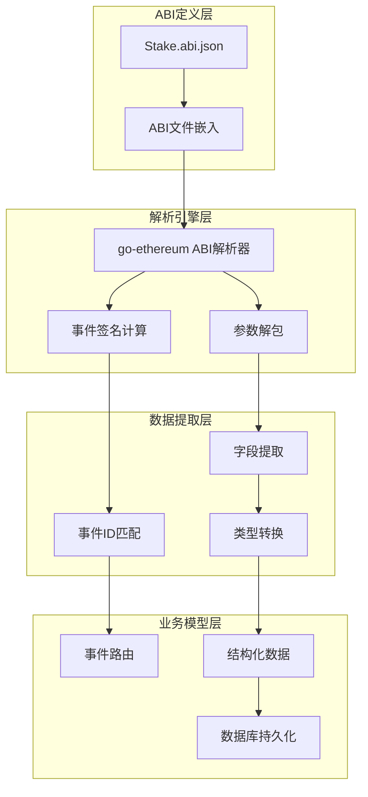
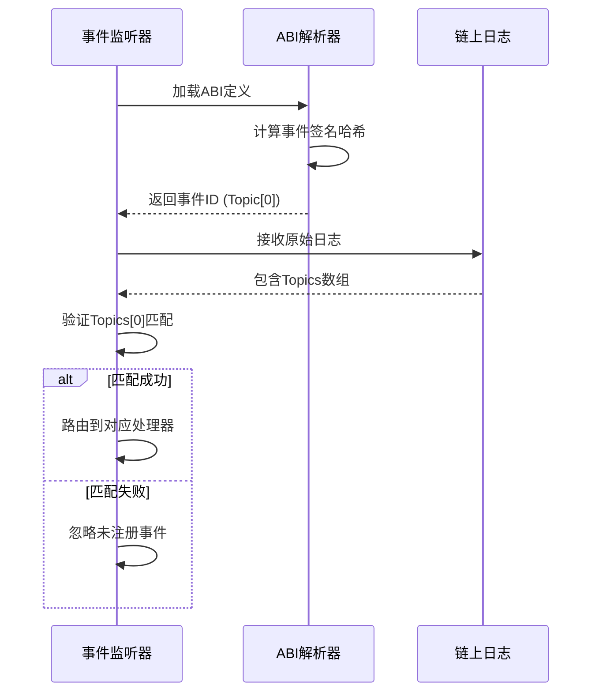
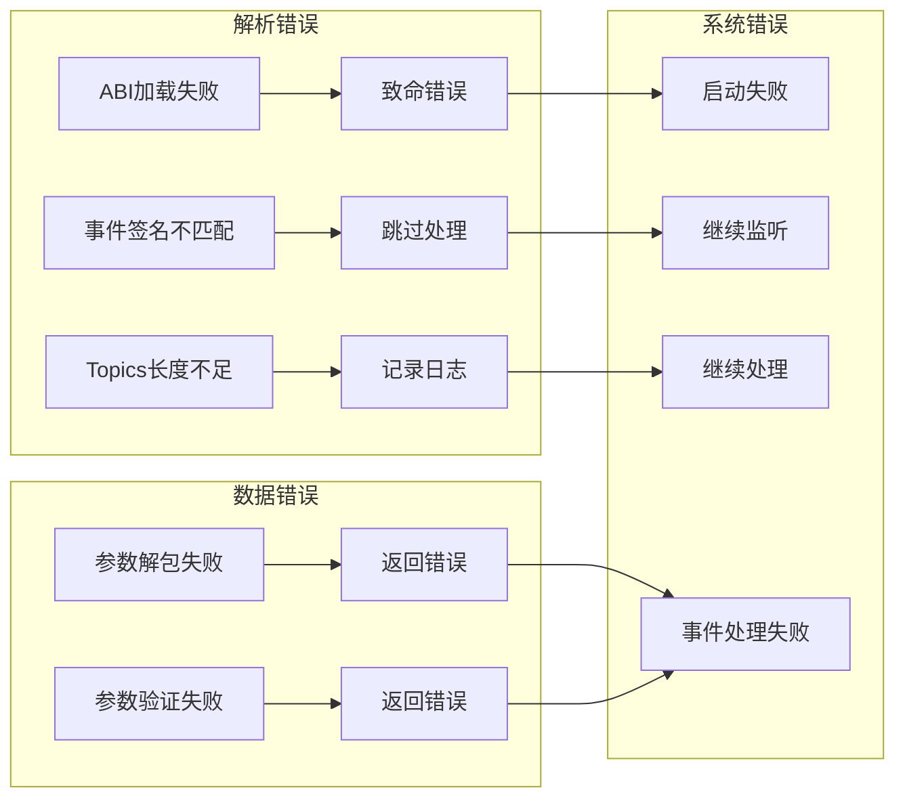

ABI（Application Binary Interface）解析是区块链事件监听系统的核心环节，负责将原始的链上日志数据转换为结构化的业务数据。本文档详细阐述Stake Backend系统中ABI解析的技术实现、数据提取流程以及相关的最佳实践。

## ABI解析架构概览

ABI解析系统采用分层架构设计，将ABI定义、解析逻辑和数据转换分离，确保系统的可维护性和可扩展性。核心流程如下：



Sources: [abi.go](internal/abi/abi.go#L1-L23), [Stake.abi.json](internal/abi/Stake.abi.json#L1-L100)

## ABI文件结构与嵌入机制

系统使用Go 1.16引入的`//go:embed`指令将ABI JSON文件直接嵌入到编译后的二进制文件中，避免了运行时的文件读取操作。ABI文件定义了智能合约的接口规范，包括事件、函数和错误定义。

ABI文件包含以下核心组成部分：

| 组件类型 | 数量 | 主要用途 |
|---------|------|---------|
| 事件定义 | 7个 | 监听链上状态变化 |
| 函数定义 | 12个 | 合约交互接口 |
| 错误定义 | 8个 | 异常处理机制 |
| 构造函数 | 1个 | 合约初始化参数 |

关键的事件定义包括：

1. **Staked事件**：`Staked(address indexed user, uint256 amount)` - 用户质押事件
2. **RewardClaimed事件**：`RewardClaimed(address indexed user, uint256 amount)` - 奖励领取事件
3. **Withdrawn事件**：`Withdrawn(address indexed user, uint256 amount)` - 提款事件
4. **MinStakeAmountUpdated事件**：`MinStakeAmountUpdated(uint256 oldAmount, uint256 newAmount)` - 最小质押金额更新事件
5. **RewardRateUpdated事件**：`RewardRateUpdated(uint256 oldRate, uint256 newRate)` - 奖励率更新事件

Sources: [Stake.abi.json](internal/abi/Stake.abi.json#L200-L300), [abi.go](internal/abi/abi.go#L11-L13)

## 事件签名与Topic计算

以太坊事件通过**事件签名哈希**进行识别，这是ABI解析的关键机制。系统通过以下步骤计算和验证事件ID：



事件签名的计算规则为：`keccak256("EventName(type1,type2,...)")`。例如，Staked事件的签名为`keccak256("Staked(address,uint256)")`，这确保了事件标识的唯一性。

在事件处理器初始化时，系统会从ABI中提取事件定义并计算其ID，用于后续的日志匹配：

1. **加载ABI定义**：通过`LoadStakeABI()`函数解析嵌入的ABI文件
2. **提取事件定义**：通过事件名称从ABI的Events映射中获取事件对象
3. **计算事件ID**：使用事件对象的ID属性（即签名哈希）
4. **注册事件处理器**：将事件ID与对应的处理器关联

Sources: [staked_event_handler.go](internal/listener/staked_event_handler.go#L34-L48), [contract_event_listener.go](internal/listener/contract_event_listener.go#L61-L75)

## 日志数据解析流程

日志数据解析是将原始的十六进制数据转换为结构化数据的核心过程。系统采用统一的解析模式处理所有事件类型：

```mermaid
flowchart TD
    A[接收原始日志] --> B{验证Topics长度}
    B -->|长度不足| C[返回错误]
    B -->|长度足够| D[验证Topics[0]事件ID]
    D -->|不匹配| E[返回错误]
    D -->|匹配| F[提取indexed参数]
    F --> G[解包非indexed参数]
    G --> H[验证参数完整性]
    H -->|验证失败| I[返回错误]
    H -->|验证成功| J[构建业务模型]
    J --> K[返回结构化数据]
```

以Staked事件为例，解析过程如下：

1. **验证Topics长度**：Staked事件包含1个indexed参数（user地址），因此Topics数组至少需要2个元素
2. **验证事件ID**：检查Topics[0]是否与注册的Staked事件ID匹配
3. **提取indexed参数**：从Topics[1]中提取user地址
4. **解包非indexed参数**：从Data字段解包amount参数
5. **验证参数完整性**：确保解包后的参数不为nil
6. **构建业务模型**：创建StakedEvent结构体实例

Sources: [staked_event_handler.go](internal/listener/staked_event_handler.go#L76-L103)

## 事件参数提取模式

系统针对不同类型的事件参数采用不同的提取策略：

| 参数类型 | 提取方式 | 数据来源 | 示例 |
|---------|---------|---------|------|
| indexed参数 | 从Topics数组提取 | Topics[1], Topics[2], ... | user地址 |
| 非indexed参数 | 使用ABI解包 | Data字段 | amount, oldAmount, newAmount |
| 元数据参数 | 直接从日志对象获取 | 事件日志 | TxHash, BlockNumber, LogIndex |

**indexed参数提取**：indexed参数存储在Topics数组中，每个indexed参数占据一个Topic位置。对于地址类型，需要使用`common.BytesToAddress()`进行转换：

```go
// 提取indexed参数（user地址）
user := common.BytesToAddress(eventLog.Topics[1].Bytes()).Hex()
```

**非indexed参数解包**：使用go-ethereum的ABI解包功能，通过`UnpackIntoInterface`方法将Data字段解包到预定义的结构体中：

```go
// 定义解包结构体
var unpacked struct {
    Amount *big.Int
}

// 解包Data字段
if err := h.contractABI.UnpackIntoInterface(&unpacked, stakedEventName, eventLog.Data); err != nil {
    return nil, fmt.Errorf("unpack Staked log data: %w", err)
}
```

Sources: [staked_event_handler.go](internal/listener/staked_event_handler.go#L84-L92), [min_stake_amount_updated_event_handler.go](internal/listener/min_stake_amount_updated_event_handler.go#L84-L93)

## 数据类型转换与验证

ABI解析后的数据需要经过类型转换和验证才能用于业务处理。系统定义了严格的转换规则：

| Solidity类型 | Go类型 | 转换方式 | 验证规则 |
|-------------|--------|---------|---------|
| address | string | `common.BytesToAddress().Hex()` | 42字符十六进制格式 |
| uint256 | *big.Int → string | `.String()` | 非nil，十进制字符串 |
| bool | bool | 直接使用 | 无需特殊验证 |

**地址类型转换**：将Topics中的32字节数据转换为标准的以太坊地址格式（0x前缀 + 40个十六进制字符）。

**数值类型处理**：Solidity的uint256类型在Go中使用`*big.Int`表示，最终转换为十进制字符串存储，以避免精度损失：

```go
// 数值类型转换示例
Amount: unpacked.Amount.String()  // 转换为十进制字符串
```

**验证机制**：系统在数据转换后进行完整性验证，确保关键字段不为nil或空值：

```go
// 验证解包后的参数
if unpacked.Amount == nil {
    return nil, fmt.Errorf("unpack Staked log data: amount is nil")
}
```

Sources: [staked_event_handler.go](internal/listener/staked_event_handler.go#L94-L102), [event.go](internal/models/event.go#L24-L36)

## 错误处理策略

ABI解析过程中的错误处理采用分层策略，确保系统的健壮性：



**致命错误**：ABI加载失败会导致事件处理器无法创建，系统启动失败：

```go
contractABI, err := pkgabi.LoadStakeABI()
if err != nil {
    return nil, err  // 返回错误，阻止处理器创建
}
```

**业务错误**：参数解包或验证失败会返回具体错误，但不会影响其他事件的处理：

```go
if err := h.contractABI.UnpackIntoInterface(&unpacked, stakedEventName, eventLog.Data); err != nil {
    return nil, fmt.Errorf("unpack Staked log data: %w", err)
}
```

**警告级别**：未匹配的事件或Topics长度不足会记录日志，但继续处理：

```go
if len(eventLog.Topics) < 2 {
    return nil, fmt.Errorf("Staked log topics length = %d, want at least 2", len(eventLog.Topics))
}
```

Sources: [staked_event_handler.go](internal/listener/staked_event_handler.go#L76-L82), [contract_event_listener.go](internal/listener/contract_event_listener.go#L192-L206)

## 性能优化与最佳实践

ABI解析系统采用以下优化策略提升性能：

1. **ABI预加载**：在事件处理器初始化时加载ABI，避免重复解析
2. **事件ID缓存**：将计算好的事件ID存储在处理器结构体中，避免重复计算
3. **批量处理**：在回放模式下，按批次处理历史日志，减少数据库连接开销
4. **错误隔离**：单个事件处理失败不影响其他事件的处理

**最佳实践**：

1. **ABI版本管理**：确保ABI文件与合约版本同步更新
2. **事件签名验证**：在生产环境中启用严格的事件签名验证
3. **日志监控**：监控ABI解析相关的错误日志，及时发现兼容性问题
4. **性能测试**：定期进行ABI解析性能测试，确保在高并发场景下的稳定性

Sources: [contract_event_listener.go](internal/listener/contract_event_listener.go#L156-L190), [main.go](main.go#L110-L138)

## 扩展与维护指南

当需要添加新的事件类型时，需要遵循以下步骤：

1. **更新ABI文件**：在`Stake.abi.json`中添加新的事件定义
2. **创建事件模型**：在`internal/models/event.go`中定义对应的结构体
3. **实现事件处理器**：在`internal/listener/`目录下创建新的处理器
4. **注册处理器**：在`main.go`中注册新的事件处理器
5. **创建数据访问层**：在`internal/repository/`和`internal/service/`中实现数据访问和业务逻辑

**维护要点**：

1. **向后兼容**：添加新事件时确保不影响现有事件的处理
2. **测试覆盖**：为新的事件处理器编写完整的单元测试
3. **文档更新**：及时更新本文档，反映最新的ABI解析实现
4. **性能监控**：监控新事件处理器的性能，确保不会成为系统瓶颈