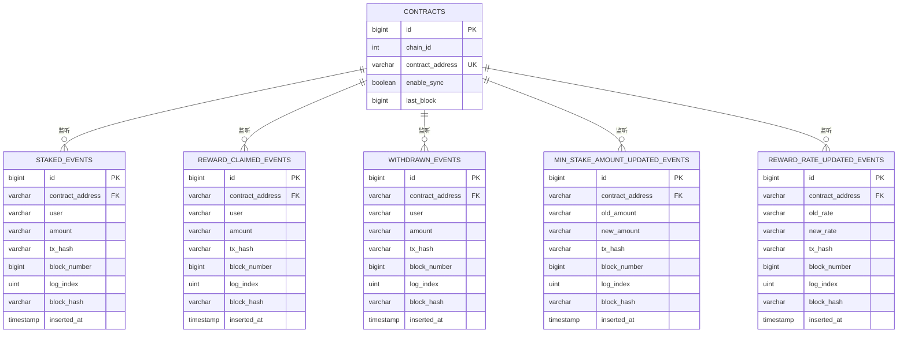
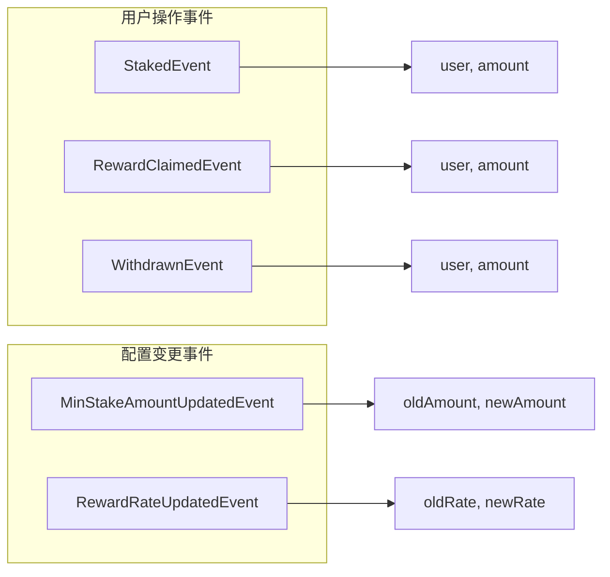
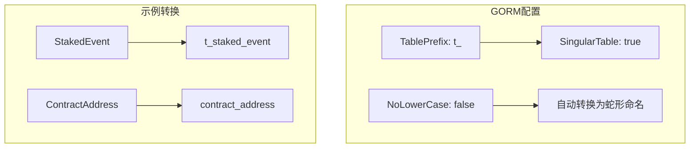
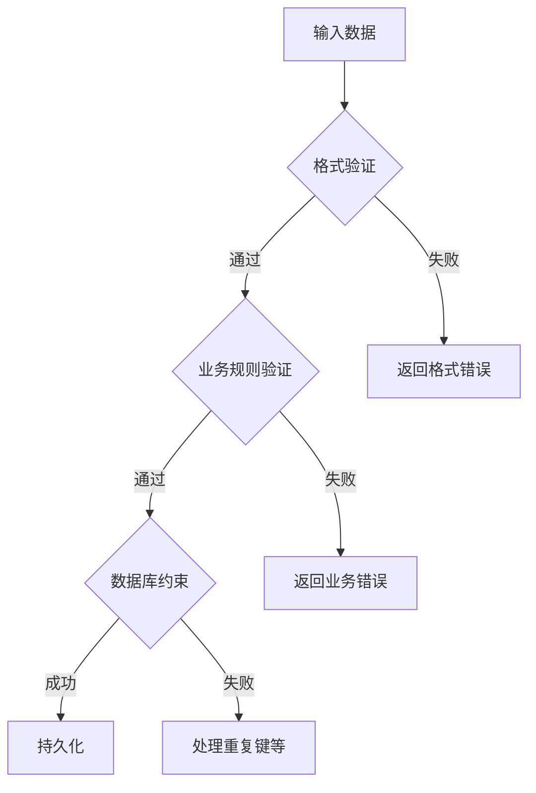
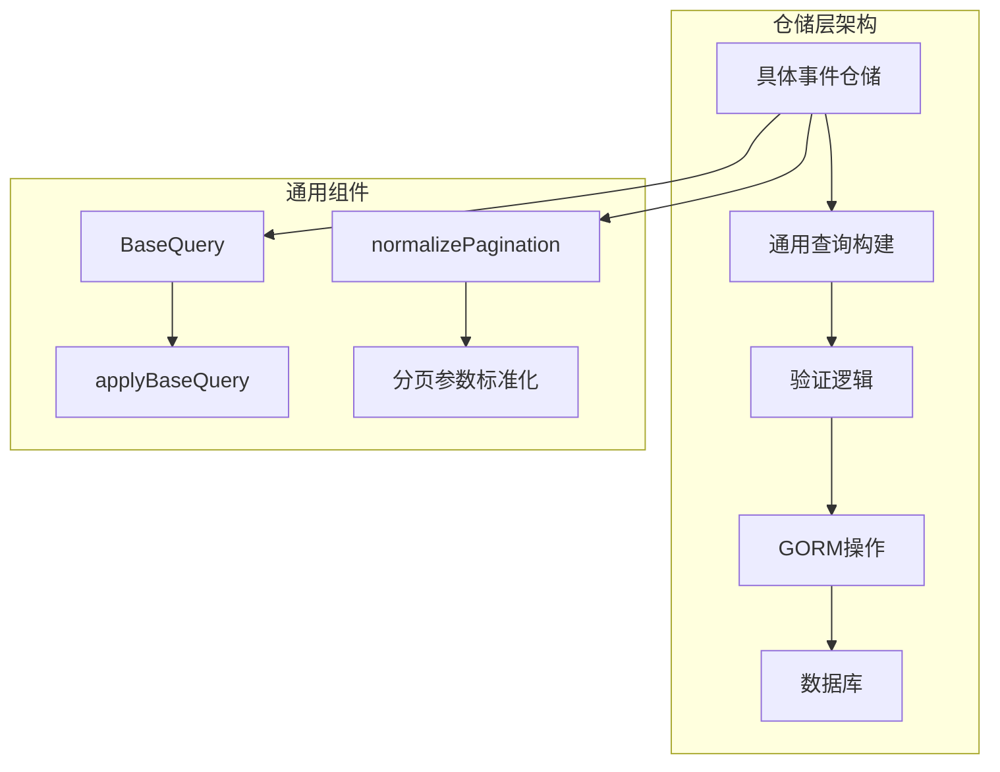

本文档详细介绍了基于GORM的MySQL数据库模型设计，包括表结构、索引策略、数据验证规范以及仓储层设计模式。该系统用于存储和索引以太坊质押合约事件，支持高效的事件查询和历史数据回溯。

## 数据库架构概览

系统采用**六表架构**，围绕智能合约事件存储设计。核心设计哲学是**为查询优化而非原始存储**，将ABI解码后的结构化数据直接持久化，避免运行时重复解析。



Sources: [main.go](main.go#L45-L65), [internal/models/event.go](internal/models/event.go#L1-L93)

## 表结构详细设计

### 合约配置表 (contracts)

合约表作为系统锚点，存储待监听的智能合约元数据。**EnableSync字段**控制事件监听的启停状态，**LastBlock字段**记录同步进度以支持断点续传。

| 字段名 | 类型 | 约束 | 说明 |
|--------|------|------|------|
| id | bigint | 主键，自增 | 主键ID |
| chain_id | int | 索引，默认1 | 链ID（默认以太坊主网） |
| contract_address | varchar(42) | 索引，唯一 | 合约地址（小写，0x前缀） |
| enable_sync | boolean | 默认true | 是否启用同步 |
| last_block | bigint | 默认0 | 最后同步区块高度 |

Sources: [internal/models/contract.go](internal/models/contract.go#L1-L10), [internal/repository/contract_repository.go](internal/repository/contract_repository.go#L30-L50)

### 事件表通用模式

所有事件表遵循**统一设计模式**，确保查询接口的一致性。每个事件表包含以下核心字段：

| 字段类别 | 字段名 | 类型 | 设计意图 |
|----------|--------|------|----------|
| **标识** | id | bigint | 自增主键 |
| **定位** | contract_address | varchar(42) | 事件来源合约 |
| **业务** | 事件特定字段 | varchar | 业务数据存储 |
| **溯源** | tx_hash, block_number, log_index | varchar/bigint/uint | 链上定位信息 |
| **审计** | block_hash, inserted_at | varchar/timestamp | 完整性验证与时间戳 |

Sources: [internal/models/event.go](internal/models/event.go#L20-L93)

### 五类事件表字段映射



| 事件类型 | 用户相关字段 | 数值字段 | 特殊字段 |
|----------|--------------|----------|----------|
| StakedEvent | user | amount | - |
| RewardClaimedEvent | user | amount | - |
| WithdrawnEvent | user | amount | - |
| MinStakeAmountUpdatedEvent | - | old_amount, new_amount | - |
| RewardRateUpdatedEvent | - | old_rate, new_rate | - |

Sources: [internal/models/event.go](internal/models/event.go#L20-L93)

## 命名规范与索引策略

### 命名约定

系统采用**三层命名约定**确保一致性：

1. **表名规范**：`t_`前缀 + 单数形式（如`t_staked_event`）
2. **字段名规范**：蛇形命名法（snake_case）
3. **索引名规范**：`idx_`前缀 + 表名 + 字段名



Sources: [main.go](main.go#L48-L52)

### 索引策略设计

索引设计遵循**查询驱动原则**，基于实际查询模式创建复合索引：

| 索引类型 | 命名模式 | 用途 | 示例 |
|----------|----------|------|------|
| **主查询索引** | `idx_{table}_contract_block` | 合约+区块范围查询 | `idx_staked_events_contract_block` |
| **用户查询索引** | `idx_{table}_user` | 按用户地址查询 | `idx_staked_events_user` |
| **唯一约束** | `uniq_{table}_tx_log` | 交易哈希+日志索引 | `uniq_staked_events_tx_log` |
| **普通索引** | `idx_{table}_{field}` | 单字段查询 | `idx_staked_events_tx_hash` |

```sql
-- 典型的复合索引设计
CREATE INDEX idx_staked_events_contract_block 
ON t_staked_event (contract_address, block_number);

CREATE UNIQUE INDEX uniq_staked_events_tx_log 
ON t_staked_event (tx_hash, log_index);
```

Sources: [internal/models/event.go](internal/models/event.go#L25-L30), [internal/models/event.go](internal/models/event.go#L40-L45)

## 数据验证规范

### 验证层次架构

系统采用**三层验证架构**确保数据完整性：



### 关键验证规则

| 验证类型 | 规则 | 实现位置 | 错误处理 |
|----------|------|----------|----------|
| **地址验证** | 42字符，0x前缀，十六进制 | `validateAddress()` | `ErrInvalidXxxEvent` |
| **哈希验证** | 66字符，32字节十六进制 | `validateHash()` | `ErrInvalidXxxEvent` |
| **金额验证** | 十进制字符串，≤256位，非负 | `validateUint256Amount()` | `ErrInvalidXxxEvent` |
| **唯一性验证** | tx_hash + log_index组合唯一 | 数据库约束 | `ErrDuplicatedKey` |

```go
// 金额验证示例
func validateUint256Amount(sentinel error, value string) error {
    amount, ok := new(big.Int).SetString(value, 10)
    if !ok {
        return fmt.Errorf("%w: amount must be a decimal uint256 string", sentinel)
    }
    if amount.Sign() < 0 {
        return fmt.Errorf("%w: amount must not be negative", sentinel)
    }
    if amount.BitLen() > 256 {
        return fmt.Errorf("%w: amount exceeds uint256", sentinel)
    }
    return nil
}
```

Sources: [internal/repository/common.go](internal/repository/common.go#L100-L130)

## 仓储层设计模式

### 仓储架构分层



### 仓储接口标准

每个事件仓储提供统一的CRUD接口：

| 方法 | 签名 | 用途 | 错误处理 |
|------|------|------|----------|
| **GetByID** | `GetByID(ctx, id)` | 按ID查询单条记录 | `ErrXxxNotFound` |
| **List** | `List(ctx, query)` | 分页查询 | 参数验证错误 |
| **Create** | `Create(ctx, event)` | 创建记录 | 幂等处理重复键 |

### 分页查询实现

分页查询采用**标准化处理**，确保一致的用户体验：

```go
// 分页参数标准化
func normalizePagination(page, pageSize int) (int, int) {
    if page <= 0 {
        page = defaultPage  // 默认第1页
    }
    if pageSize <= 0 {
        pageSize = defaultPageSize  // 默认20条
    }
    if pageSize > maxPageSize {
        pageSize = maxPageSize  // 最大100条
    }
    return page, pageSize
}
```

Sources: [internal/repository/common.go](internal/repository/common.go#L15-L30), [internal/repository/staked_event_repository.go](internal/repository/staked_event_repository.go#L50-L80)

### 幂等性设计

系统通过**重复键检测**实现事件处理的幂等性，避免区块链重组导致的数据重复：

```go
func (r *StakedEventRepository) Create(ctx context.Context, event *models.StakedEvent) error {
    // ... 验证逻辑 ...
    
    if err := r.db.WithContext(ctx).Create(event).Error; err != nil {
        if isDuplicateKeyError(err) {
            return nil  // 幂等：忽略重复插入
        }
        return fmt.Errorf("create staked event tx_hash=%s log_index=%d: %w", 
            event.TxHash, event.LogIndex, err)
    }
    return nil
}
```

Sources: [internal/repository/common.go](internal/repository/common.go#L135-L147), [internal/repository/staked_event_repository.go](internal/repository/staked_event_repository.go#L85-L110)

## 数据迁移与版本管理

### 自动迁移机制

系统使用GORM的**AutoMigrate**功能实现数据库版本管理，无需手动编写SQL迁移脚本：

```go
if err := db.AutoMigrate(
    &models.Contract{},
    &models.StakedEvent{},
    &models.RewardClaimedEvent{},
    &models.WithdrawnEvent{},
    &models.MinStakeAmountUpdatedEvent{},
    &models.RewardRateUpdatedEvent{},
); err != nil {
    log.Fatalf("Failed to migrate database: %v", err)
}
```

### 迁移策略

| 场景 | 策略 | 风险控制 |
|------|------|----------|
| **新字段添加** | AutoMigrate自动添加列 | 默认值处理 |
| **索引变更** | 自动创建新索引 | 性能影响评估 |
| **表结构重构** | 手动迁移+数据迁移 | 测试环境验证 |

Sources: [main.go](main.go#L55-L65)

## 性能优化建议

### 查询优化策略

1. **复合索引优先**：为高频查询创建复合索引
2. **覆盖索引**：常用查询字段包含在索引中
3. **避免全表扫描**：始终使用索引字段过滤

### 存储优化

| 数据类型 | 存储策略 | 理由 |
|----------|----------|------|
| **地址** | varchar(42) + 小写存储 | 统一格式，便于索引 |
| **金额** | varchar(78) + 字符串存储 | 避免精度丢失，支持uint256 |
| **哈希** | varchar(66) + 小写存储 | 固定长度，便于比较 |
| **时间戳** | timestamp + 自动创建 | 时区处理，审计追踪 |

## 下一步阅读

数据库模型设计是系统数据层的基础。要深入理解这些模型的实际应用，建议阅读以下相关文档：

- [仓库层通用模式](14-cang-ku-ceng-tong-yong-mo-shi) - 了解仓储层的具体实现细节
- [数据验证与规范化](15-shu-ju-yan-zheng-yu-gui-fan-hua) - 深入数据完整性保障机制
- [Redis缓存策略](16-redishuan-cun-ce-lue) - 学习如何通过缓存优化查询性能
- [查询性能优化](18-cha-xun-xing-neng-you-hua) - 掌握高级查询优化技巧