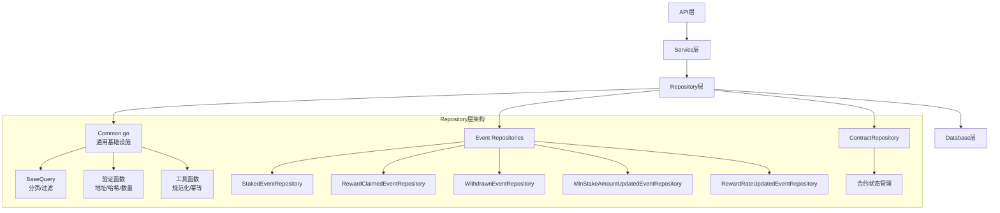
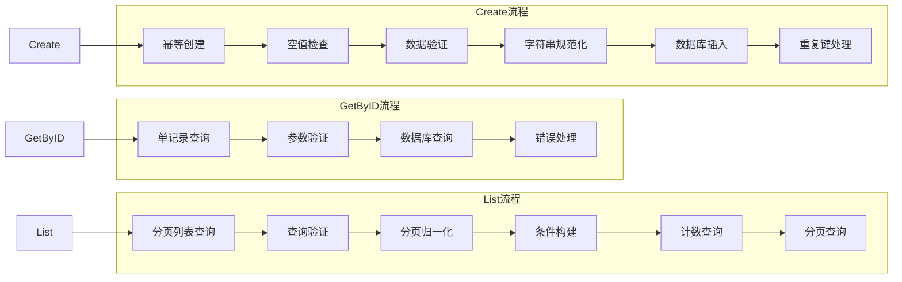

本文档详细介绍了项目中仓库层（Repository Layer）的通用设计模式与实现规范。仓库层作为数据访问的核心抽象，通过统一的接口设计、分页处理、数据验证和错误处理机制，为上层服务提供了一致且可靠的数据操作接口。

## 1. 架构概览与分层关系

仓库层位于四层架构的第三层，负责与数据库直接交互，向上为服务层提供数据操作接口。其设计遵循**单一职责原则**，每个事件类型对应一个独立的仓库实现。



Sources: [common.go](internal/repository/common.go#L1-L147), [main.go](main.go#L85-L108)

## 2. 通用基础设施（Common.go）

通用基础设施文件提供了所有仓库实现的共享组件，包括分页处理、查询构建和数据验证工具。

### 2.1 分页参数归一化

分页参数归一化确保了所有查询接口的分页行为一致性，防止无效参数导致的异常。

```go
// 分页参数常量定义
const (
    defaultPage     = 1      // 默认页码
    defaultPageSize = 20     // 默认每页数量
    maxPageSize     = 100    // 最大每页数量限制
)

// normalizePagination 归一化分页参数
func normalizePagination(page, pageSize int) (int, int) {
    if page <= 0 {
        page = defaultPage
    }
    if pageSize <= 0 {
        pageSize = defaultPageSize
    }
    if pageSize > maxPageSize {
        pageSize = maxPageSize
    }
    return page, pageSize
}
```

**参数处理规则**：
| 参数 | 输入值 | 处理结果 | 说明 |
|------|--------|----------|------|
| `page` | ≤0 | 1 | 使用默认页码 |
| `page` | >0 | 原值 | 保持用户指定值 |
| `pageSize` | ≤0 | 20 | 使用默认大小 |
| `pageSize` | 1-100 | 原值 | 保持用户指定值 |
| `pageSize` | >100 | 100 | 限制最大值 |

Sources: [common.go](internal/repository/common.go#L13-L32)

### 2.2 BaseQuery 结构体

BaseQuery 是所有事件查询的基础结构，封装了跨事件类型的公共过滤条件。

```go
// BaseQuery 所有事件查询的公共过滤条件
type BaseQuery struct {
    ID              int64      // 记录ID
    ContractAddress string     // 合约地址
    TxHash          string     // 交易哈希
    BlockNumberFrom *uint64    // 起始区块号（可选）
    BlockNumberTo   *uint64    // 结束区块号（可选）
    Page            int        // 页码
    PageSize        int        // 每页数量
}
```

**字段说明**：
- **ID**：精确匹配记录ID
- **ContractAddress**：按合约地址过滤（自动转为小写）
- **TxHash**：按交易哈希过滤（自动转为小写）
- **BlockNumberFrom/To**：区块号范围查询（可选参数）
- **Page/PageSize**：分页参数

Sources: [common.go](internal/repository/common.go#L34-L43)

### 2.3 查询验证与应用

验证函数确保查询参数的合法性，应用函数将查询条件转换为数据库查询。

```go
// validateBaseQuery 校验公共查询条件
func validateBaseQuery(sentinel error, q BaseQuery) error {
    if q.ID < 0 {
        return fmt.Errorf("%w: id must not be negative", sentinel)
    }
    // ... 其他验证逻辑
}

// applyBaseQuery 在 gorm.DB 上叠加公共查询条件
func applyBaseQuery(db *gorm.DB, q BaseQuery) *gorm.DB {
    if q.ID > 0 {
        db = db.Where("id = ?", q.ID)
    }
    if q.ContractAddress != "" {
        db = db.Where("contract_address = ?", strings.ToLower(q.ContractAddress))
    }
    // ... 其他条件应用
    return db
}
```

**验证规则**：
| 字段 | 验证规则 | 错误消息 |
|------|----------|----------|
| ID | 必须 ≥ 0 | "id must not be negative" |
| ContractAddress | 必须是有效的十六进制地址 | "contract_address must be a valid hex address" |
| TxHash | 必须是66字符的十六进制字符串 | "tx_hash must be a 32-byte hex string" |
| BlockNumber范围 | From ≤ To | "block_number_from must not be greater than block_number_to" |

Sources: [common.go](internal/repository/common.go#L45-L86)

## 3. 数据验证工具集

通用验证函数提供了标准化的数据验证能力，确保数据质量。

### 3.1 地址验证

地址验证函数使用 go-ethereum 库的标准方法，确保以太坊地址的合法性。

```go
// validateAddress 校验 hex 地址
func validateAddress(sentinel error, field, value string) error {
    if !common.IsHexAddress(value) {
        return fmt.Errorf("%w: %s must be a valid hex address", sentinel, field)
    }
    return nil
}
```

**验证标准**：
- 必须是有效的十六进制地址格式
- 支持带 `0x` 前缀的格式
- 使用 go-ethereum 库的 `IsHexAddress` 方法

Sources: [common.go](internal/repository/common.go#L88-L95)

### 3.2 哈希验证

哈希验证确保交易哈希和区块哈希的格式正确。

```go
// validateHash 校验 32 字节 hex 哈希
func validateHash(sentinel error, field, value string) error {
    if len(value) != 66 || !strings.HasPrefix(value, "0x") || !isHex(value[2:]) {
        return fmt.Errorf("%w: %s must be a 32-byte hex string", sentinel, field)
    }
    return nil
}
```

**哈希格式要求**：
- 总长度：66 字符（`0x` + 64 个十六进制字符）
- 前缀：必须以 `0x` 开头
- 字符集：0-9, a-f, A-F

Sources: [common.go](internal/repository/common.go#L97-L104)

### 3.3 uint256 数量验证

uint256 数量验证确保大整数的正确性和范围。

```go
// validateUint256Amount 校验 uint256 十进制字符串
func validateUint256Amount(sentinel error, value string) error {
    amount, ok := new(big.Int).SetString(value, 10)
    if !ok {
        return fmt.Errorf("%w: amount must be a decimal uint256 string", sentinel)
    }
    if amount.Sign() < 0 {
        return fmt.Errorf("%w: amount must not be negative", sentinel)
    }
    if amount.BitLen() > 256 {
        return fmt.Errorf("%w: amount exceeds uint256", sentinel)
    }
    return nil
}
```

**验证规则**：
| 检查项 | 要求 | 错误消息 |
|--------|------|----------|
| 格式 | 十进制数字字符串 | "amount must be a decimal uint256 string" |
| 符号 | 非负数 | "amount must not be negative" |
| 范围 | ≤ 2^256 - 1 | "amount exceeds uint256" |

Sources: [common.go](internal/repository/common.go#L106-L120)

## 4. 仓库结构模式

每个事件类型遵循统一的仓库结构模式，确保接口一致性和代码可维护性。

### 4.1 仓库结构体定义

每个仓库都包含数据库连接和错误哨兵变量。

```go
// StakedEventRepository 质押事件仓库
type StakedEventRepository struct {
    db *gorm.DB
}

// 错误哨兵变量
var (
    ErrInvalidStakedEvent  = errors.New("invalid staked event")
    ErrStakedEventNotFound = errors.New("staked event not found")
)
```

**错误哨兵变量的作用**：
- **ErrInvalidXxx**：参数验证失败时使用
- **ErrXxxNotFound**：记录不存在时使用
- 用于错误包装和错误类型判断

Sources: [staked_event_repository.go](internal/repository/staked_event_repository.go#L13-L28)

### 4.2 构造函数模式

构造函数采用标准的依赖注入模式，并进行空值检查。

```go
// NewStakedEventRepository 创建质押事件仓库
func NewStakedEventRepository(db *gorm.DB) (*StakedEventRepository, error) {
    if db == nil {
        return nil, fmt.Errorf("create staked event repository: db is nil")
    }
    return &StakedEventRepository{db: db}, nil
}
```

**构造函数特点**：
- 返回 `(Repository, error)` 双返回值
- 进行依赖项空值检查
- 错误消息包含创建上下文

Sources: [staked_event_repository.go](internal/repository/staked_event_repository.go#L22-L28)

### 4.3 标准 CRUD 方法

每个仓库实现三个核心方法：GetByID、List、Create。



#### 4.3.1 GetByID 方法

```go
func (r *StakedEventRepository) GetByID(ctx context.Context, id int64) (*models.StakedEvent, error) {
    if id <= 0 {
        return nil, fmt.Errorf("%w: id must be greater than 0", ErrInvalidStakedEvent)
    }
    
    var event models.StakedEvent
    if err := r.db.WithContext(ctx).First(&event, id).Error; err != nil {
        if errors.Is(err, gorm.ErrRecordNotFound) {
            return nil, fmt.Errorf("%w: id=%d", ErrStakedEventNotFound, id)
        }
        return nil, fmt.Errorf("get staked event by id %d: %w", id, err)
    }
    
    return &event, nil
}
```

#### 4.3.2 List 方法

```go
func (r *StakedEventRepository) List(ctx context.Context, query StakedEventQuery) ([]models.StakedEvent, int64, error) {
    // 1. 验证查询参数
    if err := validateStakedEventQuery(query); err != nil {
        return nil, 0, err
    }
    
    // 2. 归一化分页参数
    page, pageSize := normalizePagination(query.Page, query.PageSize)
    
    // 3. 构建查询条件
    db := r.applyQuery(r.db.WithContext(ctx).Model(&models.StakedEvent{}), query)
    
    // 4. 计算总数
    var total int64
    if err := db.Count(&total).Error; err != nil {
        return nil, 0, fmt.Errorf("count staked events: %w", err)
    }
    
    // 5. 执行分页查询
    var events []models.StakedEvent
    err := db.Order("block_number DESC, log_index DESC").
        Limit(pageSize).
        Offset((page - 1) * pageSize).
        Find(&events).Error
    if err != nil {
        return nil, 0, fmt.Errorf("list staked events: %w", err)
    }
    
    return events, total, nil
}
```

#### 4.3.3 Create 方法

```go
func (r *StakedEventRepository) Create(ctx context.Context, event *models.StakedEvent) error {
    if event == nil {
        return fmt.Errorf("%w: event is nil", ErrInvalidStakedEvent)
    }
    if err := validateStakedEvent(*event); err != nil {
        return err
    }
    normalizeStrings(&event.ContractAddress, &event.User, &event.TxHash, &event.BlockHash)
    
    if err := r.db.WithContext(ctx).Create(event).Error; err != nil {
        if isDuplicateKeyError(err) {
            return nil  // 幂等处理：重复记录直接返回成功
        }
        return fmt.Errorf("create staked event tx_hash=%s log_index=%d: %w", event.TxHash, event.LogIndex, err)
    }
    
    return nil
}
```

Sources: [staked_event_repository.go](internal/repository/staked_event_repository.go#L35-L93)

## 5. 查询模式与扩展

查询模式通过嵌入 BaseQuery 实现扩展，为特定事件类型添加专用过滤条件。

### 5.1 查询结构体设计

```go
// StakedEventQuery 质押事件查询条件
type StakedEventQuery struct {
    BaseQuery  // 嵌入基础查询条件
    User string // 用户地址过滤
}

// MinStakeAmountUpdatedEventQuery 最小质押金额更新事件查询
type MinStakeAmountUpdatedEventQuery struct {
    BaseQuery // 仅使用基础查询条件
}
```

**设计特点**：
- **继承基础条件**：通过嵌入 BaseQuery 复用公共过滤
- **扩展专用条件**：添加事件特有的过滤字段
- **向后兼容**：新增基础字段时，所有查询自动支持

Sources: [staked_event_repository.go](internal/repository/staked_event_repository.go#L30-L33), [min_stake_amount_updated_event_repository.go](internal/repository/min_stake_amount_updated_event_repository.go#L29-L31)

### 5.2 查询应用模式

```go
func (r *StakedEventRepository) applyQuery(db *gorm.DB, query StakedEventQuery) *gorm.DB {
    // 应用基础查询条件
    db = applyBaseQuery(db, query.BaseQuery)
    
    // 应用专用查询条件
    if query.User != "" {
        db = db.Where("user = ?", strings.ToLower(query.User))
    }
    
    return db
}
```

**应用顺序**：
1. 先应用基础查询条件（ID、地址、哈希、区块范围）
2. 再应用事件专用查询条件（用户、金额等）
3. 所有字符串条件自动转为小写

Sources: [staked_event_repository.go](internal/repository/staked_event_repository.go#L95-L102)

### 5.3 查询验证模式

```go
func validateStakedEventQuery(query StakedEventQuery) error {
    // 验证基础查询条件
    if err := validateBaseQuery(ErrInvalidStakedEvent, query.BaseQuery); err != nil {
        return err
    }
    
    // 验证专用查询条件
    if query.User != "" {
        if err := validateAddress(ErrInvalidStakedEvent, "user", query.User); err != nil {
            return err
        }
    }
    
    return nil
}
```

**验证策略**：
- 使用统一的哨兵错误 `ErrInvalidStakedEvent`
- 先验证基础条件，再验证专用条件
- 只验证非空字段，允许可选条件为空

Sources: [staked_event_repository.go](internal/repository/staked_event_repository.go#L125-L136)

## 6. 数据验证与规范化

数据验证确保写入数据库的数据质量，规范化处理确保数据一致性。

### 6.1 事件数据验证

每个事件类型都有专用的验证函数，确保所有必填字段都符合规范。

```go
func validateStakedEvent(event models.StakedEvent) error {
    s := ErrInvalidStakedEvent
    
    // 验证地址字段
    if err := validateAddress(s, "contract_address", event.ContractAddress); err != nil {
        return err
    }
    if err := validateAddress(s, "user", event.User); err != nil {
        return err
    }
    
    // 验证数量字段
    if err := validateUint256Amount(s, event.Amount); err != nil {
        return err
    }
    
    // 验证哈希字段
    if err := validateHash(s, "tx_hash", event.TxHash); err != nil {
        return err
    }
    if err := validateHash(s, "block_hash", event.BlockHash); err != nil {
        return err
    }
    
    return nil
}
```

**验证字段分类**：
| 字段类型 | 验证方法 | 验证规则 |
|----------|----------|----------|
| 地址字段 | `validateAddress` | 有效的十六进制地址 |
| 数量字段 | `validateUint256Amount` | 非负的 uint256 范围 |
| 哈希字段 | `validateHash` | 66字符的十六进制字符串 |

Sources: [staked_event_repository.go](internal/repository/staked_event_repository.go#L104-L123)

### 6.2 字符串规范化

规范化函数确保所有存储的字符串都采用统一的小写格式。

```go
// normalizeStrings 将传入的字符串指针值转为小写
func normalizeStrings(ptrs ...*string) {
    for _, p := range ptrs {
        *p = strings.ToLower(*p)
    }
}
```

**规范化时机**：
- 在数据验证通过后执行
- 在数据库插入前完成
- 确保所有地址、哈希字段统一小写存储

Sources: [common.go](internal/repository/common.go#L137-L141)

## 7. 错误处理与幂等性

错误处理采用哨兵错误模式，幂等性确保重复操作的安全性。

### 7.1 错误哨兵模式

```go
// 错误哨兵变量定义
var (
    ErrInvalidStakedEvent  = errors.New("invalid staked event")
    ErrStakedEventNotFound = errors.New("staked event not found")
)
```

**哨兵错误用途**：
- **参数验证失败**：`ErrInvalidXxx`
- **记录不存在**：`ErrXxxNotFound`
- **错误包装**：使用 `%w` 包装哨兵错误
- **错误判断**：使用 `errors.Is` 进行类型判断

### 7.2 幂等创建处理

```go
// isDuplicateKeyError 判断是否为重复键错误
func isDuplicateKeyError(err error) bool {
    return errors.Is(err, gorm.ErrDuplicatedKey)
}

// 在 Create 方法中的应用
if err := r.db.WithContext(ctx).Create(event).Error; err != nil {
    if isDuplicateKeyError(err) {
        return nil  // 重复记录直接返回成功
    }
    return fmt.Errorf("create staked event tx_hash=%s log_index=%d: %w", event.TxHash, event.LogIndex, err)
}
```

**幂等性设计**：
- 重复键错误被视为正常情况
- 返回 `nil` 表示操作成功
- 适用于事件回放和重试场景
- 确保数据一致性

Sources: [common.go](internal/repository/common.go#L143-L146), [staked_event_repository.go](internal/repository/staked_event_repository.go#L85-L89)

## 8. 上层集成模式

仓库层通过依赖注入集成到上层架构，实现解耦和可测试性。

### 8.1 服务层集成

```go
// 服务层依赖注入
type StakedEventService struct {
    repo     *repository.StakedEventRepository
    rdb      *redis.Client
    cacheTTL time.Duration
}

// 服务层调用仓库
func (s *StakedEventService) List(ctx context.Context, query repository.StakedEventQuery) (*StakedEventListResult, error) {
    events, total, err := s.repo.List(ctx, query)
    if err != nil {
        return nil, err
    }
    // ... 构建返回结果
}
```

### 8.2 API 层集成

```go
// API 层查询解析
func parseStakedEventQuery(c *gin.Context) (repository.StakedEventQuery, error) {
    var query repository.StakedEventQuery
    
    query.ID, err = parseOptionalInt64(c, "id")
    query.ContractAddress = c.Query("contract_address")
    query.User = c.Query("user")
    // ... 其他参数解析
    
    return query, nil
}
```

### 8.3 监听器集成

```go
// 事件监听器调用仓库
func (h *StakedEventLogHandler) Handle(ctx context.Context, eventLog types.Log) error {
    event, err := h.parseLog(eventLog)
    if err != nil {
        return err
    }
    
    // 调用仓库创建记录
    if err := h.repo.Create(ctx, event); err != nil {
        return err
    }
    
    // 清除相关缓存
    if err := cache.DeleteByPrefix(ctx, h.rdb, "staked:list:"); err != nil {
        log.Printf("cache delete staked list prefix: %v", err)
    }
    
    return nil
}
```

Sources: [staked_event_service.go](internal/service/staked_event_service.go#L37-L70), [staked_event_handler.go](internal/api/staked_event_handler.go#L58-L87), [staked_event_handler.go](internal/listener/staked_event_handler.go#L59-L74)

## 9. 最佳实践与扩展指南

### 9.1 添加新事件仓库

1. **创建模型**：在 `internal/models/event.go` 中定义事件模型
2. **创建仓库**：在 `internal/repository/` 中创建新文件
3. **遵循模式**：使用标准的仓库结构模式
4. **注册实例**：在 `main.go` 中初始化仓库实例

### 9.2 查询条件扩展

```go
// 1. 定义查询结构体
type NewEventQuery struct {
    BaseQuery
    NewField string  // 新增专用字段
}

// 2. 实现验证函数
func validateNewEventQuery(query NewEventQuery) error {
    if err := validateBaseQuery(ErrInvalidNewEvent, query.BaseQuery); err != nil {
        return err
    }
    // 验证新字段
    return nil
}

// 3. 实现查询应用函数
func (r *NewEventRepository) applyQuery(db *gorm.DB, query NewEventQuery) *gorm.DB {
    db = applyBaseQuery(db, query.BaseQuery)
    if query.NewField != "" {
        db = db.Where("new_field = ?", query.NewField)
    }
    return db
}
```

### 9.3 性能优化建议

1. **索引优化**：确保查询字段有合适的数据库索引
2. **批量操作**：对于批量插入，考虑使用事务和批量插入
3. **查询优化**：避免 N+1 查询，使用预加载或批量查询
4. **缓存策略**：合理使用缓存减少数据库压力

## 10. 总结

仓库层通用模式通过以下设计原则实现了代码的一致性和可维护性：

1. **单一职责**：每个仓库专注于一种事件类型
2. **接口统一**：所有仓库实现相同的 CRUD 接口
3. **代码复用**：通过 BaseQuery 和通用函数减少重复代码
4. **错误处理**：统一的哨兵错误模式和幂等性设计
5. **数据质量**：严格的验证和规范化确保数据一致性

这种模式为项目提供了坚实的数据访问基础，同时保持了良好的扩展性，便于添加新的事件类型和查询条件。

## 下一步阅读

建议继续阅读以下文档以深入理解相关架构：
- [数据库模型设计](13-shu-ju-ku-mo-xing-she-ji) - 了解模型层的设计细节
- [数据验证与规范化](15-shu-ju-yan-zheng-yu-gui-fan-hua) - 深入验证机制
- [事件处理器实现模式](11-shi-jian-chu-li-qi-shi-xian-mo-shi) - 了解事件处理如何与仓库层集成