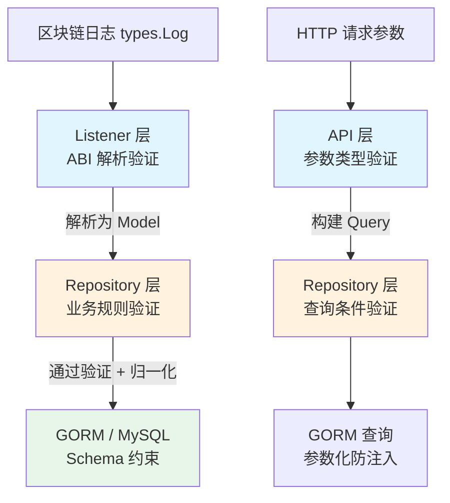
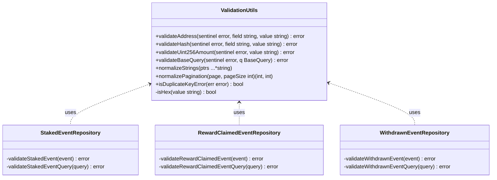
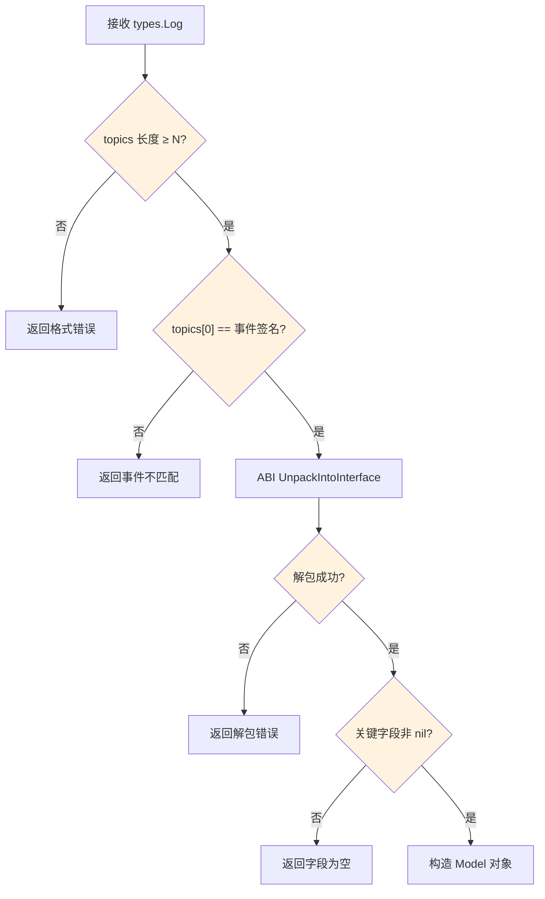
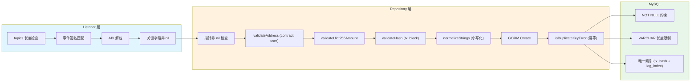

本页面详细剖析 Stake 后端项目中数据验证与规范化的完整体系。项目采用**多层防御策略**，在数据生命周期的每个关键节点（ABI 解析、仓库写入、API 查询）设置独立验证关卡，并通过集中的工具函数库保障一致性与可维护性。

## 验证体系全景

项目的数据验证并非集中在单一位置，而是分布在三个架构层中，每一层针对不同类型的无效数据进行拦截：



**第一层（Listener）**：从原始链上日志中提取数据时进行结构校验——验证 topics 数量、事件签名匹配、ABI 解包结果非空。**第二层（Repository）**：在写入数据库前执行完整的业务规则验证——地址格式、哈希格式、金额范围。**第三层（GORM Schema）**：通过结构体标签定义数据库约束（字段长度、非空、唯一索引），作为最后的兜底防线。

Sources: [common.go](internal/repository/common.go#L1-L147), [staked_event_handler.go](internal/listener/staked_event_handler.go#L1-L104), [staked_event_repository.go](internal/repository/staked_event_repository.go#L1-L137)

## 集中化验证工具库

项目将所有通用验证逻辑集中在 `internal/repository/common.go` 中，为五种事件类型的仓库提供统一的校验原语：

| 验证函数 | 校验内容 | 错误信息示例 |
|---------|---------|------------|
| `validateAddress` | 使用 `common.IsHexAddress()` 校验 42 字符以太坊地址 | `contract_address must be a valid hex address` |
| `validateHash` | 校验长度为 66、`0x` 前缀、剩余 64 字符均为十六进制 | `tx_hash must be a 32-byte hex string` |
| `validateUint256Amount` | 十进制字符串 → 解析为 `big.Int` → 非负 + 不超过 256 位 | `amount exceeds uint256` |
| `validateBaseQuery` | ID 非负、ContractAddress/TxHash 格式、BlockNumber 范围合理性 | `block_number_from must not be greater than block_number_to` |



以 `validateUint256Amount` 为例，它执行三重检查：先尝试用 `big.Int.SetString` 将十进制字符串解析为大整数，失败则说明格式非法；再检查 `Sign() < 0` 排除负数；最后检查 `BitLen() > 256` 确保不超过 uint256 上限。这种设计避免了浮点数精度损失，直接以字符串形式在链上数据与数据库之间传递大数值。

Sources: [common.go](internal/repository/common.go#L88-L113), [common.go](internal/repository/common.go#L115-L129)

## 哨兵错误模式

每种事件类型都定义了自己的**哨兵错误（Sentinel Error）**，用于区分验证失败的来源，同时也支撑 API 层的 HTTP 状态码映射：

```go
// 每个仓库文件顶部都定义了一对错误
var (
    ErrInvalidStakedEvent  = errors.New("invalid staked event")
    ErrStakedEventNotFound = errors.New("staked event not found")
)
```

所有验证函数都接受一个 `sentinel error` 参数，在 `fmt.Errorf("%w: ...")` 中将其作为根因包装。API 层的 `respondRepositoryError` 函数通过 `errors.Is` 判断错误类型，将验证失败映射为 `400 Bad Request`，记录未找到映射为 `404 Not Found`，其余映射为 `500 Internal Server Error`：

| 错误类型 | HTTP 状态码 | 触发场景 |
|---------|-----------|---------|
| `ErrInvalid*Event` 系列 | 400 | 地址格式错误、金额超限、哈希格式非法 |
| `Err*EventNotFound` 系列 | 404 | 按 ID 查询不存在的记录 |
| 其他错误 | 500 | 数据库连接失败等内部错误 |

Sources: [staked_event_repository.go](internal/repository/staked_event_repository.go#L13-L16), [common.go](internal/api/common.go#L42-L60)

## 事件级验证函数的统一模式

五种事件类型各自实现了**完全对称**的验证函数。以 `StakedEvent` 和 `MinStakeAmountUpdatedEvent` 的对比为例，两者遵循相同结构，但字段校验项目因事件 ABI 签名不同而异：

| 验证项 | StakedEvent | RewardClaimedEvent | WithdrawnEvent | MinStakeAmountUpdatedEvent | RewardRateUpdatedEvent |
|-------|------------|-------------------|---------------|--------------------------|----------------------|
| `validateAddress` contract_address | ✓ | ✓ | ✓ | ✓ | ✓ |
| `validateAddress` user | ✓ | ✓ | ✓ | — | — |
| `validateUint256Amount` amount | ✓ | ✓ | ✓ | — | — |
| `validateUint256Amount` old/new | — | — | — | ✓ (old + new) | ✓ (old + new) |
| `validateHash` tx_hash | ✓ | ✓ | ✓ | ✓ | ✓ |
| `validateHash` block_hash | ✓ | ✓ | ✓ | ✓ | ✓ |
| 用户地址查询验证 | ✓ | ✓ | ✓ | — | — |

对比代码可以发现，`validateStakedEvent` 和 `validateRewardClaimedEvent` 的实现几乎完全相同（仅哨兵错误不同），而 `validateMinStakeAmountUpdatedEvent` 没有 `user` 字段校验，多了 `OldAmount` + `NewAmount` 两个 uint256 校验。这种**模板化但不强行抽象**的设计，在保持代码一致性的同时避免了过度工程化。

Sources: [staked_event_repository.go](internal/repository/staked_event_repository.go#L108-L125), [reward_claimed_event_repository.go](internal/repository/reward_claimed_event_repository.go#L108-L125), [min_stake_amount_updated_event_repository.go](internal/repository/min_stake_amount_updated_event_repository.go#L91-L112)

## 数据规范化策略

验证确保数据"正确"，规范化则确保数据"一致"。项目实施了两种关键的规范化操作：

**字符串小写化**。以太坊地址和交易哈希在链上可能以 mixed-case 形式出现（如 EIP-55 校验和地址），但数据库存储和查询时统一转为小写。`normalizeStrings` 函数接受任意数量的 `*string` 指针，就地将值转为小写。在 `Create` 方法中，`ContractAddress`、`User`、`TxHash`、`BlockHash` 四个字段在验证通过后立即被规范化：

```go
normalizeStrings(&event.ContractAddress, &event.User, &event.TxHash, &event.BlockHash)
```

查询时同样应用小写化——`applyBaseQuery` 中对 `ContractAddress` 和 `TxHash` 使用 `strings.ToLower()`，`applyQuery` 中对 `User` 字段也做同样处理。这确保了无论输入大小写如何，都能命中数据库中的记录。

**分页参数归一化**。`normalizePagination` 函数将分页参数约束在合理范围内：`page` 和 `pageSize` 的默认值分别为 1 和 20，`pageSize` 上限为 100。无论客户端传入 0、负数还是超大值，都会被自动修正，避免了异常查询和潜在的资源耗尽风险。

Sources: [common.go](internal/repository/common.go#L131-L137), [common.go](internal/repository/common.go#L23-L35), [staked_event_repository.go](internal/repository/staked_event_repository.go#L95-L100)

## Listener 层的 ABI 验证

在数据进入仓库层之前，Listener 层的事件处理器已经完成了第一道验证关卡。每种事件处理器的 `parseLog` 方法遵循相同的校验流程：



不同事件类型的 topics 最低长度要求不同：`Staked` 和 `RewardClaimed` 需要至少 2 个 topic（1 个事件签名 + 1 个 indexed user 地址），`MinStakeAmountUpdated` 和 `RewardRateUpdated` 仅需 1 个 topic（无 indexed 参数）。这种校验在 ABI 解包之前完成，避免了无效数据进入以太坊 ABI 解码器。

值得注意的是，Listener 层**不做格式层面的校验**（如地址是否合法、金额是否溢出），这些校验被推迟到 Repository 层——符合**关注点分离**原则，Listener 专注于链上日志解析，Repository 专注于业务规则执行。

Sources: [staked_event_handler.go](internal/listener/staked_event_handler.go#L72-L103), [min_stake_amount_updated_event_handler.go](internal/listener/min_stake_amount_updated_event_handler.go#L72-L104), [reward_claimed_event_handler.go](internal/listener/reward_claimed_event_handler.go#L72-L103)

## 幂等写入与重复键处理

区块链事件监听天然面临重复投递的风险（节点重连、区块回放等场景）。项目的 `Create` 方法在验证和规范化之后，通过 `isDuplicateKeyError` 函数捕获 MySQL 的唯一键冲突错误（`gorm.ErrDuplicatedKey`），将其静默忽略而非视为错误：

```go
if err := r.db.WithContext(ctx).Create(event).Error; err != nil {
    if isDuplicateKeyError(err) {
        return nil  // 幂等：重复插入视为成功
    }
    return fmt.Errorf("create staked event tx_hash=%s log_index=%d: %w", event.TxHash, event.LogIndex, err)
}
```

这种设计的基石是每种事件表都定义了 `tx_hash` + `log_index` 的复合唯一索引（`uniqueIndex`），在 GORM Schema 和数据库层面提供了最终保障。结合 Listener 层的事件回放机制（详见[事件监听与回放机制](8-shi-jian-jian-ting-yu-hui-fang-ji-zhi)），构成了完整的幂等性保证。

Sources: [staked_event_repository.go](internal/repository/staked_event_repository.go#L82-L100), [common.go](internal/repository/common.go#L139-L141)

## GORM Schema 约束

结构体标签定义了数据库级别的约束，作为验证体系的最后一道防线：

| 字段类型 | 标签示例 | 约束含义 |
|---------|---------|---------|
| 以太坊地址 | `gorm:"type:varchar(42);not null"` | 42 字符上限（含 0x 前缀），非空 |
| uint256 金额 | `gorm:"type:varchar(78);not null;comment:uint256 decimal string"` | 78 字符上限（2^256 的十进制长度），非空 |
| 交易哈希 | `gorm:"type:varchar(66);not null;uniqueIndex:..."` | 66 字符（含 0x），参与唯一索引 |
| 区块号 | `gorm:"not null;index:..."` | 非空，参与联合索引 |
| 时间戳 | `gorm:"autoCreateTime"` | GORM 自动填充创建时间 |

唯一的例外是 `Contract` 模型使用 `gorm:"size:42"` 而非 `gorm:"type:varchar(42)"`——两者在 MySQL 中效果相同，但 `size` 是 GORM 的跨数据库方言写法，`type` 是数据库特定写法。事件模型使用了两种写法的混合，这不影响功能，但体现了代码由不同阶段编写。

Sources: [event.go](internal/models/event.go#L17-L35), [contract.go](internal/models/contract.go#L1-L10)

## 数据流中的完整验证路径

将上述各层串联起来，一次完整的数据写入经历了以下验证路径：



查询方向则走另一条路径：API 层将原始查询字符串解析为 Go 类型（`parseOptionalInt64`、`parseOptionalUint64Pointer` 等），然后 Repository 层的 `validate<Event>EventQuery` 和 `validateBaseQuery` 对查询条件做格式校验，最后通过 `applyBaseQuery` / `applyQuery` 构建参数化 SQL 查询，天然防御 SQL 注入。