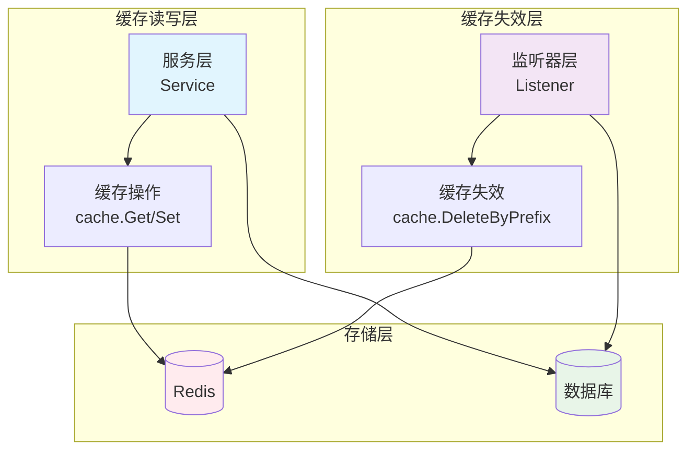
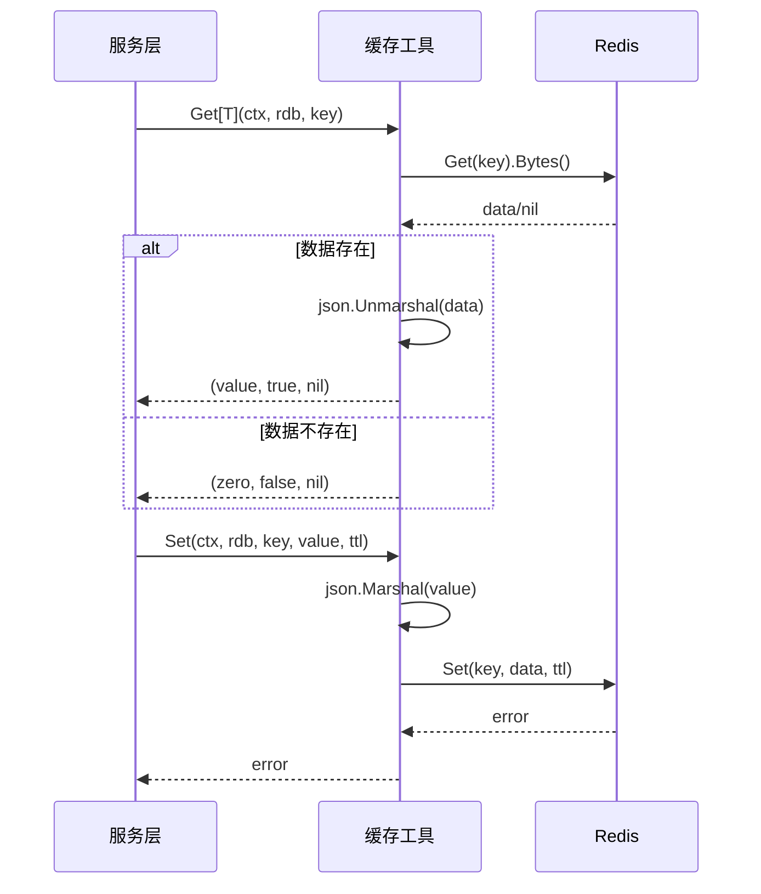
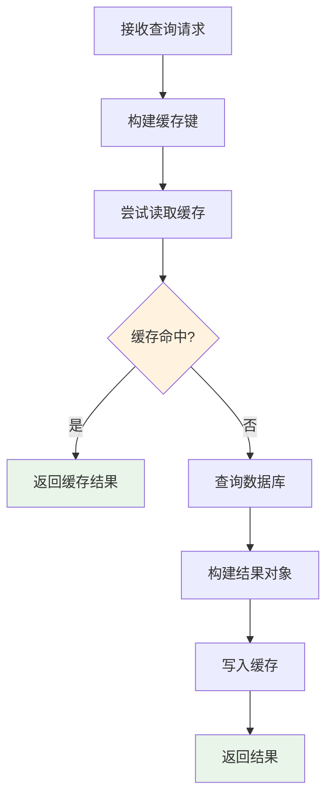
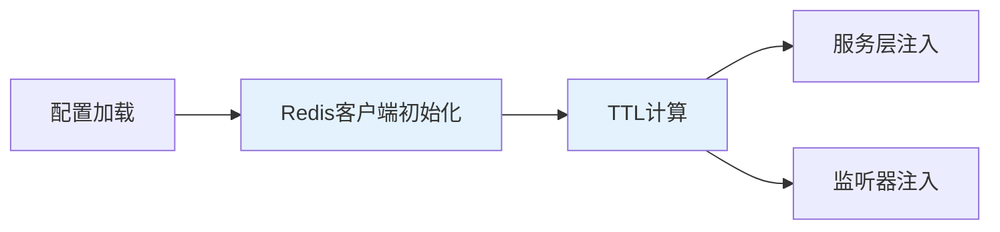

本文档详细介绍了基于 Redis 的缓存策略设计，旨在通过减少数据库查询频率来提升查询性能。缓存系统采用**读写分离**模式，在服务层实现缓存读写，在监听层实现缓存失效，构建了一个完整的缓存生命周期管理机制。

## 缓存架构概览

Redis 缓存系统采用经典的**Cache-Aside**模式，服务层作为缓存的主要读写方，事件监听器作为缓存失效的触发方。这种设计将缓存逻辑与业务逻辑解耦，同时保证了数据一致性。



Sources: [main.go](main.go#L58-L75), [internal/cache/cache.go](internal/cache/cache.go#L1-L82)

## 缓存工具层设计

缓存工具层提供了一系列泛型和非泛型函数，封装了 Redis 的常见操作。核心设计原则是**类型安全**和**错误处理**。

### 缓存读写操作

缓存工具层使用 Go 泛型实现类型安全的缓存读取，同时提供带 TTL 的缓存写入功能：



**关键实现**：
- **泛型读取**：`Get[T]` 函数返回类型化的缓存值，避免了类型断言的运行时开销
- **错误隔离**：Redis Nil 错误被特殊处理，返回 `false` 而不是错误，简化了上层调用逻辑
- **JSON 序列化**：所有缓存值都以 JSON 格式存储，确保了跨语言兼容性

```go
// Get 从 Redis 读取并反序列化缓存值。命中返回 (value, true, nil)。
func Get[T any](ctx context.Context, rdb *redis.Client, key string) (T, bool, error) {
    var zero T
    data, err := rdb.Get(ctx, key).Bytes()
    if err != nil {
        if err == redis.Nil {
            return zero, false, nil
        }
        return zero, false, fmt.Errorf("cache get %s: %w", key, err)
    }
    // ...
}
```

Sources: [internal/cache/cache.go](internal/cache/cache.go#L15-L31)

### 缓存键设计

缓存键采用**事件类型 + 查询参数哈希**的格式，确保相同查询参数生成相同的键，同时避免键冲突：

```go
// BuildListKey 根据事件类型和查询参数生成缓存 key。
// 格式："{eventType}:list:{md5(json)}"
func BuildListKey(eventType string, query any) string {
    data, err := json.Marshal(query)
    // ...
    hash := md5.Sum(data)
    return fmt.Sprintf("%s:list:%x", eventType, hash)
}
```

**键格式示例**：
- `staked:list:a1b2c3d4e5f6...`
- `withdrawn:list:7890abcdef12...`
- `reward_claimed:list:3456789012...`

**设计优势**：
1. **确定性**：相同查询参数总是生成相同的键（通过MD5哈希）
2. **隔离性**：不同事件类型的缓存完全隔离
3. **可读性**：键前缀便于监控和调试
4. **安全性**：MD5哈希避免了键长度限制和特殊字符问题

Sources: [internal/cache/cache.go](internal/cache/cache.go#L72-L81), [internal/cache/cache_test.go](internal/cache/cache_test.go#L7-L51)

## 缓存使用模式

### 服务层缓存读写

服务层采用**Cache-Aside**模式，在查询数据库前先检查缓存，缓存未命中时才查询数据库，并将结果写入缓存：



**实现示例**：

```go
func (s *StakedEventService) List(ctx context.Context, query repository.StakedEventQuery) (*StakedEventListResult, error) {
    key := cache.BuildListKey("staked", query)
    
    // 尝试读缓存
    if result, ok, err := cache.Get[StakedEventListResult](ctx, s.rdb, key); err == nil && ok {
        return &result, nil
    } else if err != nil {
        log.Printf("cache get staked list: %v", err)
    }
    
    // 查数据库
    events, total, err := s.repo.List(ctx, query)
    if err != nil {
        return nil, err
    }
    
    result := &StakedEventListResult{
        Items:    events,
        Total:    total,
        Page:     query.Page,
        PageSize: query.PageSize,
    }
    
    // 写缓存
    if err := cache.Set(ctx, s.rdb, key, result, s.cacheTTL); err != nil {
        log.Printf("cache set staked list: %v", err)
    }
    
    return result, nil
}
```

**关键特点**：
1. **错误容忍**：缓存读取失败不会中断业务流程，而是降级到数据库查询
2. **日志记录**：缓存操作错误被记录但不抛出，确保系统稳定性
3. **TTL管理**：缓存写入时带TTL，防止数据永久驻留

Sources: [internal/service/staked_event_service.go](internal/service/staked_event_service.go#L41-L70)

### 事件监听层缓存失效

当新事件被写入数据库时，监听器会主动清除相关缓存，确保下次查询能获取最新数据：

```go
func (h *StakedEventLogHandler) Handle(ctx context.Context, eventLog types.Log) error {
    // 解析并保存事件到数据库
    event, err := h.parseLog(eventLog)
    if err != nil {
        return err
    }
    if err := h.repo.Create(ctx, event); err != nil {
        return err
    }
    
    // 清除相关缓存
    if err := cache.DeleteByPrefix(ctx, h.rdb, "staked:list:"); err != nil {
        log.Printf("cache delete staked list prefix: %v", err)
    }
    
    return nil
}
```

**缓存失效策略**：
- **前缀删除**：使用 `DeleteByPrefix` 清除所有以 `{eventType}:list:` 为前缀的缓存
- **异步处理**：缓存删除失败只记录日志，不影响事件处理流程
- **即时生效**：确保下次查询立即获取最新数据

Sources: [internal/listener/staked_event_handler.go](internal/listener/staked_event_handler.go#L59-L73)

## 缓存配置管理

Redis 缓存配置通过 YAML 配置文件进行管理，支持灵活的参数调整：

### 配置参数

| 参数 | 类型 | 默认值 | 说明 |
|------|------|--------|------|
| `addr` | string | `localhost:3306` | Redis 服务器地址 |
| `password` | string | `123` | Redis 密码 |
| `db` | int | `0` | Redis 数据库编号 |
| `cache_ttl` | int | `60` | 缓存过期时间（秒） |

**配置示例**：
```yaml
redis:
  addr: localhost:6379
  password: ""
  db: 0
  cache_ttl: 300  # 5分钟
```

Sources: [config.yaml.sample](config.yaml.sample#L13-L16), [internal/config/config.go](internal/config/config.go#L30-L35)

### 初始化流程

Redis 客户端和缓存 TTL 在应用启动时初始化，并传递给需要缓存的组件：



**关键代码**：
```go
// 3.初始化Redis连接
redisClient := redis.NewClient(&redis.Options{
    Addr:     cfg.Redis.Addr,
    Password: cfg.Redis.Password,
    DB:       cfg.Redis.DB,
})

// 计算缓存 TTL
cacheTTL := time.Duration(cfg.Redis.CacheTTL) * time.Second
if cacheTTL <= 0 {
    cacheTTL = 60 * time.Second
}
```

Sources: [main.go](main.go#L58-L75)

## 缓存性能优化

### SCAN 与 DEL 组合

缓存删除采用 **SCAN + DEL** 组合模式，避免在大量缓存键时阻塞 Redis：

```go
func DeleteByPrefix(ctx context.Context, rdb *redis.Client, prefix string) error {
    var cursor uint64
    for {
        keys, nextCursor, err := rdb.Scan(ctx, cursor, prefix+"*", 100).Result()
        if err != nil {
            return fmt.Errorf("cache scan %s: %w", prefix, err)
        }
        
        if len(keys) > 0 {
            if err := rdb.Del(ctx, keys...).Err(); err != nil {
                return fmt.Errorf("cache del %s: %w", prefix, err)
            }
        }
        
        cursor = nextCursor
        if cursor == 0 {
            break
        }
    }
    
    return nil
}
```

**性能特点**：
1. **非阻塞**：SCAN 命令不会阻塞 Redis 服务器
2. **批量处理**：每次扫描 100 个键，平衡内存和性能
3. **游标遍历**：使用游标迭代，适合大规模键空间

Sources: [internal/cache/cache.go](internal/cache/cache.go#L47-L69)

### 缓存键设计优化

缓存键设计考虑了以下性能因素：

| 设计决策 | 性能影响 | 说明 |
|----------|----------|------|
| MD5哈希 | 高性能 | 固定长度，计算快速 |
| 前缀命名 | 易于管理 | 便于监控和批量操作 |
| 事件类型隔离 | 减少冲突 | 避免不同事件类型间的键冲突 |
| 查询参数序列化 | 确定性 | 相同查询参数总是生成相同键 |

## 缓存监控与调试

### 缓存命中率监控

建议通过 Redis 的 `INFO stats` 命令监控缓存命中率：

```bash
# 监控缓存命中率
redis-cli INFO stats | grep -E "keyspace_hits|keyspace_misses"
```

**关键指标**：
- `keyspace_hits`：缓存命中次数
- `keyspace_misses`：缓存未命中次数
- 命中率 = hits / (hits + misses)

### 缓存键调试

缓存键的格式便于调试和监控：

```bash
# 查看所有缓存键
redis-cli KEYS "*list:*"

# 查看特定事件类型的缓存
redis-cli KEYS "staked:list:*"

# 监控缓存键数量
redis-cli DBSIZE
```

## 最佳实践

### 缓存策略选择

| 场景 | 推荐策略 | 原因 |
|------|----------|------|
| 读多写少 | Cache-Aside | 简单高效，适合大多数场景 |
| 写密集型 | Write-Through | 保证数据一致性 |
| 实时性要求高 | Write-Behind | 异步写入，提高写入性能 |

### TTL 设置建议

| 数据类型 | 建议TTL | 说明 |
|----------|---------|------|
| 列表查询 | 60-300秒 | 平衡性能和实时性 |
| 统计数据 | 30-60秒 | 需要较新数据 |
| 配置信息 | 较长 | 变化不频繁 |

### 错误处理策略

1. **缓存读取失败**：降级到数据库查询，记录警告日志
2. **缓存写入失败**：记录错误日志，不影响业务流程
3. **缓存删除失败**：记录错误日志，确保数据一致性

## 扩展与维护

### 添加新事件类型的缓存支持

1. **服务层**：在对应的 Service 中实现缓存读写逻辑
2. **监听器层**：在事件处理器中添加缓存失效逻辑
3. **缓存键设计**：遵循 `{eventType}:list:{md5(query)}` 格式

### 缓存预热策略

对于热点数据，可以考虑启动时预热缓存：

```go
// 启动时预热缓存
func warmUpCache(ctx context.Context, rdb *redis.Client, cacheTTL time.Duration) {
    // 预热常用查询
    queries := []StakedEventQuery{
        {Page: 1, PageSize: 20},
        {Page: 1, PageSize: 50},
    }
    
    for _, query := range queries {
        key := BuildListKey("staked", query)
        // 查询数据库并缓存
    }
}
```

## 相关文档

- [缓存失效机制](17-huan-cun-shi-xiao-ji-zhi) - 了解缓存失效的详细机制
- [查询性能优化](18-cha-xun-xing-neng-you-hua) - 了解查询性能优化策略
- [REST API设计规范](19-rest-apishe-ji-gui-fan) - 了解API接口设计
- [四层架构设计](7-si-ceng-jia-gou-she-ji) - 了解整体架构设计