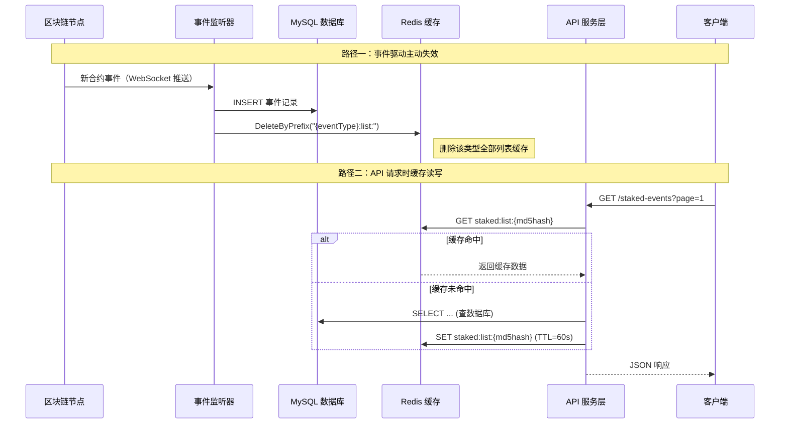
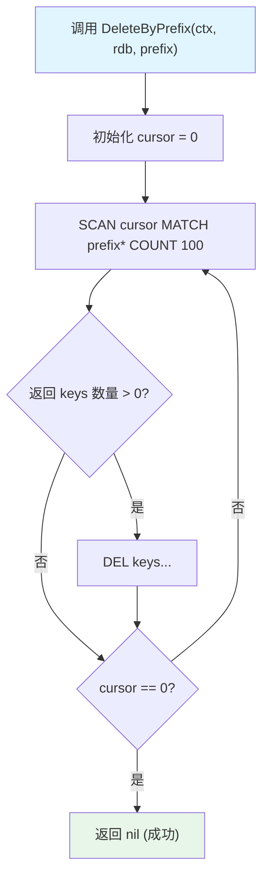
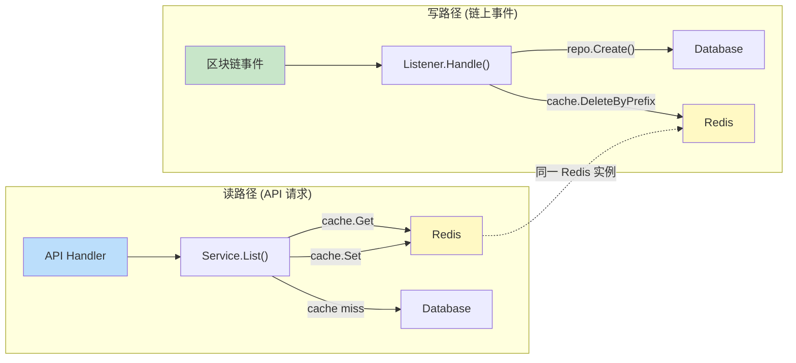

本页深入剖析项目中 Redis 缓存的双层失效策略——**TTL 自然过期**与**事件驱动主动失效**——如何在保证数据新鲜度的同时最小化数据库压力。面向高级开发者，我们将从设计决策到实现细节逐层展开。

## 失效策略总览：TTL + 事件驱动双保险

项目采用经典的 **Cache-Aside（旁路缓存）** 模式，并在写入端叠加**前缀批量失效**机制。缓存失效由两条独立路径触发，二者互为补充：

- **被动失效（TTL 过期）**：每个缓存条目在写入时附带一个可配置的 TTL（默认 60 秒），Redis 在过期后自动清除。这是一道兜底防线，确保即使事件处理链路出现异常，数据最终也会在 TTL 窗口内刷新。
- **主动失效（事件驱动）**：当区块链事件监听器捕获到新事件并成功写入数据库后，立即通过 `SCAN + DEL` 删除该事件类型对应前缀下的所有缓存键。这保证了在事件落地后，下一次 API 查询必定命中数据库最新数据。



Sources: [listener/staked_event_handler.go](internal/listener/staked_event_handler.go#L74-L77), [service/staked_event_service.go](internal/service/staked_event_service.go#L43-L68), [cache/cache.go](internal/cache/cache.go#L43-L62)

## 缓存键设计与前缀命名规范

缓存键采用 **`{eventType}:list:{md5(query)}`** 的三段式命名，兼顾了可读性与唯一性。`BuildListKey` 函数将查询参数结构体序列化为 JSON 后取 MD5 哈希，确保相同参数组合始终生成相同的键，而不同参数（如分页、过滤条件）则产生不同的键。

| 事件类型 | 缓存键前缀 | 键示例 | 失效前缀模式 |
|----------|------------|--------|--------------|
| Staked | `staked:list:` | `staked:list:a1b2c3d4...` | `staked:list:*` |
| Withdrawn | `withdrawn:list:` | `withdrawn:list:e5f6a7b8...` | `withdrawn:list:*` |
| RewardClaimed | `reward-claimed:list:` | `reward-claimed:list:c9d0e1f2...` | `reward-claimed:list:*` |
| RewardRateUpdated | `reward-rate-updated:list:` | `reward-rate-updated:list:1234abcd...` | `reward-rate-updated:list:*` |
| MinStakeAmountUpdated | `min-stake-amount-updated:list:` | `min-stake-amount-updated:list:5678ef01...` | `min-stake-amount-updated:list:*` |

这种设计有两个关键优势：**第一**，每种事件类型的缓存完全隔离，一种类型的写入不会影响其他类型的缓存命中率；**第二**，前缀模式 `"{eventType}:list:*"` 使得批量失效只需一次 `SCAN` 操作即可清除该类型下所有查询变体的缓存。

Sources: [cache/cache.go](internal/cache/cache.go#L64-L82), [cache/cache_test.go](internal/cache/cache_test.go#L10-L52)

## 主动失效：DeleteByPrefix 的 SCAN + DEL 机制

`DeleteByPrefix` 是缓存主动失效的核心实现。它采用 Redis 的 **SCAN 游标迭代**命令（而非 `KEYS`），在生产环境中避免了阻塞 Redis 主线程的风险。实现逻辑是：以 100 为批次，通过 SCAN 游标遍历所有匹配前缀的键，每收集到一批就执行 `DEL` 批量删除，直到游标回到 0。



这里的设计取舍值得深入理解：**使用 SCAN 而非 KEYS** 是因为 `KEYS` 命令会遍历整个 keyspace，在键数量较大时会造成 Redis 短暂不可用（O(N) 复杂度且阻塞）。SCAN 通过游标分批返回结果，将 O(N) 操作拆分为多次 O(1) 调用，对 Redis 性能影响可控。`COUNT 100` 参数是一个提示值，控制每次迭代扫描的桶数量。

**在实际调用点**，每种事件类型的监听器在 `Handle` 方法中都遵循完全一致的模式：先执行 `repo.Create()` 将事件写入数据库，成功后立即调用 `cache.DeleteByPrefix()` 清除该事件类型的所有列表缓存。这种 **"先写库、后删缓存"** 的顺序是 Cache-Aside 模式的标准实践，确保了缓存中不会残留已过期的数据。

Sources: [cache/cache.go](internal/cache/cache.go#L43-L62), [listener/staked_event_handler.go](internal/listener/staked_event_handler.go#L74-L77), [listener/withdrawn_event_handler.go](internal/listener/withdrawn_event_handler.go#L74-L77), [listener/reward_claimed_event_handler.go](internal/listener/reward_claimed_event_handler.go#L74-L77), [listener/reward_rate_updated_event_handler.go](internal/listener/reward_rate_updated_event_handler.go#L74-L77), [listener/min_stake_amount_updated_event_handler.go](internal/listener/min_stake_amount_updated_event_handler.go#L74-L77)

## 被动失效：TTL 过期与配置管理

TTL 过期作为缓存失效的兜底机制，通过 `config.yaml` 中的 `redis.cache_ttl` 字段进行配置，单位为秒，默认值 60。配置值在启动时由 `config.Load()` 读取，经过 `main.go` 中的时间转换后注入到每个 Service 实例：

```go
cacheTTL := time.Duration(cfg.Redis.CacheTTL) * time.Second
if cacheTTL <= 0 {
    cacheTTL = 60 * time.Second
}
```

TTL 的选择需要在**数据新鲜度**与**缓存命中率**之间权衡。对于本项目——一个链上事件索引服务——60 秒的默认 TTL 意味着在没有新事件到达时，相同查询在 1 分钟内可以直接从 Redis 返回结果，大幅降低数据库的重复查询压力。而当新事件到来时，主动失效机制会立即清除缓存，使得 TTL 窗口内的数据过期问题被有效缩短。

**容错设计**方面，所有缓存操作都采用"尽力而为"策略：缓存读取失败时降级查询数据库，缓存写入失败时仅记录警告日志，`DeleteByPrefix` 失败时也不阻塞事件处理流程。这意味着即使 Redis 完全不可用，系统仍能正常工作——只是所有请求都会穿透到数据库。

Sources: [config/config.go](internal/config/config.go#L24-L28), [config.yaml.sample](config.yaml.sample#L11-L15), [main.go](main.go#L76-L80)

## 事件类型与前缀映射一致性分析

五种事件类型在缓存失效实现上保持了严格的对称性。每种事件类型都有三个关键映射点必须保持一致：**Service 层的 `BuildListKey` 调用**、**Listener 层的 `DeleteByPrefix` 调用**，以及它们使用的**前缀字符串**。以下是完整的映射关系表：

| 事件类型 | BuildListKey eventType | DeleteByPrefix 前缀 | 数据结构后缀 |
|----------|------------------------|---------------------|-------------|
| Staked | `"staked"` | `"staked:list:"` | `StakedEventListResult` |
| Withdrawn | `"withdrawn"` | `"withdrawn:list:"` | `WithdrawnListResult` |
| RewardClaimed | `"reward-claimed"` | `"reward-claimed:list:"` | `RewardClaimedListResult` |
| RewardRateUpdated | `"reward-rate-updated"` | `"reward-rate-updated:list:"` | `RewardRateUpdatedListResult` |
| MinStakeAmountUpdated | `"min-stake-amount-updated"` | `"min-stake-amount-updated:list:"` | `MinStakeAmountUpdatedListResult` |

**一致性约束**：如果 `BuildListKey` 使用的 eventType 与 `DeleteByPrefix` 使用的前缀不匹配（例如一个是 `"staked"` 而另一个是 `"StakedEvent"`），将导致写入端的缓存失效无法清除读取端缓存的键，造成**缓存脏读**。当前实现通过硬编码字符串保持一致，这是一个务实但脆弱的方案——在[添加新事件类型指南](22-tian-jia-xin-shi-jian-lei-xing-zhi-nan)中需要特别注意这一点。

Sources: [service/staked_event_service.go](internal/service/staked_event_service.go#L43), [listener/staked_event_handler.go](internal/listener/staked_event_handler.go#L75), [service/withdrawn_event_service.go](internal/service/withdrawn_event_service.go#L43), [listener/withdrawn_event_handler.go](internal/listener/withdrawn_event_handler.go#L75), [service/reward_claimed_event_service.go](internal/service/reward_claimed_event_service.go#L43), [listener/reward_claimed_event_handler.go](internal/listener/reward_claimed_event_handler.go#L75)

## 架构分层：缓存职责在 Service 与 Listener 之间的分布

缓存逻辑的分布遵循**读写分离原则**：Service 层负责缓存的读取和写入（读路径），Listener 层负责缓存的失效（写路径）。这种分布与项目的四层架构设计([四层架构设计](7-si-ceng-jia-gou-she-ji))紧密契合。



这种设计的优势在于：**读路径的缓存逻辑是自包含的**——Service 层不需要知道 Listener 的存在，只需在查询时检查缓存；**写路径的失效逻辑也是独立的**——Listener 层不需要知道有哪些缓存键存在，只需按前缀批量清除。两者通过共享的 Redis 实例和统一的前缀命名规范进行隐式协调。

值得注意的是，`GetByID`（单条记录查询）**不使用缓存**。这是因为单条记录查询的开销远低于列表查询（通常走主键索引），缓存的收益不足以抵消其引入的复杂性。同时，单条记录的失效粒度更细，前缀删除方案不适用。

Sources: [service/staked_event_service.go](internal/service/staked_event_service.go#L43-L68), [listener/staked_event_handler.go](internal/listener/staked_event_handler.go#L65-L79), [api/staked_event_handler.go](internal/api/staked_event_handler.go#L41-L51)

## 边界场景与潜在风险

在高并发或网络异常场景下，当前的缓存失效机制存在一些值得关注的边界行为：

**事件回放期间的缓存风暴**。当服务启动时，`ContractEventListener` 会回放从 `lastBlock` 到链上最新区块之间的所有历史事件（[事件监听与回放机制](8-shi-jian-jian-ting-yu-hui-fang-ji-zhi)）。回放过程中，每个事件都会触发 `DeleteByPrefix`，但此时 API 服务可能还未启动或尚未有客户端请求。回放完成后，首批 API 请求将全部穿透到数据库，这属于冷启动场景的正常行为。

**SCAN 的非原子性**。`DeleteByPrefix` 使用 SCAN 迭代删除，在 SCAN 过程中新写入的缓存键可能被遗漏。但由于"先写库后删缓存"的顺序保证，遗漏的缓存键最多只会在 TTL 窗口内存在，随后自然过期。对于本项目 60 秒的 TTL 而言，这个时间窗口是可以接受的。

**无单条记录级失效**。当前实现只支持按事件类型前缀批量删除，不支持根据特定用户或合约地址进行精细粒度的缓存失效。例如，一个用户质押了新代币后，所有用户的质押列表查询缓存都会被清除。这是设计上的有意简化——考虑到事件频率和缓存重建成本，全量失效比精确失效的实现复杂度低得多，且不会造成正确性问题。

Sources: [listener/contract_event_listener.go](internal/listener/contract_event_listener.go#L97-L127), [cache/cache.go](internal/cache/cache.go#L43-L62), [config.yaml.sample](config.yaml.sample#L11-L15)

## 下一步

- 若需了解缓存写入端的读取-回填策略与缓存键构建细节，请参阅 [Redis缓存策略](16-redishuan-cun-ce-lue)
- 若需了解列表查询在缓存之上的分页、排序优化，请参阅 [查询性能优化](18-cha-xun-xing-neng-you-hua)
- 若需为新事件类型添加缓存支持（保持前缀一致性），请参阅 [添加新事件类型指南](22-tian-jia-xin-shi-jian-lei-xing-zhi-nan)