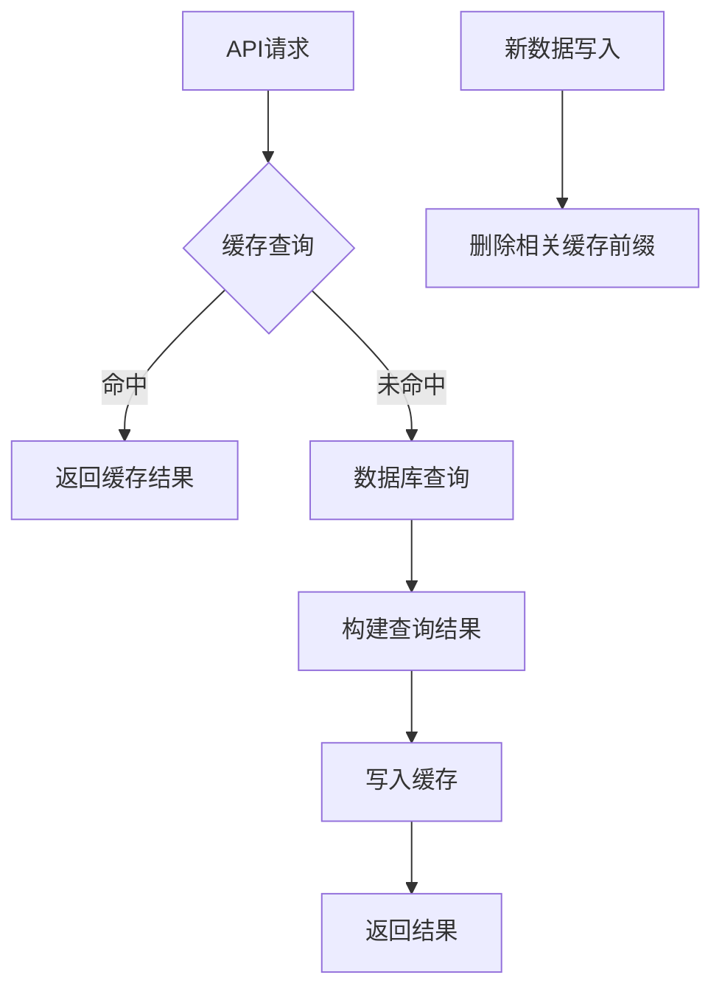
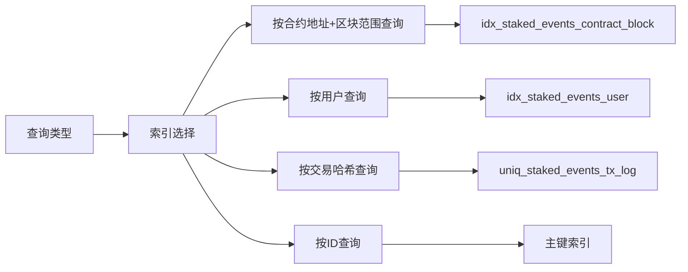

本文档详细介绍了test-stake-backend项目中的查询性能优化策略，包括数据库查询优化、缓存机制、索引设计和查询参数处理等方面。这些优化策略旨在提高系统响应速度，减少数据库负载，并确保在高并发场景下的稳定性能。

## 多层缓存架构设计

项目采用了基于Redis的多层缓存架构，通过读写分离策略显著提升查询性能。缓存层位于服务层与数据访问层之间，对API查询结果进行缓存，减少数据库访问频率。

缓存架构的核心是`internal/cache/cache.go`文件，它实现了三个关键函数：`Get`、`Set`和`DeleteByPrefix`。`Get`函数采用泛型设计，支持从Redis中读取并反序列化缓存值，当缓存命中时返回`(value, true, nil)`。`Set`函数将值序列化为JSON格式并存储到Redis，支持设置TTL（生存时间）。`DeleteByPrefix`函数通过`SCAN`命令批量删除匹配指定前缀的缓存键，避免了使用`KEYS`命令可能带来的性能问题。

缓存键的生成策略是性能优化的关键。`BuildListKey`函数根据事件类型和查询参数生成唯一的缓存键，格式为`"{eventType}:list:{md5(json)}"`。这种设计确保相同查询参数总是映射到相同的缓存键，而不同查询参数则产生不同的缓存键，实现了精确的缓存命中。

Sources: [cache.go](internal/cache/cache.go#L1-L82)

## 缓存失效机制与一致性保障

缓存失效机制是确保数据一致性的关键环节。项目采用写入时失效（Write-Through）策略，当新数据写入数据库时，立即清除相关的缓存前缀，确保后续查询能够获取最新数据。

每个事件监听器处理器（如`internal/listener/staked_event_handler.go`）在成功创建事件记录后，都会调用`cache.DeleteByPrefix`函数清除对应的缓存前缀。例如，Staked事件处理器会清除以`"staked:list:"`为前缀的所有缓存键。这种基于前缀的失效策略比逐个键失效更高效，特别是在查询参数组合复杂的情况下。

缓存TTL的配置通过`config.yaml`中的`redis.cache_ttl`参数控制，默认值为60秒。这个时间窗口平衡了数据新鲜度和缓存命中率，既避免了频繁的数据库查询，又确保数据在合理时间内更新。当缓存TTL设置为0或负数时，系统自动使用60秒作为默认值，保证了系统的健壮性。

Sources: [staked_event_handler.go](internal/listener/staked_event_handler.go#L60-L80), [config.yaml.sample](config.yaml.sample#L15-L16)

## 数据库索引优化策略

数据库索引设计是查询性能优化的基础。项目在模型定义中精心设计了复合索引和唯一索引，以支持常见的查询模式。

以StakedEvent模型为例，它定义了三个关键索引：`idx_staked_events_contract_block`（复合索引，包含contract_address和block_number）、`idx_staked_events_user`（用户索引）和`uniq_staked_events_tx_log`（唯一索引，包含tx_hash和log_index）。这些索引设计基于实际查询场景：按合约地址和区块范围查询、按用户查询、按交易哈希查询。

复合索引的字段顺序经过优化，将高选择性字段放在前面。例如，`idx_staked_events_contract_block`索引将contract_address放在前面，因为按合约地址过滤通常能大幅减少结果集。唯一索引不仅确保了数据完整性，还避免了重复事件的插入，提高了数据一致性。

Sources: [event.go](internal/models/event.go#L30-L50)

## 查询参数处理与分页优化

查询参数的处理和分页策略对查询性能有重要影响。项目实现了标准化的查询参数处理流程，包括参数验证、规范化和分页限制。

`BaseQuery`结构体定义了所有事件查询的公共过滤条件，包括ID、ContractAddress、TxHash、BlockNumberFrom、BlockNumberTo、Page和PageSize。`validateBaseQuery`函数对这些参数进行严格验证，确保参数的合法性和一致性。例如，它验证区块范围的逻辑关系（BlockNumberFrom不能大于BlockNumberTo），避免无效查询。

分页参数通过`normalizePagination`函数进行标准化处理。默认页面大小为20，最大页面大小限制为100。这种限制防止了客户端请求过大的数据集，避免了内存溢出和性能下降的风险。分页参数的处理遵循防御性编程原则，确保在任何输入情况下都能返回合理的结果。

查询条件的应用采用了链式调用模式，`applyBaseQuery`函数将BaseQuery中的条件动态添加到gorm.DB查询构建器中。这种设计避免了复杂的条件判断逻辑，提高了代码的可维护性和可读性。

Sources: [common.go](internal/repository/common.go#L1-L147), [staked_event_handler.go](internal/api/staked_event_handler.go#L50-L88)

## 服务层缓存集成模式

服务层是缓存集成的关键层，它实现了缓存读取、数据库查询和缓存写入的完整流程。以`StakedEventService`为例，其List方法展示了典型的缓存集成模式。

首先，服务通过`cache.BuildListKey`生成缓存键，确保相同查询参数总是映射到相同的缓存键。然后，尝试从Redis缓存中读取结果，如果缓存命中则直接返回，避免了数据库查询。如果缓存未命中，则执行数据库查询，构建查询结果，并将结果写入缓存。

缓存写入采用异步日志记录模式，如果缓存写入失败，系统会记录错误日志但不会影响主流程。这种设计确保了即使在缓存服务不可用的情况下，系统仍能正常响应请求，提供了良好的容错能力。

服务层还负责构建标准化的响应结构，如`StakedEventListResult`，它包含items、total、page和page_size字段，为前端提供了完整的分页信息。这种标准化响应格式简化了前端的数据处理逻辑。

Sources: [staked_event_service.go](internal/service/staked_event_service.go#L30-L70)

## 查询验证与规范化策略

查询验证和规范化是性能优化的前置环节，它们确保只有合法的查询才能到达数据库层，避免了无效查询对数据库的负载。

查询验证采用分层策略：API层验证基本的参数格式，服务层验证业务逻辑，仓库层验证数据完整性。例如，API层通过`parseOptionalInt`、`parseOptionalInt64`等函数验证参数类型；服务层验证查询参数的业务逻辑；仓库层通过`validateStakedEventQuery`等函数验证数据格式和约束。

地址和哈希字符串的规范化是性能优化的重要细节。所有地址和哈希字符串在存储和查询前都被转换为小写格式，通过`normalizeStrings`函数实现。这种规范化确保了查询的一致性，避免了因大小写差异导致的查询失败或性能下降。

数据验证函数如`validateAddress`、`validateHash`和`validateUint256Amount`提供了严格的格式检查，确保只有符合区块链数据格式的数据才能进入系统。这种前置验证避免了无效数据对查询性能的影响。

Sources: [common.go](internal/repository/common.go#L50-L100), [staked_event_handler.go](internal/api/staked_event_handler.go#L60-L88)

## 数据库连接与配置优化

数据库连接配置对查询性能有直接影响。项目使用GORM作为ORM框架，通过MySQL驱动连接数据库。虽然代码中没有显式配置连接池参数，但GORM默认使用合理的连接池设置。

数据库连接字符串包含`charset=utf8mb4&parseTime=True&loc=Local`参数，确保了字符集和时间处理的一致性。GORM的命名策略配置了表前缀`t_`和单数表名，简化了表名映射。

Redis连接配置通过`redis.NewClient`创建，支持地址、密码和数据库编号的配置。连接在应用关闭时通过`defer`语句确保正确关闭，避免了连接泄漏。

配置管理通过`config.Load`函数实现，使用Viper库从`config.yaml`文件读取配置。这种配置外部化的方式使得性能参数可以在不修改代码的情况下进行调整，提高了系统的可维护性。

Sources: [main.go](main.go#L40-L50), [config.go](internal/config/config.go#L1-L60)

## 性能优化最佳实践总结

基于项目代码分析，总结出以下查询性能优化最佳实践：

1. **分层缓存策略**：采用Redis作为缓存层，通过MD5哈希生成缓存键，实现精确的缓存命中和失效。

2. **写入时失效机制**：在数据写入时立即清除相关缓存前缀，确保数据一致性，避免脏读。

3. **复合索引设计**：根据查询模式设计复合索引，将高选择性字段放在前面，优化查询性能。

4. **分页限制与验证**：设置合理的分页参数限制，验证查询参数的合法性，避免无效查询。

5. **字符串规范化**：统一地址和哈希字符串的格式，确保查询的一致性。

6. **防御性编程**：在缓存不可用时提供降级方案，确保系统在异常情况下仍能正常运行。

7. **配置外部化**：将性能相关参数外部化配置，便于在不修改代码的情况下进行调优。

这些优化策略共同构成了一个高效的查询性能优化体系，确保系统在处理大量区块链事件数据时能够保持稳定的响应速度和良好的可扩展性。

Sources: [cache.go](internal/cache/cache.go#L1-L82), [event.go](internal/models/event.go#L1-L93), [common.go](internal/repository/common.go#L1-L147)

## 下一步阅读建议

了解了查询性能优化策略后，建议继续阅读以下相关文档：

- [Redis缓存策略](16-redishuan-cun-ce-lue) - 深入了解Redis缓存的具体实现细节和配置选项
- [缓存失效机制](17-huan-cun-shi-xiao-ji-zhi) - 探索缓存失效的完整机制和一致性保障
- [数据库模型设计](13-shu-ju-ku-mo-xing-she-ji) - 了解数据库表结构和索引设计原理
- [通用查询参数处理](20-tong-yong-cha-xun-can-shu-chu-li) - 掌握查询参数的解析和验证机制