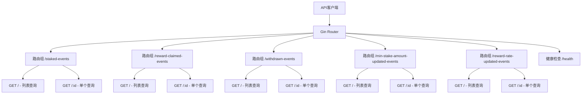

本文档详细阐述test-stake-backend项目的REST API设计规范，包括路由组织、端点设计、查询参数、分页机制、错误处理和响应格式等核心规范。这些规范确保了API的一致性、可预测性和易用性，为前端开发者和第三方集成提供清晰的接口契约。

## 路由组织架构

项目采用Gin框架构建REST API，通过`RegisterRoutes`函数统一注册所有路由。路由注册遵循**依赖注入**原则，在`main.go`中初始化数据库和Redis连接后，将依赖注入到各个处理器中。

路由架构采用**分组路由**模式，每种合约事件类型拥有独立的路由组前缀。当前系统包含五类事件API：质押事件（staked-events）、奖励领取事件（reward-claimed-events）、提款事件（withdrawn-events）、最小质押金额更新事件（min-stake-amount-updated-events）和奖励利率更新事件（reward-rate-updated-events）。



Sources: [router.go](internal/api/router.go#L17-L81), [main.go](main.go#L128-L131)

## 端点设计模式

每个事件资源遵循统一的**RESTful端点设计模式**，提供两个标准端点：

1. **列表查询端点**：`GET /{resource}` - 支持多种过滤条件和分页查询
2. **单个查询端点**：`GET /{resource}/:id` - 根据ID获取单个事件详情

这种设计遵循了**资源导向**的REST原则，每个事件类型都是一个独立的资源，具有统一的访问模式。所有端点都支持**内容协商**，默认返回JSON格式数据。

| 端点类型 | HTTP方法 | 路径模式 | 功能描述 | 参数来源 |
|---------|---------|---------|---------|---------|
| 列表查询 | GET | `/{resource}` | 获取事件列表，支持过滤和分页 | 查询字符串 |
| 单个查询 | GET | `/{resource}/:id` | 获取单个事件详情 | 路径参数 |
| 健康检查 | GET | `/health` | 服务健康状态检查 | 无 |

Sources: [staked_event_handler.go](internal/api/staked_event_handler.go#L22-L25), [reward_claimed_event_handler.go](internal/api/reward_claimed_event_handler.go#L22-L25)

## 查询参数规范

查询参数分为**公共参数**和**资源特定参数**两类。公共参数适用于所有事件类型，提供了通用的过滤和分页能力。

### 公共查询参数

| 参数名 | 类型 | 必填 | 默认值 | 描述 | 验证规则 |
|--------|------|------|--------|------|----------|
| `id` | int64 | 否 | 0 | 事件ID过滤 | 正整数 |
| `contract_address` | string | 否 | 空 | 合约地址过滤 | 有效的以太坊地址（42字符十六进制） |
| `tx_hash` | string | 否 | 空 | 交易哈希过滤 | 66字符十六进制字符串（0x前缀） |
| `block_number_from` | uint64 | 否 | nil | 起始区块号 | 无符号整数，不能大于block_number_to |
| `block_number_to` | uint64 | 否 | nil | 结束区块号 | 无符号整数 |
| `page` | int | 否 | 1 | 页码 | 正整数 |
| `page_size` | int | 否 | 20 | 每页数量 | 1-100之间的正整数 |

### 资源特定参数

不同事件类型可能支持额外的特定参数。例如，质押事件、奖励领取事件和提款事件都支持`user`参数来过滤特定用户的事件。

参数解析采用**宽松验证**策略：可选参数缺失时返回零值，格式错误时返回400状态码和明确的错误信息。地址和哈希参数会自动转换为小写进行存储和查询。

Sources: [common.go](internal/api/common.go#L13-L55), [repository/common.go](internal/repository/common.go#L15-L35)

## 分页机制实现

分页机制采用**基于页码**的分页模式，支持客户端指定页码和每页数量。系统实现了以下分页规范：

1. **默认值**：page=1，page_size=20
2. **最大限制**：page_size最大值为100，防止过大的数据请求
3. **自动归一化**：非法值（如page=0、page_size=-1）会被自动修正为默认值
4. **排序策略**：列表查询默认按`block_number DESC, log_index DESC`排序，确保最新的事件优先显示

分页响应包含完整的元数据，帮助客户端构建分页导航：

```json
{
  "items": [...],
  "total": 150,
  "page": 2,
  "page_size": 20
}
```

分页参数的验证在repository层统一处理，通过`normalizePagination`函数确保参数始终在有效范围内。

Sources: [repository/common.go](internal/repository/common.go#L15-L28), [staked_event_service.go](internal/service/staked_event_service.go#L45-L50)

## 错误处理与响应格式

系统实现了统一的错误处理机制，遵循HTTP状态码语义规范。错误响应采用标准化的JSON格式：

### 错误响应格式

```json
{
  "error": "错误描述信息"
}
```

### HTTP状态码映射

| 状态码 | 使用场景 | 示例错误 |
|--------|----------|----------|
| 200 | 成功响应 | 正常数据返回 |
| 400 | 客户端请求错误 | 参数格式错误、验证失败 |
| 404 | 资源不存在 | ID对应的事件未找到 |
| 500 | 服务器内部错误 | 未预期的系统错误 |

错误处理采用**分层映射**策略：在handler层捕获参数解析错误，返回400状态码；在repository层定义业务错误（如`ErrStakedEventNotFound`），通过`respondRepositoryError`函数映射到对应的HTTP状态码；未预期的错误统一返回500状态码。

Sources: [common.go](internal/api/common.go#L57-L76), [staked_event_handler.go](internal/api/staked_event_handler.go#L35-L40)

## 响应数据结构

API响应采用**一致的结构化数据格式**，列表查询和单个查询有不同的响应结构。

### 列表查询响应

```json
{
  "items": [
    {
      "id": 1,
      "contract_address": "0x...",
      "user": "0x...",
      "amount": "1000000000000000000",
      "tx_hash": "0x...",
      "block_number": 12345,
      "log_index": 0,
      "block_hash": "0x...",
      "inserted_at": "2024-01-01T00:00:00Z"
    }
  ],
  "total": 100,
  "page": 1,
  "page_size": 20
}
```

### 单个查询响应

```json
{
  "id": 1,
  "contract_address": "0x...",
  "user": "0x...",
  "amount": "1000000000000000000",
  "tx_hash": "0x...",
  "block_number": 12345,
  "log_index": 0,
  "block_hash": "0x...",
  "inserted_at": "2024-01-01T00:00:00Z"
}
```

数据模型遵循**区块链事件标准**，包含交易哈希、区块号、日志索引等区块链特有字段。金额字段使用**字符串表示的uint256十进制值**，避免JavaScript大数精度问题。

Sources: [models/event.go](internal/models/event.go#L30-L43), [staked_event_service.go](internal/service/staked_event_service.go#L15-L20)

## 缓存集成策略

API层与缓存层紧密集成，在service层实现透明的缓存机制。缓存策略基于**查询参数**生成缓存键，相同查询条件的请求会命中缓存。

缓存TTL（生存时间）通过配置文件设置，默认为60秒。缓存键的生成考虑了所有查询参数，确保不同查询条件的缓存隔离。缓存操作失败不会影响正常请求处理，系统会记录日志并继续查询数据库。

这种设计实现了**读透缓存**模式：先查缓存，缓存未命中则查数据库，查询结果写入缓存。

Sources: [staked_event_service.go](internal/service/staked_event_service.go#L36-L43), [config.yaml.sample](config.yaml.sample#L10-L11)

## API使用示例

### 基础查询示例

```bash
# 获取质押事件列表（默认分页）
GET /staked-events

# 获取特定用户的质押事件
GET /staked-events?user=0x1234...

# 获取特定区块范围的事件
GET /staked-events?block_number_from=10000&block_number_to=20000

# 分页查询
GET /staked-events?page=2&page_size=10

# 获取单个事件详情
GET /staked-events/123
```

### 错误处理示例

```bash
# 参数格式错误
GET /staked-events?id=abc
# 响应: 400 {"error": "id must be an integer"}

# 资源不存在
GET /staked-events/999999
# 响应: 404 {"error": "staked event not found: id=999999"}
```

## 设计原则总结

test-stake-backend的REST API设计遵循以下核心原则：

1. **一致性**：所有事件类型采用相同的端点模式和参数规范
2. **可预测性**：遵循RESTful标准和HTTP语义
3. **安全性**：参数验证、错误处理和分页限制保护系统稳定性
4. **性能**：缓存集成和数据库查询优化确保响应速度
5. **可扩展性**：模块化设计便于添加新的事件类型API

这些规范为前端开发者和第三方集成提供了清晰、可靠的接口契约，确保了系统的长期可维护性和易用性。

Sources: [router.go](internal/api/router.go#L17-L81), [common.go](internal/api/common.go#L1-L76), [repository/common.go](internal/repository/common.go#L1-L147)

## 下一步阅读

了解REST API设计规范后，建议继续阅读以下相关文档：

- [通用查询参数处理](20-tong-yong-cha-xun-can-shu-chu-li) - 深入了解查询参数的解析和处理机制
- [错误处理与响应格式](21-cuo-wu-chu-li-yu-xiang-ying-ge-shi) - 详细了解错误处理策略和响应格式规范
- [四层架构设计](7-si-ceng-jia-gou-she-ji) - 理解API层在整个系统架构中的位置和作用