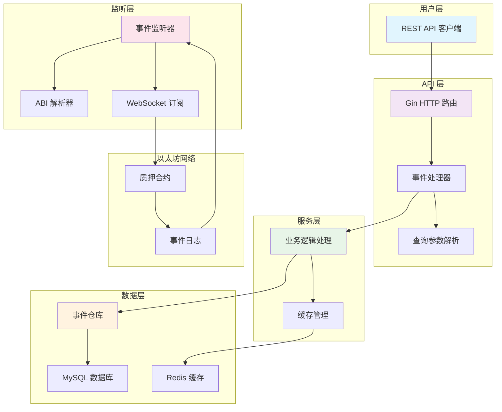

本指南将帮助您快速搭建和运行 Stake Backend 项目，这是一个以太坊质押合约事件监听后端服务。通过 WebSocket 连接以太坊节点，实时监听并回放质押合约事件，持久化到 MySQL，并提供 REST API 查询。无论您是区块链开发者还是后端工程师，都能在 10 分钟内启动服务并体验核心功能。

## 环境准备与系统要求

在开始之前，请确保您的开发环境满足以下要求：

| 组件 | 要求 | 说明 |
|------|------|------|
| **Go** | 1.26+ | 推荐使用最新稳定版本 |
| **MySQL** | 5.7+ | 用于存储事件数据 |
| **Redis** | 任意版本 | 用于缓存查询结果 |
| **以太坊节点** | 支持 WebSocket | 推荐使用 Infura 或 Alchemy 的测试网节点 |

**操作系统兼容性**：本项目支持 macOS、Linux 和 Windows（WSL2）。以下步骤以 macOS/Linux 为例，Windows 用户请参考相应包管理器。

**安装依赖工具**（如果尚未安装）：

```bash
# macOS (Homebrew)
brew install go mysql redis

# Ubuntu/Debian
sudo apt update
sudo apt install golang mysql-server redis-server

# 或者使用 Docker 运行 MySQL 和 Redis（推荐）
docker run -d --name mysql -e MYSQL_ROOT_PASSWORD=root -p 3306:3306 mysql:8.0
docker run -d --name redis -p 6379:6379 redis:7-alpine
```

Sources: [go.mod](go.mod#L1-L83), [README.md](README.md#L1-L154)

## 项目获取与配置

### 第一步：获取项目代码

```bash
# 克隆项目仓库
git clone <repo-url>
cd test-stake-backend

# 下载 Go 依赖
go mod download
```

项目使用 Go Modules 管理依赖，所有依赖将在 `go.sum` 中记录。主要依赖包括：
- **go-ethereum**：以太坊客户端库
- **Gin**：高性能 HTTP 框架
- **GORM**：ORM 库，支持 MySQL
- **Viper**：配置管理
- **go-redis**：Redis 客户端

Sources: [go.mod](go.mod#L1-L83), [README.md](README.md#L20-L30)

### 第二步：配置文件设置

复制示例配置文件并修改为您的环境配置：

```bash
cp config.yaml.sample config.yaml
```

使用文本编辑器打开 `config.yaml`，根据您的环境修改以下关键配置：

```yaml
server:
  host: localhost
  port: 8080
  mode: debug          # debug 模式便于开发调试

database:
  host: 127.0.0.1      # MySQL 主机地址
  port: 3306           # MySQL 端口
  username: root       # 数据库用户名
  password: root       # 数据库密码
  dbname: stake        # 数据库名称

redis:
  addr: localhost:6379 # Redis 地址
  password: ""         # Redis 密码（空表示无密码）
  db: 0                # Redis 数据库编号
  cache_ttl: 60        # 缓存过期时间（秒）

eth:
  rpc_url: https://sepolia.infura.io/v3/YOUR_KEY    # RPC 节点 URL
  ws_url: wss://sepolia.infura.io/ws/v3/YOUR_KEY   # WebSocket 节点 URL
  stake_address: 0x...  # 质押合约地址（必须是有效的以太坊地址）
  start_block: 10986812 # 合约部署区块号（必须准确）
```

**重要提示**：
1. `start_block` 必须设置为质押合约部署时的区块号，这用于历史事件回放
2. `ws_url` 必须支持 WebSocket 连接，用于实时事件监听
3. 确保 MySQL 和 Redis 服务已启动并可访问

Sources: [config.yaml.sample](config.yaml.sample#L1-L22), [internal/config/config.go](internal/config/config.go#L1-L60)

## 服务启动与运行

### 第一步：构建项目

```bash
# 构建可执行文件
go build -o bin/server .
```

构建成功后，将在 `bin/` 目录下生成 `server` 可执行文件。

### 第二步：启动服务

```bash
# 运行服务
./bin/server
```

服务启动后，您将看到类似以下日志输出：

```
server started on localhost:8080
contract event listener started: contract=0x... handlers=5
replay completed: blocks 10986812 -> 12345678
```

**服务启动流程**：
1. **配置加载**：读取 `config.yaml` 配置文件
2. **数据库初始化**：连接 MySQL 并自动迁移表结构（表名前缀 `t_`）
3. **Redis 连接**：建立 Redis 连接用于缓存
4. **以太坊连接**：建立 RPC 和 WebSocket 连接
5. **事件监听启动**：从 `start_block` 开始回放历史事件，然后切换到实时订阅
6. **HTTP 服务启动**：在配置的端口启动 REST API 服务

Sources: [main.go](main.go#L1-L175), [internal/listener/contract_event_listener.go](internal/listener/contract_event_listener.go#L1-L216)

## API 接口测试

服务启动后，您可以通过以下方式测试 API 接口：

### 健康检查

```bash
curl http://localhost:8080/health
# 响应：{"status":"ok"}
```

### 查询事件列表

```bash
# 查询质押事件列表（默认分页）
curl "http://localhost:8080/staked-events"

# 查询特定用户的质押事件
curl "http://localhost:8080/staked-events?user=0x..."

# 查询特定区块范围的事件
curl "http://localhost:8080/staked-events?block_number_from=10986812&block_number_to=11000000"

# 自定义分页参数
curl "http://localhost:8080/staked-events?page=2&page_size=10"
```

### 查询单个事件

```bash
# 按 ID 查询单个事件
curl http://localhost:8080/staked-events/1
```

### 所有可用 API 接口

| 方法 | 路径 | 说明 | 支持参数 |
|------|------|------|----------|
| GET | `/health` | 健康检查 | 无 |
| GET | `/staked-events` | 质押事件列表 | page, page_size, contract_address, user, tx_hash, block_number_from, block_number_to |
| GET | `/staked-events/:id` | 按 ID 查询质押事件 | 无 |
| GET | `/reward-claimed-events` | 奖励领取事件列表 | page, page_size, contract_address, user, tx_hash, block_number_from, block_number_to |
| GET | `/reward-claimed-events/:id` | 按 ID 查询奖励领取事件 | 无 |
| GET | `/withdrawn-events` | 提取事件列表 | page, page_size, contract_address, user, tx_hash, block_number_from, block_number_to |
| GET | `/withdrawn-events/:id` | 按 ID 查询提取事件 | 无 |
| GET | `/min-stake-amount-updated-events` | 最低质押金额变更事件列表 | page, page_size, contract_address, tx_hash, block_number_from, block_number_to |
| GET | `/min-stake-amount-updated-events/:id` | 按 ID 查询最低质押金额变更事件 | 无 |
| GET | `/reward-rate-updated-events` | 奖励费率变更事件列表 | page, page_size, contract_address, tx_hash, block_number_from, block_number_to |
| GET | `/reward-rate-updated-events/:id` | 按 ID 查询奖励费率变更事件 | 无 |

**通用查询参数**：
- `page`：页码，默认 1
- `page_size`：每页条数，默认 20，最大 100
- `contract_address`：合约地址过滤
- `tx_hash`：交易哈希过滤
- `block_number_from`：起始区块号
- `block_number_to`：结束区块号
- `user`：用户地址过滤（仅限 Staked、RewardClaimed、Withdrawn 事件）

Sources: [README.md](README.md#L60-L90), [internal/api/router.go](internal/api/router.go#L1-L82), [internal/api/common.go](internal/api/common.go#L1-L76)

## 项目架构概览

Stake Backend 采用四层架构设计，职责清晰，易于扩展：



**架构分层说明**：
1. **API 层**：处理 HTTP 请求，参数验证，响应格式化
2. **服务层**：业务逻辑处理，缓存策略，事务管理
3. **数据层**：数据库访问，缓存操作，数据持久化
4. **监听层**：以太坊事件监听，ABI 解析，历史回放

**数据流**：
1. 以太坊合约发出事件 → 2. WebSocket 订阅接收 → 3. ABI 解析提取数据 → 4. 数据库存储 → 5. 缓存更新 → 6. API 查询返回

Sources: [main.go](main.go#L1-L175), [internal/listener/contract_event_listener.go](internal/listener/contract_event_listener.go#L1-L216), [internal/api/router.go](internal/api/router.go#L1-L82)

## 项目目录结构

```
test-stake-backend/
├── main.go                          # 应用入口，依赖注入和启动
├── config.yaml.sample               # 配置示例文件
├── go.mod                           # Go 模块依赖管理
├── go.sum                           # 依赖校验文件
├── internal/
│   ├── abi/                         # 合约 ABI 定义
│   │   ├── Stake.abi.json           # 质押合约 ABI
│   │   └── abi.go                   # ABI 加载工具
│   ├── api/                         # HTTP API 层
│   │   ├── router.go                # 路由注册
│   │   ├── common.go                # 通用工具函数
│   │   └── *_event_handler.go       # 各事件处理器
│   ├── config/                      # 配置管理
│   │   └── config.go                # 配置加载和解析
│   ├── listener/                    # 事件监听层
│   │   ├── contract_event_listener.go # 核心监听器
│   │   └── *_event_handler.go       # 各事件解析器
│   ├── models/                      # 数据模型
│   │   ├── contract.go              # 合约同步状态
│   │   └── event.go                 # 五类事件模型
│   ├── repository/                  # 数据访问层
│   │   ├── common.go                # 通用查询逻辑
│   │   ├── contract_repository.go   # 合约状态管理
│   │   └── *_event_repository.go    # 各事件仓库
│   └── service/                     # 业务逻辑层
│       └── *_event_service.go       # 各事件服务
```

**关键文件说明**：
- `main.go`：应用启动入口，负责依赖注入和组件初始化
- `internal/listener/contract_event_listener.go`：核心监听器，负责事件订阅和回放
- `internal/api/router.go`：API 路由注册，定义所有 REST 接口
- `internal/models/event.go`：五类事件的数据模型定义

Sources: [README.md](README.md#L95-L154), [目录结构分析](.)

## 常见问题排查

### 1. 数据库连接失败
```
错误：failed to connect database
解决：检查 MySQL 服务是否启动，配置文件中的数据库连接信息是否正确
```

### 2. Redis 连接失败
```
错误：Failed to close redis
解决：检查 Redis 服务是否启动，配置文件中的 Redis 地址是否正确
```

### 3. 以太坊节点连接失败
```
错误：Failed to connect ETH client
解决：检查 RPC URL 是否正确，网络是否可达，API 密钥是否有效
```

### 4. 事件监听无数据
```
可能原因：
1. start_block 设置不正确，不是合约部署区块
2. 合约地址配置错误
3. WebSocket URL 不支持实时订阅
4. 网络问题导致订阅断开
```

### 5. API 返回空数据
```
可能原因：
1. 事件监听尚未开始或未完成历史回放
2. 查询参数不正确
3. 数据库中没有对应事件数据
```

## 下一步探索

完成快速上手后，建议您按以下顺序深入探索：

1. **[环境配置](3-huan-jing-yao-qiu-yu-an-zhuang)** - 详细了解环境要求和安装细节
2. **[配置文件详解](4-pei-zhi-wen-jian-xiang-jie)** - 深入理解每个配置项的作用
3. **[启动与运行服务](5-qi-dong-yu-yun-xing-fu-wu)** - 学习服务管理和监控
4. **[API接口测试](6-apijie-kou-ce-shi)** - 掌握 API 高级用法和测试技巧

**架构深入**：
- **[四层架构设计](7-si-ceng-jia-gou-she-ji)** - 理解整体架构设计思想
- **[事件监听与回放机制](8-shi-jian-jian-ting-yu-hui-fang-ji-zhi)** - 掌握核心监听逻辑
- **[数据流处理流程](9-shu-ju-liu-chu-li-liu-cheng)** - 了解数据从链上到 API 的完整流程

**扩展开发**：
- **[添加新事件类型指南](22-tian-jia-xin-shi-jian-lei-xing-zhi-nan)** - 学习如何扩展新的事件类型
- **[测试与调试策略](23-ce-shi-yu-diao-shi-ce-lue)** - 掌握项目测试和调试方法

通过系统学习，您将能够完全掌握 Stake Backend 的架构设计、实现细节和扩展方法。