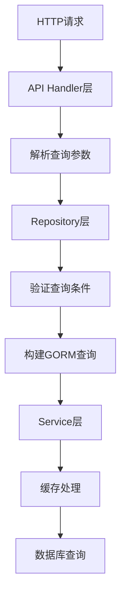
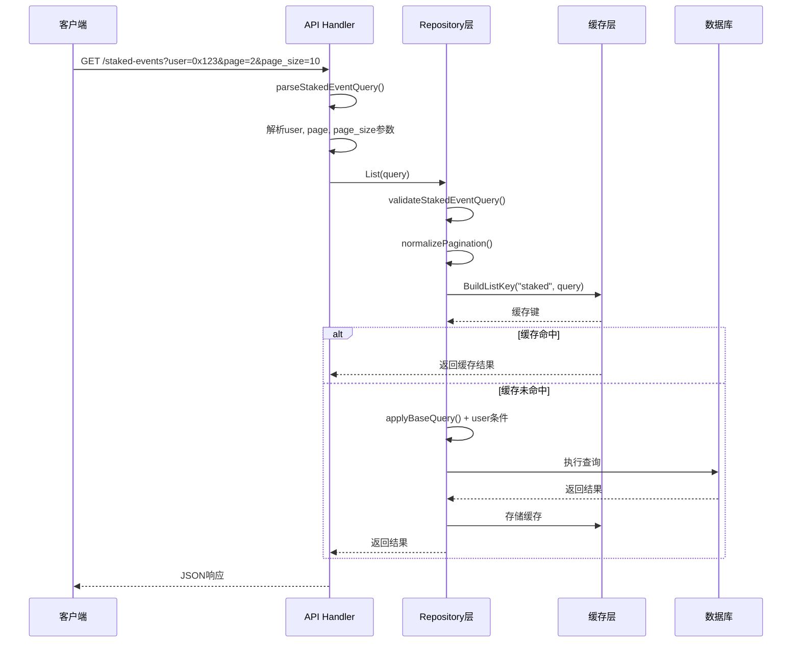

本文档详细介绍了项目中REST API的通用查询参数处理机制。该系统采用分层架构设计，将HTTP查询参数解析、验证和数据库查询条件构建分离，实现了统一且可扩展的查询处理流程。

## 查询参数解析架构

项目采用了清晰的三层架构来处理查询参数：API层负责HTTP参数解析，Repository层负责查询验证和条件构建，Service层负责缓存集成。这种设计确保了参数处理的一致性和可维护性。



Sources: [common.go](internal/api/common.go#L1-L76), [staked_event_repository.go](internal/repository/staked_event_repository.go#L30-L33)

## 通用查询参数定义

系统为所有事件类型定义了统一的通用查询参数，这些参数在`BaseQuery`结构体中封装。所有事件查询都继承这些基础参数，确保查询行为的一致性。

| 参数名 | 类型 | 必需 | 说明 | 示例值 |
|--------|------|------|------|--------|
| `id` | int64 | 否 | 事件ID精确匹配 | `123` |
| `contract_address` | string | 否 | 合约地址精确匹配 | `0x1234...` |
| `tx_hash` | string | 否 | 交易哈希精确匹配 | `0xabcd...` |
| `block_number_from` | uint64 | 否 | 区块号起始范围（包含） | `1000000` |
| `block_number_to` | uint64 | 否 | 区块号结束范围（包含） | `2000000` |
| `page` | int | 否 | 页码（默认1） | `1` |
| `page_size` | int | 否 | 每页大小（默认20，最大100） | `50` |

Sources: [common.go](internal/repository/common.go#L35-L43), [common.go](internal/repository/common.go#L13-L17)

## 参数解析工具函数

在API层，项目提供了专门的参数解析工具函数来处理不同类型的可选参数。这些函数遵循统一的错误处理模式，确保参数解析的可靠性。

```go
// parseOptionalInt 解析可选的整数参数
func parseOptionalInt(c *gin.Context, key string) (int, error) {
    value := c.Query(key)
    if value == "" {
        return 0, nil
    }
    parsed, err := strconv.Atoi(value)
    if err != nil {
        return 0, errors.New(key + " must be an integer")
    }
    return parsed, nil
}

// parseOptionalInt64 解析可选的64位整数参数
func parseOptionalInt64(c *gin.Context, key string) (int64, error) {
    // 类似实现
}

// parseOptionalUint64Pointer 解析可选的无符号64位整数参数（返回指针）
func parseOptionalUint64Pointer(c *gin.Context, key string) (*uint64, error) {
    // 类似实现
}
```

这些函数的关键设计特点包括：
1. **可选参数处理**：当参数为空时返回零值或nil，不报错
2. **类型安全转换**：使用`strconv`包进行安全的类型转换
3. **友好的错误信息**：错误消息包含参数名称，便于调试
4. **指针返回**：对于范围查询参数，返回指针以区分"未提供"和"值为0"

Sources: [common.go](internal/api/common.go#L12-L52)

## 查询参数验证机制

Repository层实现了严格的查询参数验证机制，确保查询条件的合法性和安全性。验证过程分为两个层次：基础验证和事件特定验证。

### 基础查询验证

`validateBaseQuery`函数对所有通用查询参数进行验证：

```go
func validateBaseQuery(sentinel error, q BaseQuery) error {
    // 1. ID不能为负数
    if q.ID < 0 {
        return fmt.Errorf("%w: id must not be negative", sentinel)
    }
    
    // 2. 合约地址必须是有效的十六进制地址
    if q.ContractAddress != "" {
        if err := validateAddress(sentinel, "contract_address", q.ContractAddress); err != nil {
            return err
        }
    }
    
    // 3. 交易哈希必须是有效的32字节十六进制字符串
    if q.TxHash != "" {
        if err := validateHash(sentinel, "tx_hash", q.TxHash); err != nil {
            return err
        }
    }
    
    // 4. 区块号范围验证
    if q.BlockNumberFrom != nil && q.BlockNumberTo != nil && *q.BlockNumberFrom > *q.BlockNumberTo {
        return fmt.Errorf("%w: block_number_from must not be greater than block_number_to", sentinel)
    }
    
    return nil
}
```

### 事件特定验证

每个事件类型可以在基础验证之上添加特定的验证规则。例如，包含`user`字段的事件需要验证用户地址：

```go
func validateStakedEventQuery(query StakedEventQuery) error {
    // 先进行基础验证
    if err := validateBaseQuery(ErrInvalidStakedEvent, query.BaseQuery); err != nil {
        return err
    }
    
    // 验证用户地址（如果提供）
    if query.User != "" {
        if err := validateAddress(ErrInvalidStakedEvent, "user", query.User); err != nil {
            return err
        }
    }
    
    return nil
}
```

Sources: [common.go](internal/repository/common.go#L46-L65), [staked_event_repository.go](internal/repository/staked_event_repository.go#L125-L136)

## 查询条件构建

验证通过后，系统将查询参数转换为GORM查询条件。`applyBaseQuery`函数负责构建通用的查询条件：

```go
func applyBaseQuery(db *gorm.DB, q BaseQuery) *gorm.DB {
    // 精确匹配ID
    if q.ID > 0 {
        db = db.Where("id = ?", q.ID)
    }
    
    // 合约地址匹配（自动转换为小写）
    if q.ContractAddress != "" {
        db = db.Where("contract_address = ?", strings.ToLower(q.ContractAddress))
    }
    
    // 交易哈希匹配（自动转换为小写）
    if q.TxHash != "" {
        db = db.Where("tx_hash = ?", strings.ToLower(q.TxHash))
    }
    
    // 区块号范围查询
    if q.BlockNumberFrom != nil {
        db = db.Where("block_number >= ?", *q.BlockNumberFrom)
    }
    if q.BlockNumberTo != nil {
        db = db.Where("block_number <= ?", *q.BlockNumberTo)
    }
    
    return db
}
```

**关键设计决策**：
1. **地址规范化**：所有地址字段自动转换为小写，确保查询的一致性
2. **条件性构建**：只对提供的参数添加查询条件，未提供的参数不影响查询
3. **范围查询**：使用`>=`和`<=`实现闭区间范围查询

Sources: [common.go](internal/repository/common.go#L68-L86)

## 分页参数处理

分页参数通过`normalizePagination`函数进行标准化处理，确保分页行为的可预测性：

```go
func normalizePagination(page, pageSize int) (int, int) {
    // 默认第一页
    if page <= 0 {
        page = defaultPage  // 默认值：1
    }
    
    // 默认每页20条
    if pageSize <= 0 {
        pageSize = defaultPageSize  // 默认值：20
    }
    
    // 最大每页100条
    if pageSize > maxPageSize {
        pageSize = maxPageSize  // 最大值：100
    }
    
    return page, pageSize
}
```

**分页常量**：
- `defaultPage = 1`：默认页码
- `defaultPageSize = 20`：默认每页大小
- `maxPageSize = 100`：最大每页大小

Sources: [common.go](internal/repository/common.go#L13-L32)

## 事件特定查询参数

除了通用查询参数外，某些事件类型支持特定的查询参数。这些参数通过嵌入`BaseQuery`结构体并添加额外字段来实现。

### 包含用户字段的事件

StakedEvent、RewardClaimedEvent和WithdrawnEvent事件支持`user`参数：

```go
type StakedEventQuery struct {
    BaseQuery        // 嵌入通用查询参数
    User string      // 用户地址过滤
}

type RewardClaimedEventQuery struct {
    BaseQuery
    User string
}

type WithdrawnEventQuery struct {
    BaseQuery
    User string
}
```

### 无额外参数的事件

MinStakeAmountUpdatedEvent和RewardRateUpdatedEvent事件仅使用通用查询参数：

```go
type MinStakeAmountUpdatedEventQuery struct {
    BaseQuery        // 仅嵌入通用查询参数
}

type RewardRateUpdatedEventQuery struct {
    BaseQuery
}
```

Sources: [staked_event_repository.go](internal/repository/staked_event_repository.go#L30-L33), [min_stake_amount_updated_event_repository.go](internal/repository/min_stake_amount_updated_event_repository.go#L29-L31)

## 缓存键生成策略

查询参数被用于生成缓存键，确保相同查询条件的结果能够被缓存和复用。`BuildListKey`函数实现了基于查询参数的缓存键生成：

```go
func BuildListKey(eventType string, query any) string {
    data, err := json.Marshal(query)
    if err != nil {
        log.Printf("cache: failed to marshal query for key building: %v", err)
        return fmt.Sprintf("%s:list:error", eventType)
    }
    
    hash := md5.Sum(data)
    return fmt.Sprintf("%s:list:%x", eventType, hash)
}
```

**缓存键格式**：`{eventType}:list:{md5(json)}`

**示例**：
- 查询参数：`{ID: 0, ContractAddress: "0x1234", Page: 1, PageSize: 20}`
- 生成的缓存键：`staked:list:a1b2c3d4e5f6...`

这种设计确保了：
1. **查询唯一性**：相同查询条件生成相同的缓存键
2. **参数无关性**：参数顺序不影响缓存键生成
3. **高效查找**：MD5哈希确保缓存键的固定长度

Sources: [cache.go](internal/cache/cache.go#L71-L81)

## 查询处理流程示例

以StakedEvent的列表查询为例，展示完整的查询参数处理流程：



## 错误处理机制

查询参数错误通过统一的错误处理机制返回给客户端。系统区分不同类型的错误并返回相应的HTTP状态码：

| 错误类型 | HTTP状态码 | 示例场景 |
|----------|------------|----------|
| 参数格式错误 | 400 Bad Request | `page`参数不是整数 |
| 查询条件无效 | 400 Bad Request | `block_number_from`大于`block_number_to` |
| 记录未找到 | 404 Not Found | 指定ID的事件不存在 |
| 服务器内部错误 | 500 Internal Server Error | 数据库连接失败 |

错误响应格式统一为：
```json
{
    "error": "错误描述信息"
}
```

Sources: [common.go](internal/api/common.go#L54-L75)

## 最佳实践与设计原则

### 1. 参数解析的一致性
所有查询参数都通过统一的工具函数解析，确保错误处理和类型转换的一致性。

### 2. 验证的层次性
采用基础验证+事件特定验证的层次化设计，既保证了通用性，又支持灵活性。

### 3. 查询构建的条件性
只对提供的参数构建查询条件，未提供的参数不影响查询结果，实现了灵活的查询组合。

### 4. 缓存的智能性
基于查询参数生成缓存键，确保相同查询条件的结果能够被有效缓存和复用。

### 5. 错误的可追溯性
错误信息包含参数名称和具体问题，便于开发者调试和用户理解。

## 扩展指南

当需要为新的事件类型添加查询支持时，请遵循以下步骤：

1. **定义查询结构体**：在Repository层定义继承`BaseQuery`的查询结构体
2. **实现参数解析**：在API层实现对应的`parseXxxEventQuery`函数
3. **添加验证逻辑**：在Repository层实现`validateXxxEventQuery`函数
4. **实现查询构建**：在Repository层实现`applyQuery`方法
5. **集成缓存**：在Service层使用`BuildListKey`生成缓存键

```go
// 示例：为新事件类型添加查询支持
type NewEventQuery struct {
    BaseQuery
    SpecialField string  // 新事件特定的查询字段
}

func parseNewEventQuery(c *gin.Context) (repository.NewEventQuery, error) {
    var query repository.NewEventQuery
    var err error
    
    // 解析通用参数
    query.ID, err = parseOptionalInt64(c, "id")
    if err != nil {
        return query, err
    }
    query.ContractAddress = c.Query("contract_address")
    // ... 其他通用参数
    
    // 解析特定参数
    query.SpecialField = c.Query("special_field")
    
    return query, nil
}
```

Sources: [staked_event_handler.go](internal/api/staked_event_handler.go#L58-L87), [staked_event_repository.go](internal/repository/staked_event_repository.go#L30-L33)

## 总结

通用查询参数处理系统通过分层架构、统一验证和智能缓存，实现了高效、可靠且可扩展的查询处理机制。该设计不仅保证了API的一致性，还为未来的功能扩展提供了良好的基础。开发者可以基于现有的模式快速为新事件类型添加查询支持，而无需重复实现通用逻辑。