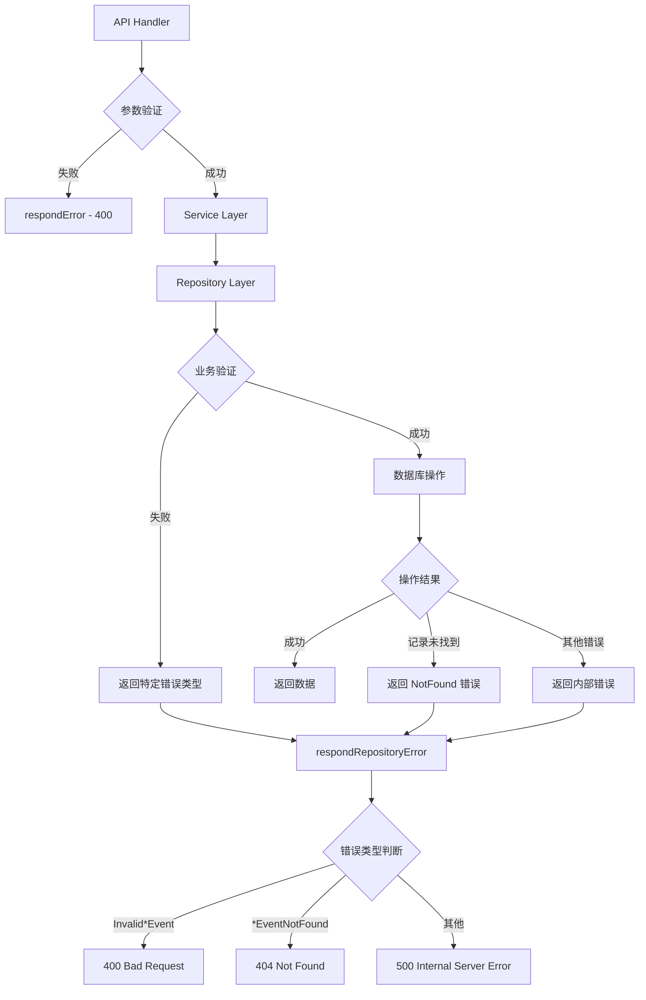
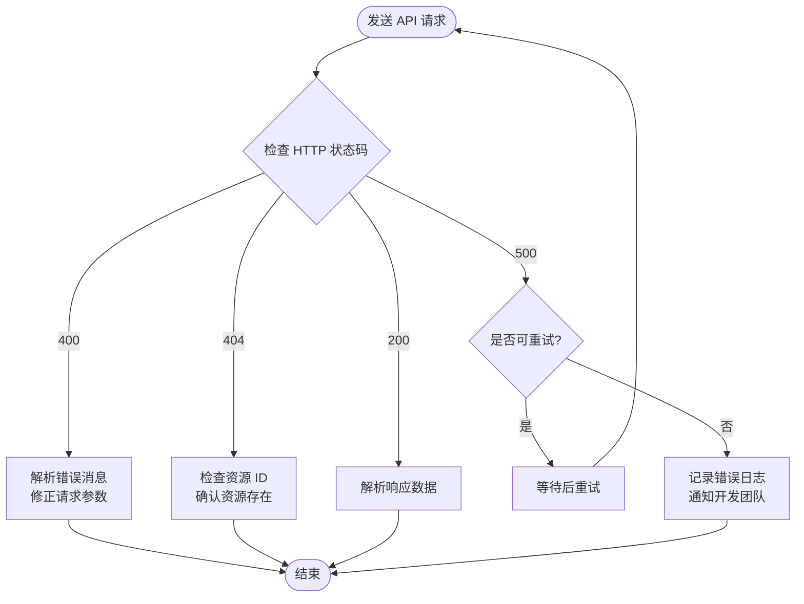

本文档详细介绍了 Stake 后端系统的 API 响应格式和错误处理机制。通过统一的错误处理架构，系统能够将业务逻辑错误转换为符合 RESTful 规范的 HTTP 响应，确保客户端能够清晰理解并处理各种异常情况。

## 统一响应格式设计

系统采用简洁的 JSON 格式作为所有 API 响应的标准格式。成功响应直接返回业务数据，而错误响应则封装在统一的 `error` 字段中。这种设计遵循了 REST API 的最佳实践，既保持了响应的简洁性，又提供了足够的错误信息。

### 成功响应格式

对于成功的 API 请求，系统返回 HTTP 200 状态码和业务数据。对于单个资源查询，直接返回资源对象；对于列表查询，返回包含分页信息的结果结构体。

```json
// 单个资源查询 - GET /staked-events/:id
{
  "id": 1,
  "contract_address": "0x...",
  "user": "0x...",
  "amount": "1000000000000000000",
  "tx_hash": "0x...",
  "block_number": 12345,
  "log_index": 0,
  "block_hash": "0x...",
  "inserted_at": "2024-01-01T00:00:00Z"
}

// 列表查询 - GET /staked-events?page=1&page_size=20
{
  "items": [...],
  "total": 100,
  "page": 1,
  "page_size": 20
}
```

### 错误响应格式

当请求处理过程中发生错误时，系统返回 HTTP 4xx 或 5xx 状态码，并在响应体中包含错误描述信息。

```json
{
  "error": "错误描述信息"
}
```

Sources: [common.go](internal/api/common.go#L68-L76), [staked_event_handler.go](internal/api/staked_event_handler.go#L50-L88)

## 错误处理架构

系统采用分层的错误处理架构，每一层都有明确的职责划分。这种设计实现了错误处理逻辑的集中管理和错误信息的统一转换。



### 核心错误处理函数

系统在 `internal/api/common.go` 中定义了两个核心错误处理函数：

**`respondError`** 函数用于直接返回带有指定 HTTP 状态码和错误消息的响应。它接受三个参数：Gin 上下文、HTTP 状态码和错误消息字符串。

**`respondRepositoryError`** 函数负责将仓库层的错误转换为适当的 HTTP 响应。它使用 `errors.Is` 进行错误类型匹配，根据不同的错误类型返回不同的 HTTP 状态码。

Sources: [common.go](internal/api/common.go#L63-L76)

## 错误类型分类

系统定义了三种主要的错误类型，每种类型对应特定的 HTTP 状态码和业务场景。

### 参数验证错误 (400 Bad Request)

参数验证错误发生在客户端请求参数不符合预期格式或约束时。这类错误通常在 API 处理器层直接检测并返回。

| 错误场景 | HTTP 状态码 | 触发条件 |
|---------|------------|---------|
| ID 格式错误 | 400 | `id must be a positive integer` |
| 整数参数格式错误 | 400 | `{param} must be an integer` |
| 无符号整数参数格式错误 | 400 | `{param} must be an unsigned integer` |
| 地址格式错误 | 400 | `{field} must be a valid hex address` |
| 哈希格式错误 | 400 | `{field} must be a 32-byte hex string` |
| 金额格式错误 | 400 | `amount must be a decimal uint256 string` |
| 区块范围错误 | 400 | `block_number_from must not be greater than block_number_to` |
| 资源对象为空 | 400 | `event is nil` |

Sources: [common.go](internal/api/common.go#L12-L55), [staked_event_repository.go](internal/repository/staked_event_repository.go#L69-L94)

### 资源未找到错误 (404 Not Found)

当请求的资源在数据库中不存在时，系统返回 404 状态码。每种事件类型都有对应的未找到错误。

| 错误类型 | 错误消息格式 | 触发条件 |
|---------|-------------|---------|
| `ErrStakedEventNotFound` | `staked event not found: id={id}` | 质押事件记录不存在 |
| `ErrRewardClaimedEventNotFound` | `reward claimed event not found: id={id}` | 奖励领取事件记录不存在 |
| `ErrWithdrawnEventNotFound` | `withdrawn event not found: id={id}` | 提款事件记录不存在 |
| `ErrMinStakeAmountUpdatedEventNotFound` | `min stake amount updated event not found: id={id}` | 最小质押金额更新事件记录不存在 |
| `ErrRewardRateUpdatedEventNotFound` | `reward rate updated event not found: id={id}` | 奖励率更新事件记录不存在 |

Sources: [staked_event_repository.go](internal/repository/staked_event_repository.go#L13-L14), [common.go](internal/api/common.go#L57-L75)

### 内部服务器错误 (500 Internal Server Error)

当发生未预期的系统错误时，如数据库连接失败、查询执行错误等，系统返回 500 状态码。为了安全起见，具体的错误信息不会暴露给客户端，而是记录到服务器日志中。

```go
// 默认错误处理逻辑
default:
    respondError(c, http.StatusInternalServerError, "internal server error")
```

Sources: [common.go](internal/api/common.go#L73-L75)

## 错误传播机制

系统采用自下而上的错误传播模式，各层处理特定的错误类型，并将其他错误向上层传递。

### 仓库层错误定义

每个事件仓库都在包级别定义了两种错误类型：验证错误和未找到错误。

```go
var (
    ErrInvalidStakedEvent  = errors.New("invalid staked event")
    ErrStakedEventNotFound = errors.New("staked event not found")
)
```

### 错误包装与传递

仓库层使用 `fmt.Errorf` 的 `%w` 动词对错误进行包装，在保留原始错误的同时添加上下文信息。

```go
if err := r.db.WithContext(ctx).First(&event, id).Error; err != nil {
    if errors.Is(err, gorm.ErrRecordNotFound) {
        return nil, fmt.Errorf("%w: id=%d", ErrStakedEventNotFound, id)
    }
    return nil, fmt.Errorf("get staked event by id %d: %w", id, err)
}
```

### 服务层错误透传

服务层直接透传仓库层的错误，不进行额外的错误处理。这种设计保持了各层的职责清晰。

```go
func (s *StakedEventService) GetByID(ctx context.Context, id int64) (*models.StakedEvent, error) {
    return s.repo.GetByID(ctx, id)
}
```

Sources: [staked_event_repository.go](internal/repository/staked_event_repository.go#L28-L44), [staked_event_service.go](internal/service/staked_event_service.go#L42-L44)

## 健康检查端点

系统提供 `/health` 端点用于监控服务状态。该端点返回简单的 JSON 响应，不包含任何业务逻辑。

```json
{
  "status": "ok"
}
```

Sources: [router.go](internal/api/router.go#L75-L80)

## 错误处理最佳实践

### 客户端错误处理建议

1. **检查 HTTP 状态码**：首先根据状态码判断请求是否成功
2. **解析错误消息**：对于 4xx 错误，解析 `error` 字段获取具体错误信息
3. **区分可重试与不可重试错误**：5xx 错误可能值得重试，4xx 错误通常需要修改请求

### 错误处理流程图



### 常见错误场景示例

**场景一：无效的区块范围查询**

```bash
# 请求
GET /staked-events?block_number_from=100&block_number_to=50

# 响应 (400 Bad Request)
{
  "error": "invalid staked event: block_number_from must not be greater than block_number_to"
}
```

**场景二：查询不存在的记录**

```bash
# 请求
GET /staked-events/99999

# 响应 (404 Not Found)
{
  "error": "staked event not found: id=99999"
}
```

**场景三：无效的地址格式**

```bash
# 请求
GET /staked-events?contract_address=invalid-address

# 响应 (400 Bad Request)
{
  "error": "invalid staked event: contract_address must be a valid hex address"
}
```

## 错误处理扩展指南

当添加新的事件类型时，需要按照以下模式定义错误处理：

1. **定义仓库层错误**：在新的仓库文件中定义 `ErrInvalid*Event` 和 `Err*EventNotFound` 错误
2. **更新错误映射**：在 `respondRepositoryError` 函数中添加新的错误类型映射
3. **保持一致性**：确保错误消息格式与现有错误保持一致

```go
// 示例：添加新的事件类型错误
var (
    ErrInvalidNewEventType  = errors.New("invalid new event type")
    ErrNewEventTypeNotFound = errors.New("new event type not found")
)
```

Sources: [common.go](internal/api/common.go#L57-L75), [staked_event_repository.go](internal/repository/staked_event_repository.go#L13-L14)

## 监控与调试建议

### 日志记录策略

- **500 错误**：记录完整的错误堆栈和请求上下文
- **4xx 错误**：记录错误消息和请求参数，用于调试
- **成功请求**：记录关键业务操作，用于审计追踪

### 错误统计指标

建议监控以下错误相关指标：

1. **错误率**：按错误类型和端点分类的错误发生频率
2. **响应时间**：错误请求与正常请求的响应时间差异
3. **错误趋势**：错误类型和数量的时序变化

## 下一步阅读

- [REST API设计规范](19-rest-apishe-ji-gui-fan) - 了解完整的 API 设计原则
- [通用查询参数处理](20-tong-yong-cha-xun-can-shu-chu-li) - 掌握参数验证的详细实现
- [仓库层通用模式](14-cang-ku-ceng-tong-yong-mo-shi) - 深入了解数据访问层的错误处理