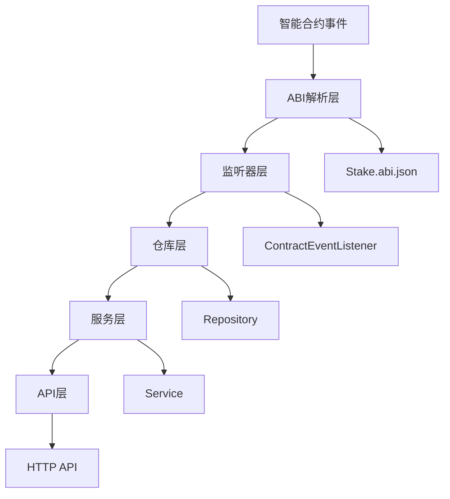
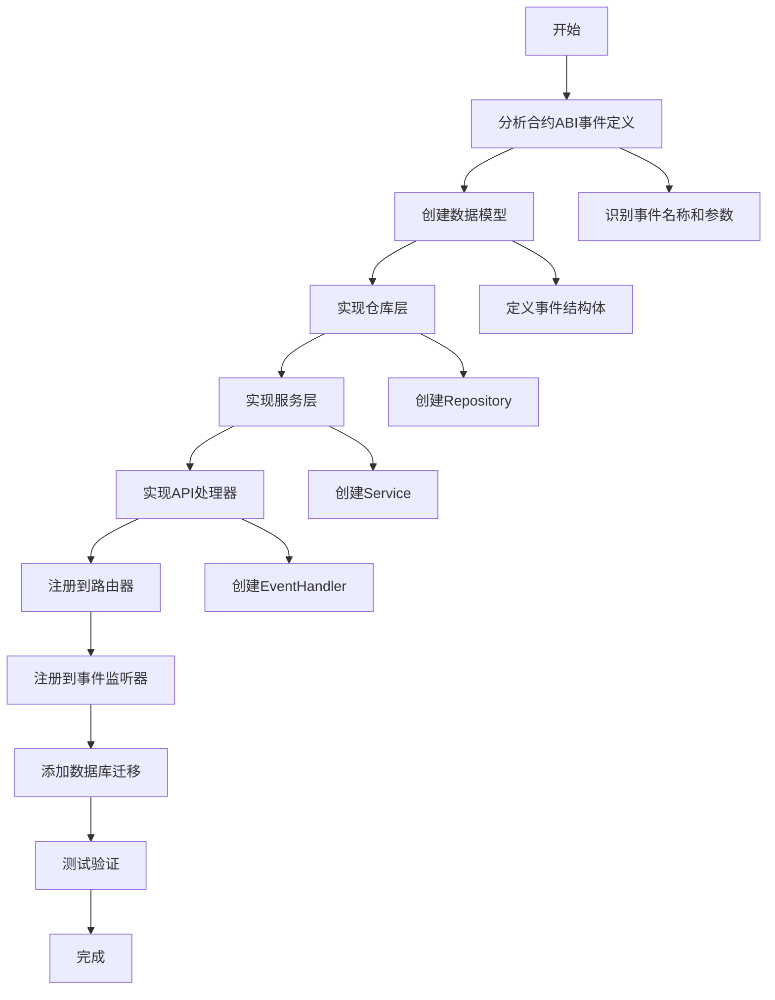

本指南详细介绍了如何为 Stake 后端系统添加新的事件类型，涵盖从合约事件分析到完整实现的全过程。通过遵循既有的架构模式，开发者可以高效地扩展系统功能。

## 概述：事件处理架构

Stake 后端采用四层架构处理智能合约事件，每一层都有明确的职责分工。这种分层设计确保了代码的可维护性和可扩展性，新增事件类型只需遵循既有的模式即可无缝集成。



## 添加新事件类型的完整流程

以下流程图展示了添加新事件类型的完整步骤，从分析合约ABI到实现完整的四层架构：



## 步骤1：分析合约ABI事件定义

首先需要从智能合约的ABI文件中识别要处理的新事件。ABI文件定义了合约的所有接口，包括事件、函数和错误。

**查看ABI事件定义**：打开 `internal/abi/Stake.abi.json` 文件，搜索 `"type": "event"` 可以找到所有事件定义。每个事件包含：
- **name**: 事件名称（如 `Paused`、`Unpaused`）
- **inputs**: 事件参数列表，包括类型和是否indexed
- **anonymous**: 是否为匿名事件

**示例 - Paused事件**：
```json
{
  "anonymous": false,
  "inputs": [
    {
      "indexed": false,
      "internalType": "address",
      "name": "account",
      "type": "address"
    }
  ],
  "name": "Paused",
  "type": "event"
}
```

**关键信息提取**：
1. 事件名称：`Paused`
2. 参数列表：`account` (address类型，非indexed)
3. 事件签名：`Paused(address)`
4. 事件ID：通过事件签名哈希计算得出

**计算事件ID**：使用Go的crypto包计算事件签名的keccak256哈希：
```go
import "github.com/ethereum/go-ethereum/crypto"
eventID := crypto.Keccak256Hash([]byte("Paused(address)"))
```

Sources: [Stake.abi.json](internal/abi/Stake.abi.json#L200-L215)

## 步骤2：创建数据模型

在 `internal/models/event.go` 中定义新的事件数据模型。模型需要包含事件的所有字段以及通用的元数据字段。

**模型设计原则**：
1. **主键ID**：使用 `int64` 类型，自增
2. **合约地址**：存储事件来源的合约地址
3. **事件特定字段**：根据事件参数定义
4. **交易信息**：TxHash、BlockNumber、LogIndex、BlockHash
5. **时间戳**：InsertedAt 字段记录插入时间

**Paused事件模型示例**：
```go
// PausedEvent 对应 Stake ABI 中的 Paused 事件：
// Paused(address indexed account)
type PausedEvent struct {
    ID              int64     `gorm:"primaryKey;autoIncrement" json:"id"`
    ContractAddress string    `gorm:"size:42;not null;index:idx_paused_events_contract_block,priority:1" json:"contract_address"`
    Account         string    `gorm:"size:42;not null;index:idx_paused_events_account" json:"account"`
    TxHash          string    `gorm:"size:66;not null;uniqueIndex:uniq_paused_events_tx_log,priority:1" json:"tx_hash"`
    BlockNumber     uint64    `gorm:"not null;index:idx_paused_events_contract_block,priority:2" json:"block_number"`
    LogIndex        uint      `gorm:"not null;uniqueIndex:uniq_paused_events_tx_log,priority:2" json:"log_index"`
    BlockHash       string    `gorm:"size:66;not null" json:"block_hash"`
    InsertedAt      time.Time `gorm:"autoCreateTime" json:"inserted_at"`
}
```

**索引设计考虑**：
- **合约区块索引**：`(contract_address, block_number)` 用于按合约和区块范围查询
- **账户索引**：`(account)` 用于按用户查询
- **唯一索引**：`(tx_hash, log_index)` 防止重复记录

**字段类型说明**：
- 地址字段：`varchar(42)` 存储以太坊地址
- 哈希字段：`varchar(66)` 存储交易哈希和区块哈希
- 数值字段：对于uint256类型，使用 `varchar(78)` 存储十进制字符串
- 索引字段：使用 `priority` 参数定义复合索引顺序

Sources: [event.go](internal/models/event.go#L1-L93)

## 步骤3：实现仓库层

在 `internal/repository/` 目录下创建新的仓库文件。仓库层负责数据持久化和查询逻辑。

**文件命名规范**：`{event_name}_event_repository.go`，例如 `paused_event_repository.go`

**仓库层实现要点**：

1. **错误定义**：定义特定于事件的错误变量
```go
var (
    ErrInvalidPausedEvent  = errors.New("invalid paused event")
    ErrPausedEventNotFound = errors.New("paused event not found")
)
```

2. **查询结构体**：基于 `BaseQuery` 扩展，添加事件特定的查询字段
```go
type PausedEventQuery struct {
    BaseQuery
    Account string  // 按账户查询
}
```

3. **CRUD方法**：实现标准的增删改查方法
   - `GetByID`: 根据ID获取单条记录
   - `List`: 分页查询列表
   - `Create`: 创建新记录（支持幂等操作）

4. **数据验证**：实现事件特定的验证函数
```go
func validatePausedEvent(event models.PausedEvent) error {
    s := ErrInvalidPausedEvent
    if err := validateAddress(s, "contract_address", event.ContractAddress); err != nil {
        return err
    }
    if err := validateAddress(s, "account", event.Account); err != nil {
        return err
    }
    if err := validateHash(s, "tx_hash", event.TxHash); err != nil {
        return err
    }
    if err := validateHash(s, "block_hash", event.BlockHash); err != nil {
        return err
    }
    return nil
}
```

5. **查询应用**：实现查询条件应用函数
```go
func (r *PausedEventRepository) applyQuery(db *gorm.DB, query PausedEventQuery) *gorm.DB {
    db = applyBaseQuery(db, query.BaseQuery)
    if query.Account != "" {
        db = db.Where("account = ?", strings.ToLower(query.Account))
    }
    return db
}
```

**仓库层最佳实践**：
- 使用 `normalizeStrings` 统一地址和哈希为小写
- 实现 `isDuplicateKeyError` 处理重复插入场景
- 使用 `validateBaseQuery` 复用通用查询验证
- 分页参数通过 `normalizePagination` 标准化

Sources: [staked_event_repository.go](internal/repository/staked_event_repository.go#L1-L137), [common.go](internal/repository/common.go#L1-L147)

## 步骤4：实现服务层

在 `internal/service/` 目录下创建新的服务文件。服务层负责业务逻辑和缓存管理。

**文件命名规范**：`{event_name}_event_service.go`，例如 `paused_event_service.go`

**服务层核心职责**：

1. **结果结构体**：定义API返回格式
```go
type PausedEventListResult struct {
    Items    []models.PausedEvent `json:"items"`
    Total    int64                `json:"total"`
    Page     int                  `json:"page"`
    PageSize int                  `json:"page_size"`
}
```

2. **缓存策略**：实现查询结果缓存
```go
func (s *PausedEventService) List(ctx context.Context, query repository.PausedEventQuery) (*PausedEventListResult, error) {
    key := cache.BuildListKey("paused", query)
    
    // 尝试读缓存
    if result, ok, err := cache.Get[PausedEventListResult](ctx, s.rdb, key); err == nil && ok {
        return &result, nil
    } else if err != nil {
        log.Printf("cache get paused list: %v", err)
    }
    
    // 查数据库
    events, total, err := s.repo.List(ctx, query)
    if err != nil {
        return nil, err
    }
    
    result := &PausedEventListResult{
        Items:    events,
        Total:    total,
        Page:     query.Page,
        PageSize: query.PageSize,
    }
    
    // 写缓存
    if err := cache.Set(ctx, s.rdb, key, result, s.cacheTTL); err != nil {
        log.Printf("cache set paused list: %v", err)
    }
    
    return result, nil
}
```

3. **错误处理**：记录缓存操作错误但不影响主流程

**服务层设计模式**：
- 依赖注入：通过构造函数注入仓库和Redis客户端
- 泛型缓存：使用Go泛型实现类型安全的缓存操作
- 错误隔离：缓存失败不应影响数据查询

Sources: [staked_event_service.go](internal/service/staked_event_service.go#L1-L71), [cache.go](internal/cache/cache.go#L1-L82)

## 步骤5：实现API处理器

在 `internal/api/` 目录下创建新的API处理器。API层负责HTTP接口实现和请求解析。

**文件命名规范**：`{event_name}_event_handler.go`，例如 `paused_event_handler.go`

**API处理器实现**：

1. **路由注册**：实现 `Register` 方法
```go
func (h *PausedEventHandler) Register(r gin.IRouter) {
    group := r.Group("/paused-events")
    group.GET("", h.List)
    group.GET("/:id", h.GetByID)
}
```

2. **查询解析**：实现事件特定的查询解析函数
```go
func parsePausedEventQuery(c *gin.Context) (repository.PausedEventQuery, error) {
    var query repository.PausedEventQuery
    var err error
    
    query.ID, err = parseOptionalInt64(c, "id")
    if err != nil {
        return query, err
    }
    query.ContractAddress = c.Query("contract_address")
    query.Account = c.Query("account")
    query.TxHash = c.Query("tx_hash")
    query.BlockNumberFrom, err = parseOptionalUint64Pointer(c, "block_number_from")
    if err != nil {
        return query, err
    }
    query.BlockNumberTo, err = parseOptionalUint64Pointer(c, "block_number_to")
    if err != nil {
        return query, err
    }
    query.Page, err = parseOptionalInt(c, "page")
    if err != nil {
        return query, err
    }
    query.PageSize, err = parseOptionalInt(c, "page_size")
    if err != nil {
        return query, err
    }
    
    return query, nil
}
```

3. **错误处理**：使用统一的错误响应格式
```go
func (h *PausedEventHandler) List(c *gin.Context) {
    query, err := parsePausedEventQuery(c)
    if err != nil {
        respondError(c, http.StatusBadRequest, err.Error())
        return
    }
    
    result, err := h.service.List(c.Request.Context(), query)
    if err != nil {
        respondRepositoryError(c, err)
        return
    }
    
    c.JSON(http.StatusOK, result)
}
```

**API设计规范**：
- RESTful风格：使用标准的HTTP方法
- 分页查询：支持page和page_size参数
- 过滤查询：支持多种过滤条件
- 错误响应：使用统一的错误格式

Sources: [staked_event_handler.go](internal/api/staked_event_handler.go#L1-L88), [common.go](internal/api/common.go#L1-L76)

## 步骤6：注册到路由器

在 `internal/api/router.go` 中注册新的API处理器。路由器负责将HTTP请求分发到对应的处理器。

**注册步骤**：

1. **创建仓库实例**：
```go
pausedEventRepo, err := repository.NewPausedEventRepository(db)
if err != nil {
    return fmt.Errorf("register paused event repository: %w", err)
}
```

2. **创建服务实例**：
```go
pausedEventService, err := service.NewPausedEventService(pausedEventRepo, rdb, cacheTTL)
if err != nil {
    return fmt.Errorf("register paused event service: %w", err)
}
```

3. **注册处理器**：
```go
NewPausedEventHandler(pausedEventService).Register(r)
```

**注册位置**：在 `RegisterRoutes` 函数中，按照其他事件类型的注册模式添加新事件的注册代码。

Sources: [router.go](internal/api/router.go#L1-L82)

## 步骤7：注册到事件监听器

在 `main.go` 中注册新的事件处理器。事件监听器负责监听区块链事件并分发到对应的处理器。

**注册步骤**：

1. **创建仓库实例**：
```go
pausedEventRepo, err := repository.NewPausedEventRepository(db)
if err != nil {
    log.Fatalf("Failed to create paused event repository: %v", err)
}
```

2. **注册事件处理器**：
在事件处理器注册循环中添加新的处理器工厂函数：
```go
for _, newHandler := range []func() (listener.ContractEventHandler, error){
    // ... 其他事件处理器
    func() (listener.ContractEventHandler, error) {
        return listener.NewPausedEventLogHandler(pausedEventRepo, redisClient)
    },
} {
    // ... 处理器注册逻辑
}
```

**事件处理器实现**：在 `internal/listener/` 目录下创建新的事件处理器，实现 `ContractEventHandler` 接口。

**事件处理器实现要点**：
1. **接口实现**：实现 `EventName()`、`EventID()` 和 `Handle()` 方法
2. **ABI解析**：使用合约ABI解析事件日志
3. **数据提取**：从事件日志中提取事件数据
4. **缓存清理**：处理事件后清理相关缓存

Sources: [main.go](main.go#L1-L175), [staked_event_handler.go](internal/listener/staked_event_handler.go#L1-L104)

## 步骤8：添加数据库迁移

在 `main.go` 的数据库迁移部分添加新模型的迁移。

**迁移代码**：
```go
if err := db.AutoMigrate(
    &models.Contract{},
    &models.StakedEvent{},
    &models.RewardClaimedEvent{},
    &models.WithdrawnEvent{},
    &models.MinStakeAmountUpdatedEvent{},
    &models.RewardRateUpdatedEvent{},
    &models.PausedEvent{},  // 新增
); err != nil {
    log.Fatalf("Failed to migrate database: %v", err)
}
```

**迁移注意事项**：
- GORM会自动创建表和索引
- 如果表已存在，会添加新字段但不会删除旧字段
- 索引会在表创建时自动创建

Sources: [main.go](main.go#L47-L55)

## 步骤9：测试验证

完成所有实现后，需要进行系统测试：

1. **单元测试**：测试各个组件的独立功能
2. **集成测试**：测试事件监听、处理和查询的完整流程
3. **API测试**：测试HTTP接口的响应和错误处理
4. **性能测试**：测试缓存效果和查询性能

## 常见问题与解决方案

### 1. 事件ID计算错误
**问题**：事件ID计算错误导致无法匹配事件日志。
**解决**：使用正确的事件签名计算keccak256哈希，注意参数类型的准确性。

### 2. 数据库迁移失败
**问题**：新模型字段与现有表结构不兼容。
**解决**：检查字段类型和约束，必要时手动执行SQL迁移脚本。

### 3. 缓存键冲突
**问题**：不同事件类型使用相同的缓存键前缀。
**解决**：确保每个事件类型使用唯一的缓存键前缀，如 `"paused:list:"`。

### 4. 查询性能问题
**问题**：复杂查询导致数据库性能下降。
**解决**：优化索引设计，添加必要的复合索引，避免全表扫描。

## 架构扩展性考虑

当前架构设计支持灵活的扩展：

1. **新事件类型**：只需遵循既有的四层模式
2. **新查询条件**：在查询结构体中添加新字段
3. **新缓存策略**：修改服务层的缓存逻辑
4. **新API端点**：在处理器中添加新的路由和方法

## 下一步建议

完成新事件类型添加后，建议：

1. **参考[测试与调试策略](23-ce-shi-yu-diao-shi-ce-lue)**：了解如何为新功能编写测试
2. **查看[事件处理器实现模式](11-shi-jian-chu-li-qi-shi-xian-mo-shi)**：深入理解事件处理的最佳实践
3. **学习[缓存失效机制](17-huan-cun-shi-xiao-ji-zhi)**：优化缓存策略提升性能

通过遵循本指南，您可以高效地为Stake后端系统添加新的事件类型，保持架构的一致性和可维护性。