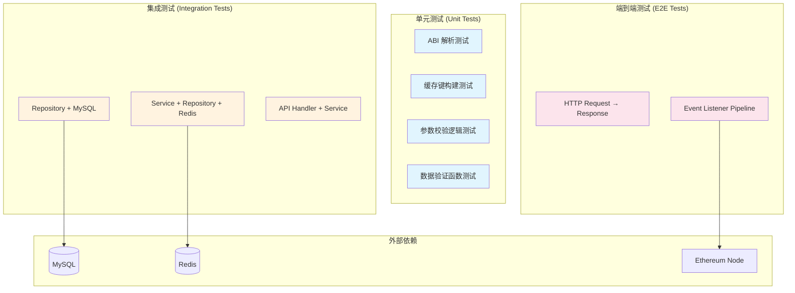
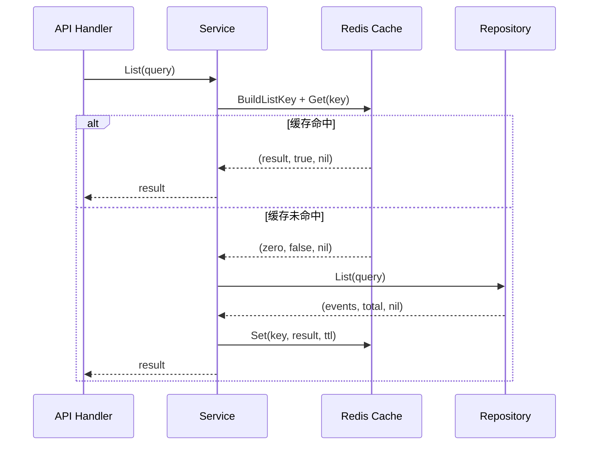

本文档面向高级开发者，系统性地阐述 test-stake-backend 项目的测试架构设计、分层测试策略、Mock 方案以及生产级调试方法。项目当前测试覆盖仅限 `internal/cache/cache_test.go` 中的缓存键构建函数，**测试基础设施尚处于早期阶段**，本文旨在提供完整的测试蓝图和实践指南。

## 测试架构全景

项目采用四层架构（API → Service → Repository → External），每层的可测试性和依赖隔离策略各不相同。下图展示了分层测试的理想目标结构：



项目的测试策略遵循 **Testing Pyramid** 原则：大量快速的单元测试作为基础，少量集成测试覆盖层间交互，极少量端到端测试验证关键路径。当前唯一存在的测试 [cache_test.go](internal/cache/cache_test.go#L1-L52) 验证了 `BuildListKey` 函数的确定性、输入区分性和事件类型区分性，属于典型的纯函数单元测试。

Sources: [cache_test.go](internal/cache/cache_test.go#L1-L52), [common.go](internal/repository/common.go#L1-L147)

## 分层测试策略

### Layer 1：Repository 层测试

Repository 层是测试复杂度最高的层，因为每个仓库都依赖 GORM 的 `*gorm.DB` 实例。推荐的策略是使用 **SQLite 内存数据库**作为测试替身，避免对外部 MySQL 的依赖。

测试用例应覆盖以下核心场景：

| 测试目标 | 验证要点 | 涉及文件 |
|---------|---------|---------|
| `Create` 幂等性 | 重复 `tx_hash + log_index` 不报错 | [staked_event_repository.go](internal/repository/staked_event_repository.go#L72-L97) |
| `Create` 数据校验 | 非法地址、负数金额、超长 amount 拒绝入库 | [common.go](internal/repository/common.go#L99-L147) |
| `GetByID` 边界 | 有效 ID 返回数据、不存在的 ID 返回 `ErrNotFound` | [staked_event_repository.go](internal/repository/staked_event_repository.go#L32-L48) |
| `List` 分页 | 默认分页（page=1, pageSize=20）、最大 pageSize=100 限制 | [common.go](internal/repository/common.go#L14-L26) |
| `List` 过滤 | `contract_address`、`user`、`tx_hash`、`block_number` 范围过滤 | [common.go](internal/repository/common.go#L56-L80) |
| 地址规范化 | 存储和查询时自动 `ToLower` | [common.go](internal/repository/common.go#L141-L145) |
| `GetOrCreate` | 首次调用创建记录、后续调用返回已有记录 | [contract_repository.go](internal/repository/contract_repository.go#L21-L45) |

Repository 测试的关键挑战在于 `NewXxxRepository` 的 `nil` 检查和数据验证函数。以 [StakedEventRepository](internal/repository/staked_event_repository.go#L21-L24) 为例，构造函数要求 `db` 非 nil；而 [validateStakedEvent](internal/repository/staked_event_repository.go#L105-L124) 则校验 `contract_address`、`user` 为合法十六进制地址、`amount` 为合法 uint256 十进制字符串、`tx_hash` 和 `block_hash` 为 66 字符十六进制字符串。

Sources: [staked_event_repository.go](internal/repository/staked_event_repository.go#L1-L137), [common.go](internal/repository/common.go#L1-L147), [contract_repository.go](internal/repository/contract_repository.go#L1-L63)

### Layer 2：Service 层测试

Service 层在 Repository 和缓存之间编排数据流。以 [StakedEventService](internal/service/staked_event_service.go#L28-L71) 为例，`List` 方法的执行逻辑是：先查 Redis 缓存 → 缓存未命中则查数据库 → 将结果写回缓存。



Service 层的测试策略是通过 **接口抽象** 或 **构造函数注入** 来隔离 Redis 和 Repository 依赖。当前的 Service 结构体直接持有 `*repository.StakedEventRepository` 和 `*redis.Client` 具体类型，建议在测试中引入以下 Mock 方案：

- **Repository Mock**：实现一个内存存储的 `StakedEventRepository` 替身，暴露 `Create` 和 `List` 的可预测行为
- **Redis Mock**：使用 `miniredis`（纯 Go 实现的内存 Redis）替代真实 Redis，或使用接口抽象

**Service 层测试重点**：缓存穿透（首次查询）、缓存命中（重复查询）、缓存失效（新事件写入后旧缓存被清除）。

Sources: [staked_event_service.go](internal/service/staked_event_service.go#L1-L71), [cache.go](internal/cache/cache.go#L1-L82)

### Layer 3：Listener/Event Handler 层测试

事件处理器是项目中最复杂的可测试组件。每个处理器（如 [StakedEventLogHandler](internal/listener/staked_event_handler.go#L28-L104)）接收 `types.Log`，执行 ABI 解析、数据转换、持久化和缓存清除。

`parseLog` 方法是纯逻辑函数，适合独立单元测试。其核心流程为：

1. 验证 `topics[0]` 等于预计算的事件签名哈希
2. 从 `topics[1]` 提取 indexed 参数（如 `user` 地址）
3. 从 `data` 字段 Unpack 非 indexed 参数（如 `amount`）
4. 组装模型结构体

| 事件类型 | Topics 数量 | Indexed 参数 | Data 参数 | 关联文件 |
|---------|------------|-------------|----------|---------|
| Staked | ≥2 | `user` | `amount` | [staked_event_handler.go](internal/listener/staked_event_handler.go#L83-L104) |
| RewardClaimed | ≥2 | `user` | `amount` | [reward_claimed_event_handler.go](internal/listener/reward_claimed_event_handler.go) |
| Withdrawn | ≥2 | `user` | `amount` | [withdrawn_event_handler.go](internal/listener/withdrawn_event_handler.go) |
| MinStakeAmountUpdated | ≥1 | 无 | `oldAmount`, `newAmount` | [min_stake_amount_updated_event_handler.go](internal/listener/min_stake_amount_updated_event_handler.go#L72-L105) |
| RewardRateUpdated | ≥1 | 无 | `oldRate`, `newRate` | [reward_rate_updated_event_handler.go](internal/listener/reward_rate_updated_event_handler.go) |

`parseLog` 的测试需要构造合法的 `types.Log` 对象。推荐方法是加载真实的 [Stake.abi.json](internal/abi/Stake.abi.json) 并使用 `abi.Pack` 来生成合法的 event log data，或者从 Sepolia 测试网的实际交易中提取真实的日志数据作为测试 fixture。

**ContractEventListener 的测试**更为复杂，因为它依赖 `ethclient.Client` 的 WebSocket 订阅。核心可测试的逻辑包括：

- `Register` 方法的重复注册检测和 nil handler 拒绝
- `dispatch` 方法的事件路由正确性
- `replay` 方法的批量过滤逻辑

Sources: [staked_event_handler.go](internal/listener/staked_event_handler.go#L1-L104), [contract_event_listener.go](internal/listener/contract_event_listener.go#L1-L216), [min_stake_amount_updated_event_handler.go](internal/listener/min_stake_amount_updated_event_handler.go#L72-L105)

### Layer 4：API 层测试

API 层使用 Gin 框架，可通过 `httptest.NewRecorder` 和 `gin.CreateTestContext` 进行无服务器测试。Gin 的路由注册机制天然支持测试模式——调用 `gin.SetMode(gin.TestMode)` 后直接构造 Engine 并注册路由。

API 层测试重点覆盖：

| 测试场景 | 验证要点 | 涉及文件 |
|---------|---------|---------|
| 参数解析 | `page`、`page_size` 非数字返回 400 | [common.go](internal/api/common.go#L1-L47) |
| 查询过滤 | `contract_address`、`user` 等参数正确传递到 Service | [staked_event_handler.go](internal/api/staked_event_handler.go#L57-L88) |
| 错误映射 | `ErrInvalidXxx` → 400, `ErrNotFound` → 404, 其他 → 500 | [common.go](internal/api/common.go#L49-L76) |
| 健康检查 | `/health` 返回 `{"status": "ok"}` | [router.go](internal/api/router.go#L80-L82) |
| 路径参数 | `/:id` 非正整数返回 400 | [staked_event_handler.go](internal/api/staked_event_handler.go#L38-L55) |

`respondRepositoryError` 是一个关键的错误映射函数，它将五种事件类型各自定义的 `ErrInvalidXxx` 和 `ErrNotFound` 统一映射为 HTTP 状态码。测试应覆盖每种 sentinel error 到对应状态码的映射。

Sources: [common.go](internal/api/common.go#L1-L76), [staked_event_handler.go](internal/api/staked_event_handler.go#L1-L88), [router.go](internal/api/router.go#L1-L82)

## Mock 与依赖隔离策略

### 接口抽象方案

当前项目的依赖注入采用 **具体类型注入** 而非接口注入。例如 [StakedEventService](internal/service/staked_event_service.go#L21-L25) 直接持有 `*repository.StakedEventRepository`。为支持 Mock 测试，推荐引入以下接口：

```go
// 建议在 service 包中定义接口
type StakedEventReader interface {
    GetByID(ctx context.Context, id int64) (*models.StakedEvent, error)
    List(ctx context.Context, query repository.StakedEventQuery) ([]models.StakedEvent, int64, error)
}

type StakedEventWriter interface {
    Create(ctx context.Context, event *models.StakedEvent) error
}
```

这种 **窄接口** 策略允许每个消费者仅依赖自己需要的方法集，符合接口隔离原则。Repository 层的现有实现天然满足这些接口。

### Redis 测试替代方案

缓存层测试有三种策略可选：

| 方案 | 优点 | 缺点 | 推荐场景 |
|------|------|------|---------|
| `miniredis` | 纯 Go、零配置、内存运行 | 不支持所有 Redis 命令 | **Service 层集成测试（首选）** |
| 接口抽象 + Mock | 完全可控、无外部依赖 | 需重构 `*redis.Client` 为接口 | 未来大规模重构时 |
| 真实 Redis + Docker | 最贴近生产 | CI 环境依赖、速度慢 | E2E 测试 |

对于当前项目规模，推荐 `miniredis` 方案：在 `TestMain` 中启动 miniredis 实例，构造 `*redis.Client` 注入 Service 和 Handler。

### Ethereum 客户端 Mock

`ContractEventListener` 的 `listen` 和 `replay` 方法依赖 `ethclient.Client`。测试策略分为两层：

**纯逻辑测试**（推荐优先实现）：
- `parseLog`：构造 `types.Log`，验证 ABI 解析结果。使用 [abi.go](internal/abi/abi.go#L1-L23) 中嵌入的 ABI 生成合法日志
- `dispatch`：构造 handler map，验证事件路由到正确处理器
- `Register`：验证重复注册、nil handler 的错误处理

**集成测试**（进阶）：
- 使用 `go-ethereum` 提供的 `SimulatedBackend` 模拟链上交互
- 或从 Sepolia 测试网提取真实交易日志作为 fixture

Sources: [staked_event_service.go](internal/service/staked_event_service.go#L21-L25), [abi.go](internal/abi/abi.go#L1-L23)

## 测试数据与 Fixture 管理

### 合约事件 Fixture 构造

构造合法的 `types.Log` 是事件处理器测试的核心。推荐在项目中创建 `internal/testutil/` 包，提供以下工具函数：

```go
// 构造 Staked 事件的 types.Log
func BuildStakedLog(user common.Address, amount *big.Int) types.Log

// 构造 MinStakeAmountUpdated 事件的 types.Log
func BuildMinStakeAmountUpdatedLog(oldAmount, newAmount *big.Int) types.Log
```

实现方式是使用 `contractABI.Events["Staked"].ID` 作为 `Topics[0]`，indexed 参数编码到 `Topics`，非 indexed 参数通过 `abi.Arguments.Pack` 编码到 `Data`。这与 [staked_event_handler.go](internal/listener/staked_event_handler.go#L83-L104) 中 `parseLog` 的逆向操作完全对应。

### 数据库测试 Schema

使用 GORM 的 `AutoMigrate` 配合 SQLite 内存数据库可快速建立测试 Schema。模型定义在 [event.go](internal/models/event.go#L1-L93) 和 [contract.go](internal/models/contract.go#L1-L10)，迁移逻辑与 [main.go](main.go#L35-L43) 中的 `AutoMigrate` 调用一致。

Sources: [event.go](internal/models/event.go#L1-L93), [contract.go](internal/models/contract.go#L1-L10), [main.go](main.go#L35-L43)

## 调试策略

### 配置级调试

项目的运行模式通过 `config.yaml` 的 `server.mode` 字段控制。在 [main.go](main.go#L140-L142) 中，`mode: release` 时 Gin 切换到 ReleaseMode（禁用调试日志）。**开发阶段应使用 `mode: debug`**，Gin 会输出详细的请求路由和中间件日志。

GORM 的日志级别在 [main.go](main.go#L28-L37) 中硬编码为 `logger.Info`，这会在控制台输出每条 SQL 语句。调试数据库查询问题时，这是最直接的信息来源。

Sources: [config.yaml](config.yaml#L1-L4), [main.go](main.go#L28-L37), [main.go](main.go#L140-L142)

### 事件监听调试

`ContractEventListener` 的关键路径都有 `log.Printf` 输出，包括：

- **回放进度**：`replay completed: blocks %d -> %d` 和 `replayed blocks %d-%d (%d events)` —— [contract_event_listener.go](internal/listener/contract_event_listener.go#L155-L167)
- **实时订阅状态**：`contract event listener started: contract=%s handlers=%d` —— [contract_event_listener.go](internal/listener/contract_event_listener.go#L160)
- **事件处理结果**：每个 handler 的 `Handle` 方法末尾都有日志，如 `staked event inserted: tx=%s index=%d user=%s amount=%s` —— [staked_event_handler.go](internal/listener/staked_event_handler.go#L72)
- **错误恢复**：监听器遇到错误后会在 `listenerRetryDelay`（5秒）后重试 —— [contract_event_listener.go](internal/listener/contract_event_listener.go#L139-L145)

调试事件监听问题时，重点关注以下日志模式：

| 日志内容 | 含义 | 排查方向 |
|---------|------|---------|
| `subscription error` | WebSocket 连接断开 | 检查 `ws_url` 配置和网络连通性 |
| `ignore unregistered event` | 事件未注册处理器 | 检查 ABI 中是否包含该事件签名 |
| `handle X event failed` | 事件处理出错 | 查看具体错误信息（ABI 解析/数据库写入） |
| `cache delete X list prefix` | 缓存清除失败 | 检查 Redis 连接状态 |
| `update last block failed` | 区块高度更新失败 | 数据库写入问题 |

Sources: [contract_event_listener.go](internal/listener/contract_event_listener.go#L132-L170), [staked_event_handler.go](internal/listener/staked_event_handler.go#L63-L74)

### 缓存行为调试

缓存键格式在 [cache.go](internal/cache/cache.go#L74-L82) 中定义为 `{eventType}:list:{md5(json)}`。调试缓存问题的方法：

1. **查看 Redis 中的键**：`redis-cli KEYS "staked:list:*"` 列出所有质押事件缓存键
2. **验证缓存键确定性**：现有测试 [TestBuildListKey_Deterministic](internal/cache/cache_test.go#L7-L22) 确保相同查询参数产生相同键
3. **缓存 TTL 确认**：默认 TTL 在 [main.go](main.go#L57-L60) 中计算，当 `cache_ttl` 配置 ≤0 时回退到 60 秒
4. **缓存失效验证**：每个事件 handler 在写入数据库后都会调用 `cache.DeleteByPrefix` 清除对应前缀的缓存，如 [staked_event_handler.go](internal/listener/staked_event_handler.go#L75-L77)

Sources: [cache.go](internal/cache/cache.go#L74-L82), [cache_test.go](internal/cache/cache_test.go#L7-L22), [main.go](main.go#L57-L60)

### HTTP API 调试

Gin 框架在 debug 模式下提供详细的路由调试信息。调试 API 问题的方法：

1. **健康检查**：`curl http://localhost:8080/health` 确认服务存活
2. **查询参数追踪**：Gin 的 `c.Query()` 日志可在 Handler 入口添加 `log.Printf` 输出
3. **错误响应分类**：[respondRepositoryError](internal/api/common.go#L49-L76) 将错误映射为三种 HTTP 状态码。400 表示参数校验失败，404 表示资源不存在，500 表示内部错误

| 响应码 | 错误类型 | 典型原因 |
|-------|---------|---------|
| 400 | `ErrInvalidXxx` | 地址格式错误、金额非法、参数类型不匹配 |
| 404 | `ErrXxxNotFound` | 请求的 ID 在数据库中不存在 |
| 500 | 其他错误 | 数据库连接失败、Redis 连接超时 |

Sources: [common.go](internal/api/common.go#L49-L76), [router.go](internal/api/router.go#L80-L82)

## 测试执行指南

```bash
# 运行所有测试
go test ./...

# 运行指定包的测试（带详细输出）
go test -v ./internal/cache/...

# 运行特定测试函数
go test -v -run TestBuildListKey ./internal/cache/...

# 查看测试覆盖率
go test -coverprofile=coverage.out ./...
go tool cover -html=coverage.out

# 运行基准测试（如添加了 Benchmark 函数）
go test -bench=. -benchmem ./internal/cache/...
```

### 推荐的测试文件组织

按照 Go 项目的惯例，每个包的测试文件与被测文件同目录。当前项目应新增以下测试文件：

```
internal/
├── abi/
│   └── abi_test.go                           # ABI 加载和事件签名验证
├── api/
│   ├── staked_event_handler_test.go          # API handler 单元测试
│   ├── common_test.go                        # 参数解析和错误映射测试
│   └── router_test.go                        # 路由注册和健康检查测试
├── listener/
│   ├── staked_event_handler_test.go          # 事件解析和处理测试
│   ├── contract_event_listener_test.go       # 注册、分发逻辑测试
│   └── testutil_test.go                      # 测试 fixture 构造
├── repository/
│   ├── staked_event_repository_test.go       # 数据访问层测试（SQLite）
│   ├── common_test.go                        # 验证函数测试
│   └── contract_repository_test.go           # 合约状态管理测试
├── service/
│   └── staked_event_service_test.go          # 业务逻辑测试（miniredis）
└── cache/
    └── cache_test.go                         # [已有] 缓存键构建测试
```

## 关键测试场景清单

以下列出需要优先实现的测试场景，按风险和价值排序：

| 优先级 | 测试场景 | 覆盖层 | 原因 |
|-------|---------|-------|------|
| P0 | `parseLog` 合法/非法日志解析 | Listener | ABI 解析是数据正确性的根基 |
| P0 | `validateStakedEvent` 数据校验 | Repository | 防止非法数据入库 |
| P0 | `respondRepositoryError` 错误映射 | API | 错误响应影响客户端行为 |
| P1 | Repository CRUD + 幂等 | Repository | 数据持久化正确性 |
| P1 | 缓存读写 + 失效流程 | Service | 缓存一致性是常见 Bug 来源 |
| P1 | `ContractEventHandler.Register` | Listener | 重复注册可能导致静默覆盖 |
| P2 | API 端到端请求/响应 | API | 验证层间集成正确性 |
| P2 | 分页参数归一化 | Repository | `page`、`pageSize` 边界值处理 |
| P2 | 地址规范化（ToLower） | Repository | 大小写不一致导致查询失败 |

## 下一步

完成测试策略后，可继续阅读：

- [添加新事件类型指南](22-tian-jia-xin-shi-jian-lei-xing-zhi-nan) — 理解如何扩展测试覆盖新增事件
- [部署与监控](24-bu-shu-yu-jian-kong) — 生产环境的监控与健康检查策略
- [事件处理器实现模式](11-shi-jian-chu-li-qi-shi-xian-mo-shi) — 深入理解各 Handler 的实现细节，为编写测试 fixture 提供参考
- [缓存失效机制](17-huan-cun-shi-xiao-ji-zhi) — 理解缓存一致性设计，指导缓存相关测试用例设计