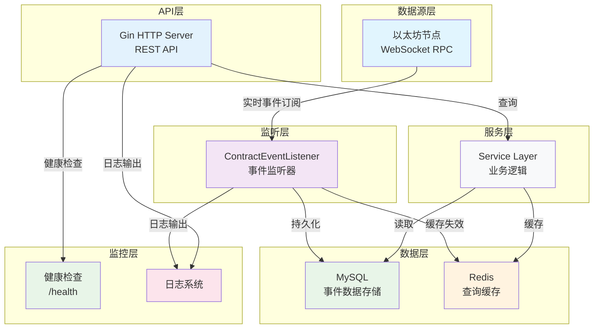
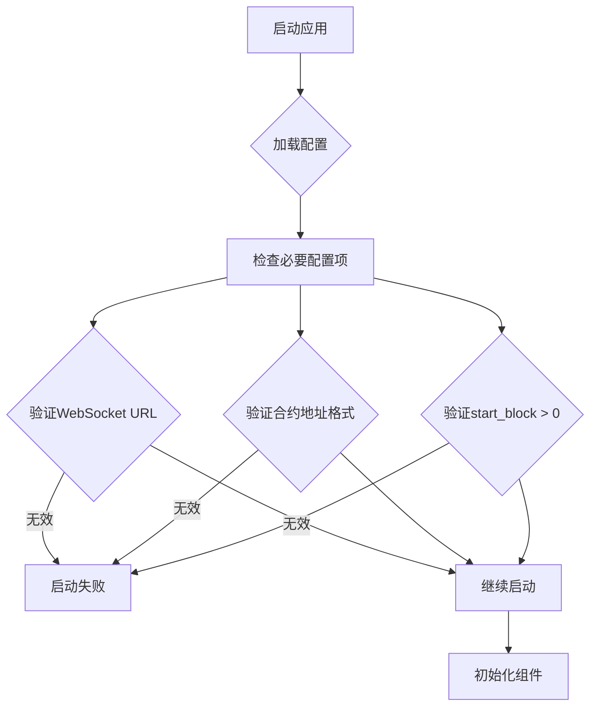
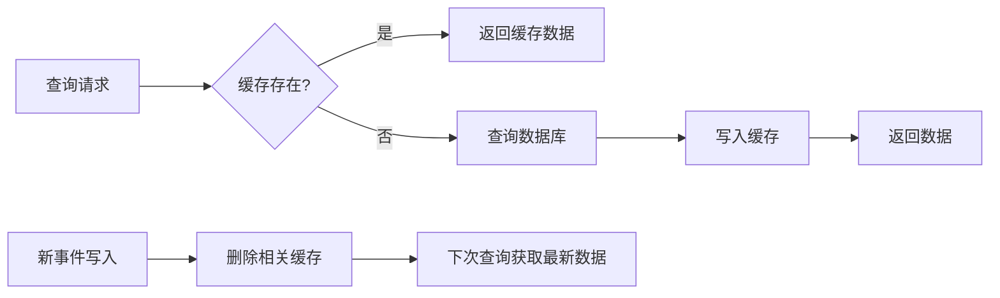

本文档为后端开发者提供完整的部署与监控指南，涵盖从环境配置到生产部署的全流程。作为以太坊质押合约事件监听后端服务，该系统需要处理实时区块链数据、高并发写入和低延迟查询，因此部署与监控策略需要特别关注数据一致性和服务可靠性。

## 部署架构概览

系统采用四层架构设计，每层都需要特定的部署考虑：



Sources: [main.go](main.go#L1-L175), [internal/listener/contract_event_listener.go](internal/listener/contract_event_listener.go#L1-L216)

## 环境要求与依赖

### 基础环境要求

| 组件 | 版本要求 | 作用 | 部署模式 |
|------|----------|------|----------|
| **Go** | 1.26+ | 编译和运行 | 编译时 |
| **MySQL** | 5.7+ | 事件数据存储 | 独立部署或云服务 |
| **Redis** | 6.0+ | 查询缓存 | 独立部署或云服务 |
| **以太坊节点** | 支持WebSocket | 实时事件订阅 | Infura、Alchemy或自建节点 |

### 生产环境推荐配置

```yaml
# 生产环境配置示例
server:
  host: 0.0.0.0  # 监听所有接口
  port: 8080
  mode: release  # 生产模式，禁用调试日志

database:
  host: mysql-prod.example.com  # 生产数据库地址
  port: 3306
  username: stake_user          # 专用数据库用户
  password: ${DB_PASSWORD}      # 环境变量引用
  dbname: stake_prod            # 生产数据库名

redis:
  addr: redis-prod.example.com:6379
  password: ${REDIS_PASSWORD}   # 环境变量引用
  db: 0
  cache_ttl: 300                # 生产环境可适当延长缓存时间

eth:
  rpc_url: https://mainnet.infura.io/v3/${INFURA_API_KEY}
  ws_url: wss://mainnet.infura.io/ws/v3/${INFURA_API_KEY}
  stake_address: 0x...          # 生产环境质押合约地址
  start_block: 12345678         # 合约部署区块号
```

Sources: [config.yaml.sample](config.yaml.sample#L1-L22), [internal/config/config.go](internal/config/config.go#L1-L60)

## 配置管理策略

### 配置文件优先级

系统使用 Viper 库进行配置管理，按以下优先级加载配置：

1. **环境变量**（最高优先级）
2. **配置文件**（config.yaml）
3. **默认值**（最低优先级）

### 环境变量覆盖

生产环境中建议使用环境变量覆盖敏感信息：

```bash
# 设置环境变量
export DB_PASSWORD="your_secure_password"
export REDIS_PASSWORD="your_redis_password"
export INFURA_API_KEY="your_infura_key"

# 启动服务
./bin/server
```

### 配置验证

系统在启动时会验证关键配置项：



Sources: [internal/listener/contract_event_listener.go](internal/listener/contract_event_listener.go#L38-L50)

## 构建与部署流程

### 标准构建流程

```bash
# 1. 克隆代码
git clone <repository-url>
cd test-stake-backend

# 2. 安装依赖
go mod download

# 3. 编译二进制文件
go build -o bin/server .

# 4. 验证编译结果
./bin/server --version  # 如果支持版本参数
```

### 多阶段构建（Docker）

虽然项目当前没有Dockerfile，但可以创建多阶段构建以减小镜像体积：

```dockerfile
# 构建阶段
FROM golang:1.26-alpine AS builder
WORKDIR /app
COPY go.mod go.sum ./
RUN go mod download
COPY . .
RUN CGO_ENABLED=0 GOOS=linux go build -o /server .

# 运行阶段
FROM alpine:latest
RUN apk --no-cache add ca-certificates
WORKDIR /root/
COPY --from=builder /server .
COPY config.yaml.sample config.yaml
EXPOSE 8080
CMD ["./server"]
```

### 自动化部署脚本

建议创建部署脚本以简化生产部署：

```bash
#!/bin/bash
# deploy.sh

set -e

echo "开始部署 Stake Backend..."

# 1. 停止现有服务
if pgrep -x "server" > /dev/null; then
    echo "停止现有服务..."
    pkill -x "server"
    sleep 2
fi

# 2. 备份数据库（可选）
echo "备份数据库..."
mysqldump -h $DB_HOST -u $DB_USER -p$DB_PASSWORD stake_prod > backup_$(date +%Y%m%d_%H%M%S).sql

# 3. 更新代码
echo "更新代码..."
git pull origin main
go mod download

# 4. 编译新版本
echo "编译新版本..."
go build -o bin/server .

# 5. 启动服务
echo "启动服务..."
nohup ./bin/server > logs/server.log 2>&1 &

echo "部署完成！"
```

## 监控与健康检查

### 内置健康检查

系统提供基础健康检查端点 `/health`：

```go
// 健康检查处理器
func healthHandler(c *gin.Context) {
    c.JSON(http.StatusOK, gin.H{
        "status": "ok",
    })
}
```

Sources: [internal/api/router.go](internal/api/router.go#L77-L82)

### 监控指标建议

虽然系统当前没有内置指标收集，但建议监控以下关键指标：

| 监控类别 | 指标 | 告警阈值 | 监控方法 |
|----------|------|----------|----------|
| **服务可用性** | HTTP 5xx 错误率 | >1% | 日志分析、APM |
| **数据延迟** | 事件处理延迟 | >30秒 | 自定义指标 |
| **资源使用** | CPU、内存使用率 | >80% | 系统监控 |
| **数据库** | 连接数、查询延迟 | >100连接 | MySQL监控 |
| **Redis** | 内存使用、命中率 | <90%命中率 | Redis监控 |
| **以太坊节点** | WebSocket连接状态 | 断开 | 自定义检查 |

### 日志管理

系统使用标准库 `log` 进行日志输出，生产环境建议：

1. **结构化日志**：使用JSON格式便于日志收集
2. **日志轮转**：防止日志文件过大
3. **集中日志**：使用ELK或类似系统收集日志

```bash
# 日志级别控制
# debug模式：输出详细调试信息
# release模式：只输出重要信息
server:
  mode: release  # 生产环境使用release模式
```

Sources: [main.go](main.go#L142-L144)

## 性能优化与扩展

### 数据库优化

1. **索引优化**：确保常用查询字段有索引
2. **连接池配置**：调整MySQL连接池参数
3. **查询优化**：避免N+1查询，使用批量操作

### Redis缓存优化

系统实现了TTL + 事件驱动的双重缓存失效策略：



**缓存配置建议**：
- 开发环境：`cache_ttl: 60` (60秒)
- 生产环境：`cache_ttl: 300` (5分钟) - 根据数据更新频率调整

Sources: [internal/cache/cache.go](internal/cache/cache.go#L1-L82), [docs/superpowers/specs/2026-06-05-redis-cache-design.md](docs/superpowers/specs/2026-06-05-redis-cache-design.md#L1-L173)

### 水平扩展

系统支持水平扩展，但需要注意：

1. **无状态设计**：API服务层是无状态的
2. **共享状态**：数据库和Redis是共享状态
3. **事件监听**：需要确保只有一个实例在监听区块链事件

**扩展策略**：
- API服务：可以部署多个实例，负载均衡
- 事件监听：单点部署，避免重复处理

## 故障排除与维护

### 常见问题及解决方案

| 问题 | 可能原因 | 解决方案 |
|------|----------|----------|
| **WebSocket连接失败** | 网络问题、节点不可用 | 检查网络连接，验证节点URL |
| **数据库连接失败** | 数据库未启动、配置错误 | 验证数据库状态和连接参数 |
| **Redis连接失败** | Redis未启动、密码错误 | 检查Redis服务和配置 |
| **事件处理延迟** | 区块链拥堵、处理逻辑慢 | 优化处理逻辑，增加重试机制 |
| **内存使用过高** | 缓存未清理、内存泄漏 | 监控内存使用，检查缓存策略 |

### 监控命令示例

```bash
# 检查服务状态
curl -f http://localhost:8080/health || echo "服务不可用"

# 查看日志
tail -f logs/server.log | grep -E "ERROR|WARN|replay"

# 检查数据库连接
mysql -h localhost -u root -p -e "SELECT COUNT(*) FROM t_staked_event"

# 检查Redis连接
redis-cli ping

# 监控系统资源
top -p $(pgrep server)
```

### 备份与恢复

**数据库备份**：
```bash
# 完整备份
mysqldump -h localhost -u root -p stake > stake_backup_$(date +%Y%m%d).sql

# 只备份结构
mysqldump -h localhost -u root -p --no-data stake > stake_schema.sql
```

**数据恢复**：
```bash
# 恢复数据库
mysql -h localhost -u root -p stake < stake_backup_20240101.sql
```

## 生产环境部署检查清单

### 部署前检查

- [ ] **配置验证**：所有配置项已正确设置
- [ ] **环境变量**：敏感信息已通过环境变量设置
- [ ] **数据库准备**：生产数据库已创建，用户权限已设置
- [ ] **Redis准备**：Redis服务已启动，配置正确
- [ ] **网络配置**：防火墙规则已设置，端口开放
- [ ] **SSL证书**：HTTPS证书已配置（如需要）

### 部署后验证

- [ ] **服务启动**：服务正常启动，无错误日志
- [ ] **健康检查**：`/health` 端点返回正常
- [ ] **API测试**：主要API端点正常工作
- [ ] **数据同步**：区块链事件正常同步
- [ ] **性能监控**：监控系统已配置告警
- [ ] **备份策略**：自动备份已配置

### 回滚计划

1. **快速回滚**：保留前一个版本的二进制文件
2. **数据库回滚**：准备数据库回滚脚本
3. **配置回滚**：保留前一个版本的配置文件
4. **监控验证**：回滚后验证服务正常

## 下一步建议

基于当前项目结构，建议考虑以下增强功能：

1. **容器化部署**：创建Dockerfile和docker-compose.yml
2. **Kubernetes部署**：创建K8s部署配置
3. **监控集成**：集成Prometheus指标收集
4. **日志聚合**：配置ELK或类似日志系统
5. **CI/CD流水线**：自动化测试和部署
6. **性能测试**：负载测试和压力测试
7. **安全加固**：安全扫描和渗透测试

**推荐阅读顺序**：
1. [项目概述](1-xiang-mu-gai-shu) - 了解项目整体架构
2. [快速上手](2-kuai-su-shang-shou) - 本地开发环境搭建
3. [配置文件详解](4-pei-zhi-wen-jian-xiang-jie) - 深入理解配置选项
4. [启动与运行服务](5-qi-dong-yu-yun-xing-fu-wu) - 服务启动流程
5. [Redis缓存策略](16-redishuan-cun-ce-lue) - 缓存机制详解
6. [事件监听与回放机制](8-shi-jian-jian-ting-yu-hui-fang-ji-zhi) - 核心功能理解

通过本文档的部署与监控策略，您可以确保系统在生产环境中稳定运行，并及时发现和解决问题。记住，部署只是开始，持续的监控和优化才是保证系统可靠性的关键。