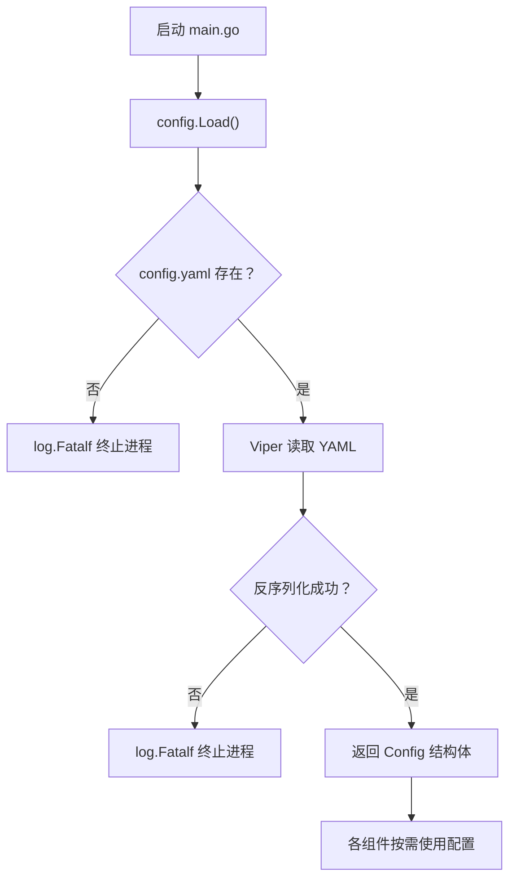

本页详细介绍 `config.yaml` 配置文件的结构、每个配置项的含义与用法。配置是启动服务的第一步——理解每项配置如何影响系统行为，能帮助你快速完成环境搭建并避免常见错误。

## 配置文件加载机制

本项目使用 [Viper](https://github.com/spf13/viper) v1.21.0 作为配置管理库。`Load()` 函数负责从工作目录下的 `config.yaml` 文件读取配置并反序列化为 Go 结构体。加载流程如下图所示：



加载函数的实现非常简洁——指定文件名为 `config`，类型为 `yaml`，搜索路径为当前目录：

[config.go](internal/config/config.go#L40-L60)

```go
func Load() *Config {
    viper.SetConfigName("config")
    viper.SetConfigType("yaml")
    viper.AddConfigPath(".")
    // ...
}
```

**关键特性说明**：

- **纯文件配置**：当前版本**不支持**环境变量覆盖（未调用 `AutomaticEnv` 或 `BindEnv`），所有配置必须写入 `config.yaml` 文件
- **启动即校验**：若文件不存在或格式错误，程序通过 `log.Fatalf` 直接终止，不会以默认值降级运行
- **敏感文件已忽略**：`.gitignore` 规则 `*.yaml` 确保包含密码、密钥等敏感信息的 `config.yaml` 不会被提交到版本库

Sources: [config.go](internal/config/config.go#L40-L60), [main.go](main.go#L32-L33), [.gitignore](.gitignore#L1)

## 完整配置结构总览

配置文件顶层由四个独立的配置节组成，分别控制服务器、数据库、缓存和以太坊连接：

| 配置节 | 结构体类型 | 职责 |
|--------|-----------|------|
| `server` | `Server` | HTTP 服务监听地址与运行模式 |
| `database` | `Database` | MySQL 连接参数 |
| `redis` | `Redis` | Redis 连接与缓存策略 |
| `eth` | `ETHConfig` | 以太坊节点连接与合约信息 |

对应 Go 结构体定义如下：

[config.go](internal/config/config.go#L10-L17)

```go
type Config struct {
    Server    Server    `mapstructure:"server"`
    Database  Database  `mapstructure:"database"`
    Redis     Redis     `mapstructure:"redis"`
    ETHConfig ETHConfig `mapstructure:"eth"`
}
```

以下是一个完整的配置文件示例：

[config.yaml.sample](config.yaml.sample#L1-L22)

```yaml
server:
  host: localhost
  port: 8080
  mode: debug          # debug / test / release

database:
  host: 192.168.110.2
  port: 33061
  username: root
  password: root
  dbname: stake

redis:
  addr: localhost:6379
  password: ""
  db: 0
  cache_ttl: 60

eth:
  rpc_url: https://sepolia.infura.io/v3/YOUR_KEY
  ws_url: wss://sepolia.infura.io/ws/v3/YOUR_KEY
  stake_address: 0x...
  start_block: 10986812
```

## server — 服务器配置

控制 HTTP API 服务的网络监听地址和 Gin 框架的运行模式。

| 字段 | 类型 | 说明 | 示例值 |
|------|------|------|--------|
| `host` | string | 监听的主机地址 | `localhost`、`0.0.0.0` |
| `port` | string | 监听的端口号（**注意：类型为字符串**） | `8080` |
| `mode` | string | Gin 运行模式 | `debug`、`test`、`release` |

`mode` 的三种取值影响日志详细程度：`debug` 模式输出所有请求日志（开发阶段推荐），`release` 模式仅输出警告和错误（部署到生产环境时使用）。在 `main.go` 中，当模式设为 `release` 时会调用 `gin.SetMode(gin.ReleaseMode)` 来精简日志输出。

**生产环境部署提示**：若需对外提供服务，应将 `host` 设为 `0.0.0.0` 以监听所有网络接口，`mode` 设为 `release`。

[config.go](internal/config/config.go#L19-L23), [main.go](main.go#L135-L137)

## database — 数据库配置

配置 MySQL 数据库连接。Viper 反序列化后，`main.go` 使用这些参数拼接 DSN（Data Source Name）字符串来建立 GORM 连接。

| 字段 | 类型 | 说明 | 示例值 |
|------|------|------|--------|
| `host` | string | 数据库主机地址 | `127.0.0.1`、`192.168.110.2` |
| `port` | string | 数据库端口（**类型为字符串**） | `3306`、`33061` |
| `username` | string | 数据库用户名 | `root` |
| `password` | string | 数据库密码 | `your_password` |
| `dbname` | string | 数据库名称 | `stake` |

连接建立后，GORM 会自动执行 `AutoMigrate` 创建或更新六张数据表（`t_contract`、`t_staked_event` 等），表名统一添加 `t_` 前缀且使用单数形式。因此你**无需手动建表**，但需要确保 `dbname` 指向的数据库已提前创建。

[config.go](internal/config/config.go#L25-L31), [main.go](main.go#L35-L55)

## redis — 缓存配置

配置 Redis 连接信息及缓存策略。Redis 用于加速 API 查询——首次查询的结果会被缓存，后续请求直接从缓存读取以降低数据库压力。

| 字段 | 类型 | 说明 | 默认值 | 示例值 |
|------|------|------|--------|--------|
| `addr` | string | Redis 地址（host:port 格式） | 无 | `localhost:6379` |
| `password` | string | Redis 密码，无密码留空 `""` | 无 | `""` |
| `db` | int | Redis 数据库编号 | 无 | `0` |
| `cache_ttl` | int | 缓存过期时间，单位为**秒** | `60`（代码兜底） | `60` |

`cache_ttl` 存在一个容错机制：即使配置文件中将其设为 `0` 或负数，`main.go` 中的逻辑会自动回退到 60 秒的默认值，确保缓存不会因配置失误而失效。

[config.go](internal/config/config.go#L33-L38), [main.go](main.go#L70-L73)

## eth — 以太坊连接配置

这是整个服务的**核心配置节**——它决定了服务连接哪个区块链节点、监听哪个合约、从哪个区块开始回放历史事件。

| 字段 | 类型 | 说明 | 示例值 |
|------|------|------|--------|
| `rpc_url` | string | 以太坊 JSON-RPC 端点（用于只读调用） | `https://sepolia.infura.io/v3/YOUR_KEY` |
| `ws_url` | string | 以太坊 WebSocket 端点（用于事件订阅） | `wss://sepolia.infura.io/ws/v3/YOUR_KEY` |
| `stake_address` | string | 质押合约的部署地址 | `0x1EC2449bCA73fAec6e80e013B8bA597688dfd136` |
| `start_block` | uint64 | 合约部署时的区块号 | `10986812` |

### start_block 的关键作用

`start_block` 是事件回放的起点——服务启动时会从该区块开始逐块扫描历史事件，直至追上最新区块后切换为实时 WebSocket 订阅。该值**必须精确设置为合约部署时的区块号**，原因如下：

- 设得**太高**：会遗漏早期事件，导致数据不完整
- 设得太**低**：会扫描大量无关区块，浪费时间且可能触发 RPC 限流

你可以通过区块浏览器（如 Etherscan）查看合约的创建交易来获取准确的部署区块号。

### rpc_url 与 ws_url 的区别

服务同时使用两种连接方式，各司其职：

| 连接 | 协议 | 用途 | 使用位置 |
|------|------|------|---------|
| `rpc_url` | HTTP/HTTPS | 建立 `ethclient` 连接，用于链状态查询 | `main.go` 中初始化 |
| `ws_url` | WSS | WebSocket 长连接，实时订阅合约事件并回放历史日志 | `listener.NewContractEventListener` |

[config.go](internal/config/config.go#L40-L45), [main.go](main.go#L75-L78)

## 常见场景配置示例

### 本地开发环境

```yaml
server:
  host: localhost
  port: 8080
  mode: debug

database:
  host: 127.0.0.1
  port: 3306
  username: root
  password: ""
  dbname: stake

redis:
  addr: localhost:6379
  password: ""
  db: 0
  cache_ttl: 30

eth:
  rpc_url: https://sepolia.infura.io/v3/YOUR_KEY
  ws_url: wss://sepolia.infura.io/ws/v3/YOUR_KEY
  stake_address: 0x1EC2449bCA73fAec6e80e013B8bA597688dfd136
  start_block: 10986812
```

### 生产部署环境

```yaml
server:
  host: 0.0.0.0
  port: 8080
  mode: release

database:
  host: db.internal
  port: 3306
  username: stake_user
  password: "StrongPassword123!"
  dbname: stake

redis:
  addr: redis.internal:6379
  password: "RedisPassword456!"
  db: 0
  cache_ttl: 120

eth:
  rpc_url: https://mainnet.infura.io/v3/YOUR_KEY
  ws_url: wss://mainnet.infura.io/ws/v3/YOUR_KEY
  stake_address: 0xYourMainnetContract
  start_block: 19000000
```

## 常见问题排查

| 现象 | 可能原因 | 解决方法 |
|------|---------|---------|
| 启动报错 `Error reading config file` | `config.yaml` 不存在或路径错误 | 复制 `config.yaml.sample` 并重命名 |
| 数据库连接失败 | `host`/`port`/`username`/`password` 配置错误 | 检查 MySQL 是否运行，凭据是否正确 |
| Redis 连接失败 | `addr` 格式错误（应为 `host:port`） | 检查 Redis 是否运行，端口是否正确 |
| 事件数据不完整 | `start_block` 设得过高 | 将其修改为合约实际部署区块号，删除数据库后重启 |
| 启动缓慢 | `start_block` 距当前区块过远 | 等待回放完成，或将 `start_block` 设到较近的区块（会丢失更早的事件） |
| 无缓存效果 | `cache_ttl` 设为 `0` 或负数 | 代码会自动回退到 60 秒，但建议显式设为正数 |

## 下一步

配置文件准备就绪后，你可以继续阅读：

- **[启动与运行服务](5-qi-dong-yu-yun-xing-fu-wu)** — 了解如何编译并启动服务，观察启动日志中的关键信息
- **[API接口测试](6-apijie-kou-ce-shi)** — 服务启动后通过 API 验证事件数据是否正常写入
- **[事件监听与回放机制](8-shi-jian-jian-ting-yu-hui-fang-ji-zhi)** — 深入理解 `eth` 配置节中 `start_block` 和 WebSocket 如何配合工作