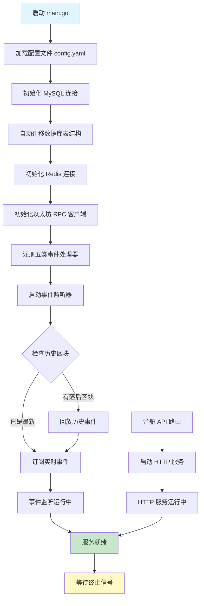
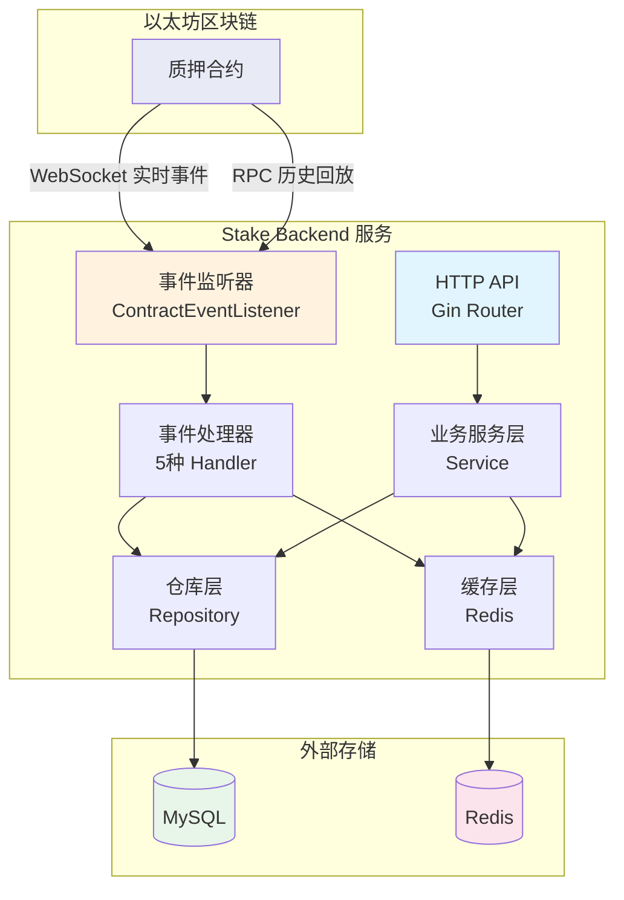

本文档面向初学者，详细讲解如何将 Stake Backend 服务从零启动到正常运行，涵盖前置依赖检查、配置准备、构建运行、启动行为解读，以及优雅停机机制。

## 一、前置条件检查

在启动服务之前，请确认以下基础环境已就绪。缺少任何一项都会导致启动失败：

| 依赖项 | 要求 | 检查方式 |
|--------|------|----------|
| Go | 1.26+ | `go version` |
| MySQL | 5.7+ | `mysql --version` |
| Redis | 任意稳定版本 | `redis-cli ping`（应返回 PONG） |
| 以太坊节点 | 支持 WebSocket（如 Infura） | 确保有 RPC URL 和 WS URL |

Sources: [go.mod](go.mod#L3-L3), [README.md](README.md#L28-L32)

项目使用 Go Modules 管理依赖，下载过程会自动拉取 `go-ethereum`、`Gin`、`GORM`、`go-redis`、`Viper` 等核心库。首次使用请执行：

```bash
cd test-stake-backend
go mod download
```

Sources: [go.mod](go.mod#L5-L24)

## 二、配置文件准备

项目启动时，`Viper` 会在当前目录查找名为 `config.yaml` 的 YAML 配置文件。仓库内提供了 `config.yaml.sample` 作为模板，你需要复制并修改：

```bash
cp config.yaml.sample config.yaml
```

Sources: [internal/config/config.go](internal/config/config.go#L33-L41)

配置文件包含四大模块，以下是每个字段的详细说明：

| 配置模块 | 字段 | 说明 | 示例值 |
|----------|------|------|--------|
| **server** | `host` | HTTP 服务监听地址 | `localhost` |
| | `port` | HTTP 服务端口 | `8080` |
| | `mode` | Gin 运行模式：`debug`/`test`/`release` | `debug` |
| **database** | `host` | MySQL 地址 | `127.0.0.1` |
| | `port` | MySQL 端口 | `3306` |
| | `username` | 数据库用户名 | `root` |
| | `password` | 数据库密码 | `root` |
| | `dbname` | 数据库名 | `stake` |
| **redis** | `addr` | Redis 地址（host:port） | `localhost:6379` |
| | `password` | Redis 密码（无密码留空） | `""` |
| | `db` | Redis 数据库编号 | `0` |
| | `cache_ttl` | 缓存过期时间（秒），默认 60 | `60` |
| **eth** | `rpc_url` | 以太坊 JSON-RPC 端点 | `https://sepolia.infura.io/v3/KEY` |
| | `ws_url` | 以太坊 WebSocket 端点 | `wss://sepolia.infura.io/ws/v3/KEY` |
| | `stake_address` | 质押合约地址（0x 开头） | `0x...` |
| | `start_block` | 合约部署区块号 | `10986812` |

> ⚠️ **重要提示**：`start_block` 必须设为合约部署时的区块号。服务启动后会从该区块开始回放历史事件，如果设置错误，会导致事件遗漏或不必要的回放。

Sources: [config.yaml.sample](config.yaml.sample#L1-L22), [internal/config/config.go](internal/config/config.go#L12-L29)

## 三、构建与启动

### 3.1 构建二进制文件

```bash
go build -o bin/server .
```

编译成功后会在 `bin/` 目录生成 `server` 可执行文件。

> **注意**：`.gitignore` 中已配置忽略 `bin/` 目录和 `*.yaml` 文件，不会被提交到版本库。

Sources: [.gitignore](.gitignore#L1-L7)

### 3.2 启动服务

```bash
./bin/server
```

如果想跳过编译步骤直接运行：

```bash
go run .
```

服务启动成功后，你会在终端看到如下日志：

```
server started on localhost:8080
```

Sources: [main.go](main.go#L159-L160)

### 3.3 启动全流程图

下面是服务从启动到正常运行的完整流程：



## 四、启动后自动执行的操作

服务启动后会自动完成以下四步关键操作：

### 4.1 数据库表结构迁移

服务连接 MySQL 后，会自动创建或更新六张数据表（表名前缀 `t_`）：

| 表名（GORM 模型） | 对应链上事件 |
|-------------------|-------------|
| `t_contracts` | 合约同步状态（记录最后同步区块号） |
| `t_staked_events` | Staked 质押事件 |
| `t_reward_claimed_events` | RewardClaimed 奖励领取事件 |
| `t_withdrawn_events` | Withdrawn 提取事件 |
| `t_min_stake_amount_updated_events` | MinStakeAmountUpdated 最低质押额变更事件 |
| `t_reward_rate_updated_events` | RewardRateUpdated 奖励费率变更事件 |

这意味着**无需手动建表**，首次运行时 GORM 会自动创建全部表和索引。

Sources: [main.go](main.go#L36-L43)

### 4.2 历史事件回放

事件监听器启动后，首先读取数据库中该合约的 `lastBlock`（最后同步区块），然后对比链上最新区块号。如果存在差距，会**批量回放**落后区块中的事件：

- 每批处理 **1000 个区块**
- 使用 `FilterLogs` API 批量查询事件日志
- 处理完成后更新数据库中的 `lastBlock`

这确保了服务即使在宕机期间也不会遗漏链上事件。

Sources: [internal/listener/contract_event_listener.go](internal/listener/contract_event_listener.go#L136-L165)

### 4.3 切换到实时订阅

历史回放完成后，监听器通过 WebSocket 建立 `SubscribeFilterLogs` 订阅，开始实时接收新区块中的合约事件。每收到一个事件，会：

1. 根据事件 `Topic[0]`（事件签名哈希）分发到对应的处理器
2. 处理器解析 ABI 数据并持久化到 MySQL
3. 更新数据库中的 `lastBlock`

如果 WebSocket 连接断开，监听器会在 **5 秒后自动重连**。

Sources: [internal/listener/contract_event_listener.go](internal/listener/contract_event_listener.go#L113-L133)

### 4.4 HTTP 服务启动

Gin HTTP 服务在独立的 goroutine 中启动，监听 `配置文件中指定的地址和端口`。在 `debug` 模式下，Gin 会输出详细的请求日志；切换到 `release` 模式可减少日志输出。

Sources: [main.go](main.go#L148-L161)

## 五、健康检查与验证

服务启动后，可以通过健康检查接口验证服务是否正常运行：

```bash
curl http://localhost:8080/health
```

正常响应：

```json
{"status": "ok"}
```

Sources: [internal/api/router.go](internal/api/router.go#L80-L82)

如需验证数据库连接和 API 功能，可以尝试查询事件列表（需要先有链上事件数据）：

```bash
# 查询质押事件列表（默认第1页，每页20条）
curl http://localhost:8080/staked-events

# 带分页参数
curl "http://localhost:8080/staked-events?page=1&page_size=10"
```

## 六、停止服务（优雅关机）

服务支持优雅关机机制。通过以下任一方式发送终止信号：

| 方式 | 操作 | 对应信号 |
|------|------|----------|
| 键盘快捷键 | `Ctrl + C` | SIGINT |
| 系统命令 | `kill <PID>` | SIGTERM |

收到终止信号后，服务会：

1. **停止接受新的 HTTP 请求**
2. **等待正在处理的请求完成**（最多 5 秒超时）
3. **关闭 HTTP 服务**
4. **关闭事件监听器和以太坊 WebSocket 连接**
5. **关闭 Redis 连接**

```
shutting down...
server stopped
```

Sources: [main.go](main.go#L163-L174)

## 七、服务运行架构概览

以下是服务运行时各组件的协作关系：



## 八、常见问题排查

| 问题现象 | 可能原因 | 解决方案 |
|----------|----------|----------|
| `Error reading config file` | 缺少 `config.yaml` | 复制 `config.yaml.sample` 并修改 |
| `failed to connect database` | MySQL 未启动或连接参数错误 | 检查 MySQL 服务和配置中的 host/port/用户名/密码 |
| `Failed to connect ETH client` | RPC URL 无效或网络不通 | 检查 `eth.rpc_url` 是否正确，测试网络连通性 |
| `create contract event listener: eth ws_url is empty` | WebSocket URL 未配置 | 检查 `eth.ws_url` 字段 |
| `create contract event listener: eth start_block must greater than 0` | start_block 未设置 | 设置为合约部署时的区块号 |
| `subscription error` | WebSocket 连接断开 | 服务会自动在 5 秒后重连；检查网络稳定性 |
| `port already in use` | 端口被占用 | 修改 `server.port` 或关闭占用该端口的进程 |

Sources: [main.go](main.go#L15-L171), [internal/listener/contract_event_listener.go](internal/listener/contract_event_listener.go#L78-L86)

## 九、阅读建议

完成本页学习后，建议按以下顺序继续阅读：

1. **[API接口测试](6-apijie-kou-ce-shi)** — 学习如何通过 HTTP 接口查询链上事件数据
2. **[四层架构设计](7-si-ceng-jia-gou-she-ji)** — 深入理解项目的分层架构设计
3. **[事件监听与回放机制](8-shi-jian-jian-ting-yu-hui-fang-ji-zhi)** — 详细了解历史回放和实时订阅的工作原理