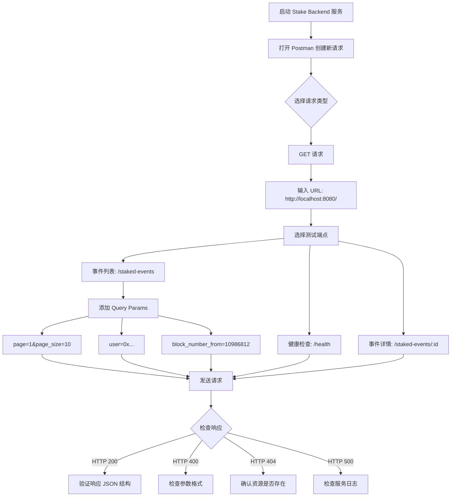
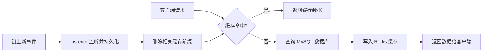

本文档将引导你如何对 Stake Backend 提供的 REST API 进行接口测试，包括健康检查、事件列表查询和单条事件查询。通过本文，你将掌握使用 curl 或 Postman 测试每个 API 端点的具体方法。

## 测试前的准备

在开始 API 接口测试之前，请确保你已经完成以下步骤：

1. **配置文件已就绪** — 复制 `config.yaml.sample` 为 `config.yaml` 并正确填写数据库、Redis 和以太坊节点信息
2. **服务已成功启动** — 参考 [启动与运行服务](5-qi-dong-yu-yun-xing-fu-wu) 完成服务启动
3. **历史事件已回放** — 服务启动后会自动从 `start_block` 开始回放历史事件，等待回放完成后再测试查询接口，否则查询结果可能为空

启动成功后，终端会打印类似如下日志：

```
server started on localhost:8080
```

此时可以通过 `curl http://localhost:8080/health` 快速验证服务是否正常运行。

Sources: [main.go](main.go#L155-L161)、[config.yaml.sample](config.yaml.sample#L1-L22)

## 完整 API 端点总览

服务共提供 **11 个 REST API 端点**，涵盖 1 个健康检查和 5 类合约事件的列表/详情查询：

| 方法 | 路径 | 说明 | 特有参数 |
|------|------|------|----------|
| GET | `/health` | 健康检查 | 无 |
| GET | `/staked-events` | 质押事件列表 | `user` |
| GET | `/staked-events/:id` | 按 ID 查询质押事件 | — |
| GET | `/reward-claimed-events` | 奖励领取事件列表 | `user` |
| GET | `/reward-claimed-events/:id` | 按 ID 查询奖励领取事件 | — |
| GET | `/withdrawn-events` | 提取事件列表 | `user` |
| GET | `/withdrawn-events/:id` | 按 ID 查询提取事件 | — |
| GET | `/min-stake-amount-updated-events` | 最低质押金额变更事件列表 | 无 |
| GET | `/min-stake-amount-updated-events/:id` | 按 ID 查询 | — |
| GET | `/reward-rate-updated-events` | 奖励费率变更事件列表 | 无 |
| GET | `/reward-rate-updated-events/:id` | 按 ID 查询 | — |

> **注意**：`user` 参数仅在涉及用户的三类事件（Staked、RewardClaimed、Withdrawn）中可用，因为这些事件的 Solidity 定义包含 `address indexed user`。MinStakeAmountUpdated 和 RewardRateUpdated 事件不涉及用户地址，因此不支持 `user` 参数。

Sources: [router.go](internal/api/router.go#L17-L74)、[staked_event_handler.go](internal/api/staked_event_handler.go#L20-L24)、[min_stake_amount_updated_event_handler.go](internal/api/min_stake_amount_updated_event_handler.go#L58-L86)

## 第一步：测试健康检查接口

健康检查接口是最简单的端点，用于验证服务是否正常运行，不涉及任何参数。

**请求：**

```bash
curl http://localhost:8080/health
```

**成功响应（HTTP 200）：**

```json
{
  "status": "ok"
}
```

如果返回此响应，说明服务已正常运行，可以继续后续测试。

Sources: [router.go](internal/api/router.go#L77-L81)

## 第二步：测试事件列表查询接口

事件列表查询是最核心的 API 功能，支持丰富的过滤和分页参数。所有 5 类事件的列表接口采用统一的查询模式。

### 通用查询参数

以下参数适用于所有事件列表接口：

| 参数 | 类型 | 是否必填 | 默认值 | 说明 |
|------|------|----------|--------|------|
| `page` | int | 否 | 1 | 页码，从 1 开始 |
| `page_size` | int | 否 | 20 | 每页条数，最大 100 |
| `contract_address` | string | 否 | — | 合约地址过滤（0x 开头的十六进制地址） |
| `tx_hash` | string | 否 | — | 交易哈希过滤（66 字符，0x 开头） |
| `block_number_from` | uint64 | 否 | — | 起始区块号（含） |
| `block_number_to` | uint64 | 否 | — | 结束区块号（含） |
| `user` | string | 否 | — | 用户地址过滤（仅 Staked/RewardClaimed/Withdrawn） |

> **分页规则**：`page` 和 `page_size` 会自动归一化——`page` ≤ 0 时默认为 1，`page_size` ≤ 0 时默认为 20，`page_size` > 100 时会被截断为 100。

Sources: [common.go](internal/repository/common.go#L13-L32)、[common.go](internal/api/common.go#L12-L52)

### 测试示例：查询质押事件列表

**1. 无参数查询（获取第一页，默认 20 条）：**

```bash
curl "http://localhost:8080/staked-events"
```

**2. 指定分页参数：**

```bash
curl "http://localhost:8080/staked-events?page=2&page_size=10"
```

**3. 按用户地址过滤：**

```bash
curl "http://localhost:8080/staked-events?user=0x1234567890abcdef1234567890abcdef12345678"
```

**4. 按区块范围过滤：**

```bash
curl "http://localhost:8080/staked-events?block_number_from=10986812&block_number_to=11000000"
```

**5. 组合多个过滤条件：**

```bash
curl "http://localhost:8080/staked-events?user=0x1234...&block_number_from=11000000&page=1&page_size=5"
```

**成功响应结构（HTTP 200）：**

```json
{
  "items": [
    {
      "id": 1,
      "contract_address": "0x...",
      "user": "0x...",
      "amount": "1000000000000000000",
      "tx_hash": "0x...",
      "block_number": 10986812,
      "log_index": 0,
      "block_hash": "0x...",
      "inserted_at": "2024-01-01T00:00:00Z"
    }
  ],
  "total": 100,
  "page": 1,
  "page_size": 20
}
```

列表接口的响应始终包含 `items`（数据数组）、`total`（总条数）、`page`（当前页码）和 `page_size`（每页条数）四个字段，方便前端实现分页功能。

Sources: [staked_event_handler.go](internal/api/staked_event_handler.go#L26-L40)、[staked_event_service.go](internal/service/staked_event_service.go#L16-L21)、[staked_event_service.go](internal/service/staked_event_service.go#L41-L70)

## 第三步：测试按 ID 查询事件详情

每个事件类型都提供了通过 ID 查询单条记录的接口。`id` 路径参数必须为正整数。

**请求示例：**

```bash
# 查询 ID 为 1 的质押事件
curl "http://localhost:8080/staked-events/1"

# 查询 ID 为 5 的奖励领取事件
curl "http://localhost:8080/reward-claimed-events/5"

# 查询 ID 为 3 的提取事件
curl "http://localhost:8080/withdrawn-events/3"

# 查询 ID 为 2 的最低质押金额变更事件
curl "http://localhost:8080/min-stake-amount-updated-events/2"

# 查询 ID 为 1 的奖励费率变更事件
curl "http://localhost:8080/reward-rate-updated-events/1"
```

**成功响应（HTTP 200）——以 StakedEvent 为例：**

```json
{
  "id": 1,
  "contract_address": "0x0000000000000000000000000000000000000000",
  "user": "0xabcdef1234567890abcdef1234567890abcdef12",
  "amount": "1000000000000000000",
  "tx_hash": "0x1234567890abcdef1234567890abcdef1234567890abcdef1234567890abcdef",
  "block_number": 10986812,
  "log_index": 0,
  "block_hash": "0xfedcba0987654321fedcba0987654321fedcba0987654321fedcba0987654321",
  "inserted_at": "2024-01-01T00:00:00Z"
}
```

> **不同事件类型的响应字段差异**：Staked/RewardClaimed/Withdrawn 包含 `user` 和 `amount` 字段；MinStakeAmountUpdated 包含 `old_amount` 和 `new_amount` 字段；RewardRateUpdated 包含 `old_rate` 和 `new_rate` 字段。

Sources: [staked_event_handler.go](internal/api/staked_event_handler.go#L42-L56)、[models/event.go](internal/models/event.go#L24-L92)

## 第四步：测试错误处理

了解 API 的错误响应格式有助于排查问题。系统会返回三种类型的错误：

### 参数校验错误（HTTP 400）

**无效的 ID 格式：**

```bash
curl "http://localhost:8080/staked-events/abc"
```

```json
{
  "error": "id must be a positive integer"
}
```

**无效的查询参数类型：**

```bash
curl "http://localhost:8080/staked-events?page=abc"
```

```json
{
  "error": "page must be an integer"
}
```

**无效的地址格式：**

```bash
curl "http://localhost:8080/staked-events?contract_address=invalid"
```

```json
{
  "error": "contract_address must be a valid hex address"
}
```

**无效的交易哈希格式：**

```bash
curl "http://localhost:8080/staked-events?tx_hash=0x123"
```

```json
{
  "error": "tx_hash must be a 32-byte hex string"
}
```

**无效的区块范围：**

```bash
curl "http://localhost:8080/staked-events?block_number_from=200&block_number_to=100"
```

```json
{
  "error": "block_number_from must not be greater than block_number_to"
}
```

### 资源不存在错误（HTTP 404）

```bash
curl "http://localhost:8080/staked-events/99999"
```

```json
{
  "error": "staked event not found"
}
```

### 服务器内部错误（HTTP 500）

当数据库连接异常等不可恢复错误发生时，系统会返回通用的 500 错误。

```json
{
  "error": "internal server error"
}
```

> **错误处理机制**：API 层通过 `respondRepositoryError` 函数统一处理来自数据仓库层的错误，自动区分参数校验错误（400）、资源未找到（404）和内部错误（500），确保客户端获得语义明确的错误码。

Sources: [common.go](internal/api/common.go#L54-L75)

## 第五步：使用 Postman 进行测试

除了命令行 curl，你也可以使用 Postman 等图形化工具进行 API 测试。以下是使用 Postman 测试的工作流：



**Postman 测试建议**：
- 为每种事件类型创建一个 Collection，方便批量运行
- 使用环境变量管理 `{{base_url}}`（如 `http://localhost:8080`），便于切换不同环境
- 利用 Postman 的 Tests 脚本自动验证 HTTP 状态码和响应字段结构

## 缓存对测试的影响

系统使用 Redis 缓存列表查询结果，默认缓存时间为 60 秒（可通过配置文件中的 `redis.cache_ttl` 修改）。这意味着：

- **相同查询参数**的列表请求在缓存有效期内会返回相同结果
- **新增链上事件后**，列表查询可能在缓存过期前不会反映最新数据
- **按 ID 查询**不经过缓存，始终直接读取数据库

如果在测试中需要立即看到最新数据，可以：
1. 等待缓存自动过期（默认 60 秒）
2. 修改配置文件中的 `cache_ttl` 为更小的值后重启服务
3. 使用不同的查询参数组合来绕过缓存



Sources: [cache.go](internal/cache/cache.go#L14-L82)、[staked_event_service.go](internal/service/staked_event_service.go#L41-L70)、[config.go](internal/config/config.go#L30-L35)

## 各事件类型响应字段速查

由于五类事件的字段存在差异，以下表格提供速查对照：

| 字段 | Staked | RewardClaimed | Withdrawn | MinStakeAmountUpdated | RewardRateUpdated |
|------|--------|---------------|-----------|----------------------|-------------------|
| `id` | ✅ | ✅ | ✅ | ✅ | ✅ |
| `contract_address` | ✅ | ✅ | ✅ | ✅ | ✅ |
| `user` | ✅ | ✅ | ✅ | ❌ | ❌ |
| `amount` | ✅ | ✅ | ✅ | ❌ | ❌ |
| `old_amount` / `new_amount` | ❌ | ❌ | ❌ | ✅ | ❌ |
| `old_rate` / `new_rate` | ❌ | ❌ | ❌ | ❌ | ✅ |
| `tx_hash` | ✅ | ✅ | ✅ | ✅ | ✅ |
| `block_number` | ✅ | ✅ | ✅ | ✅ | ✅ |
| `log_index` | ✅ | ✅ | ✅ | ✅ | ✅ |
| `block_hash` | ✅ | ✅ | ✅ | ✅ | ✅ |
| `inserted_at` | ✅ | ✅ | ✅ | ✅ | ✅ |

> `amount`、`old_amount`、`new_amount`、`old_rate`、`new_rate` 均为 **uint256 十进制字符串**格式，前端展示时需要根据代币精度进行转换。

Sources: [models/event.go](internal/models/event.go#L24-L92)

## 下一步

完成 API 接口测试后，建议按以下顺序继续深入学习：

- [四层架构设计](7-si-ceng-jia-gou-she-ji) — 了解 API 层在整个系统架构中的位置和职责
- [REST API设计规范](19-rest-apishe-ji-gui-fan) — 深入理解 API 的设计原则和路由注册机制
- [通用查询参数处理](20-tong-yong-cha-xun-can-shu-chu-li) — 详细了解查询参数的解析、校验和归一化逻辑
- [错误处理与响应格式](21-cuo-wu-chu-li-yu-xiang-ying-ge-shi) — 深入理解 API 层的错误分类和响应格式规范