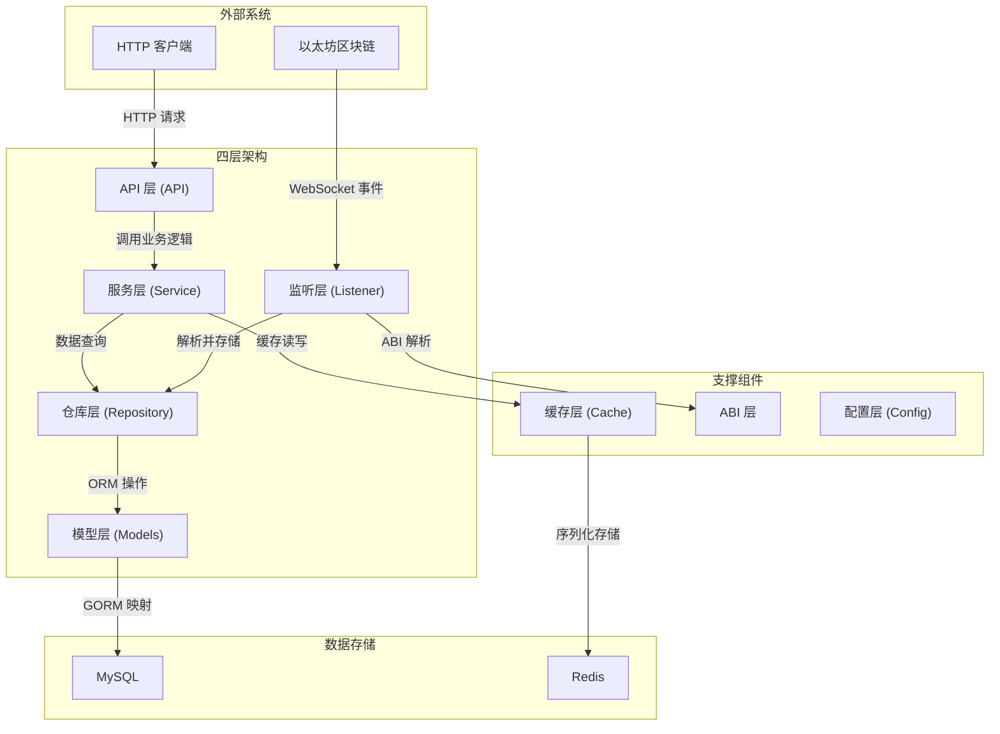
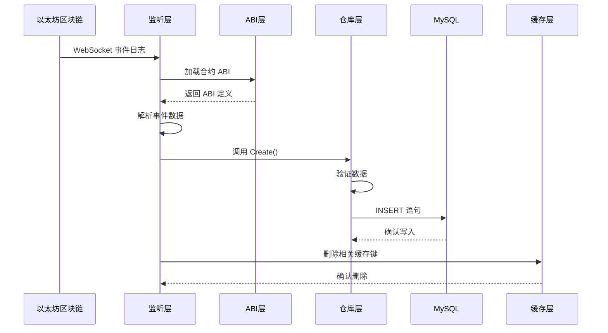
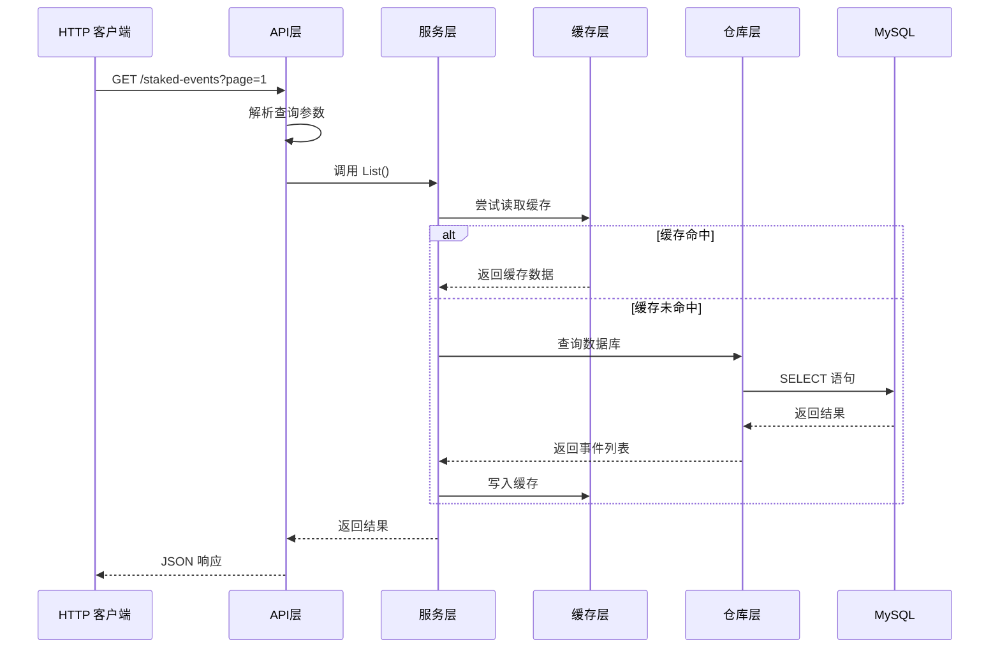
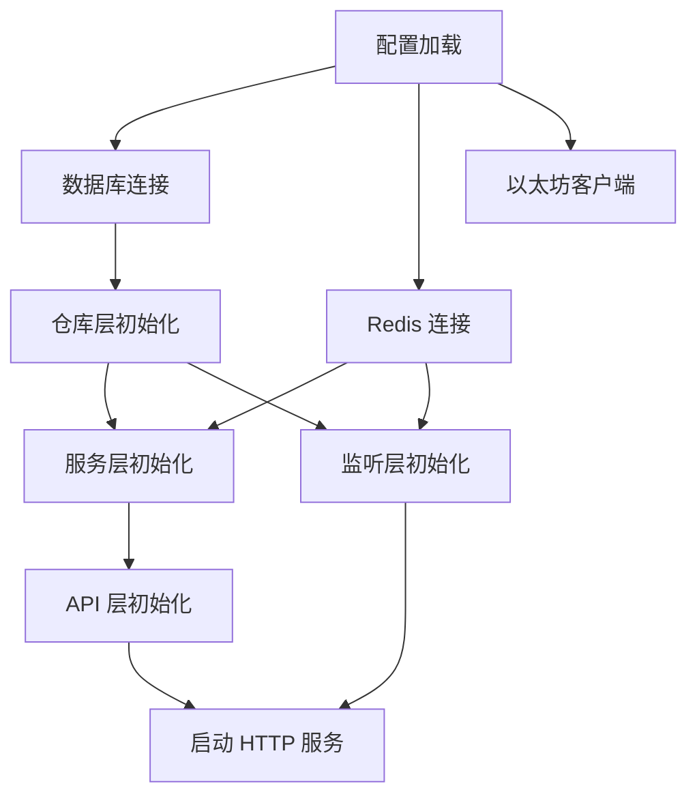

本文档详细阐述了 test-stake-backend 项目的四层架构设计，这是一种**关注点分离**的架构模式，将系统划分为 API 层、服务层、仓库层和模型层。这种设计确保了代码的可维护性、可测试性和可扩展性，特别适合处理复杂的区块链事件监听与数据查询场景。

## 架构概览

系统采用经典的**分层架构**，每层都有明确的职责边界。从上至下，请求依次流经 API 层、服务层、仓库层，最终到达模型层定义的数据结构。同时，系统引入了**监听层**作为数据输入的第二入口，与 API 层形成对称的数据流通道。

**Sources: [main.go](main.go#L1-L175), [README.md](README.md#L1-L154)**

## 分层职责详解

### 1. 模型层 (Models)

模型层位于架构的最底层，定义了系统中的**数据结构**。这些结构体不仅是 GORM 的 ORM 模型，也是各层之间传递数据的**领域对象**。

**核心职责**：
- 定义数据库表结构和字段映射
- 提供 JSON 序列化标签
- 作为各层间数据传递的载体

**关键组件**：
- `Contract`：合约同步状态模型，记录最后同步的区块高度
- `StakedEvent`、`RewardClaimedEvent` 等：五类合约事件模型

每个事件模型都遵循统一的模式：包含合约地址、交易哈希、区块号、日志索引等核心字段，以及事件特定的数据字段（如用户地址、金额等）。这些模型通过 GORM 标签定义了数据库索引策略，优化了查询性能。

**Sources: [models/contract.go](internal/models/contract.go#L1-L10), [models/event.go](internal/models/event.go#L1-L93)**

### 2. 仓库层 (Repository)

仓库层封装了所有**数据访问逻辑**，是系统与数据库之间的桥梁。它实现了**仓储模式**，为每种事件类型提供统一的 CRUD 操作接口。

**核心职责**：
- 数据验证与规范化
- 数据库查询构建与执行
- 分页处理
- 错误处理与转换

**设计亮点**：
- **BaseQuery 模式**：定义了通用查询参数（如合约地址、区块范围、分页），通过组合模式扩展特定查询
- **验证链**：使用 `validateBaseQuery` 和特定验证函数构建完整的验证链
- **幂等写入**：通过 `isDuplicateKeyError` 实现重复事件的静默忽略

仓库层还负责**数据规范化**，如将地址和哈希转换为小写，确保数据一致性。每个仓库都定义了特定的错误类型（如 `ErrInvalidStakedEvent`、`ErrStakedEventNotFound`），便于上层进行精确的错误处理。

**Sources: [repository/common.go](internal/repository/common.go#L1-L147), [repository/staked_event_repository.go](internal/repository/staked_event_repository.go#L1-L137)**

### 3. 服务层 (Service)

服务层实现了**业务逻辑**，协调仓库层和缓存层，为 API 层提供简洁的接口。

**核心职责**：
- 缓存策略实现（读取、写入、失效）
- 业务逻辑封装
- 结果聚合与转换

**缓存策略**：
服务层实现了**旁路缓存模式**：
1. 尝试从 Redis 读取缓存
2. 缓存未命中时查询数据库
3. 将结果写入缓存
4. 返回结果

缓存键通过 `BuildListKey` 函数生成，基于事件类型和查询参数的 MD5 哈希，确保相同查询条件命中同一缓存。

**Sources: [service/staked_event_service.go](internal/service/staked_event_service.go#L1-L71), [cache/cache.go](internal/cache/cache.go#L1-L82)**

### 4. API 层 (API)

API 层是系统的 **HTTP 接口层**，基于 Gin 框架实现 RESTful API。

**核心职责**：
- 路由注册与管理
- HTTP 请求参数解析
- 响应格式化
- 错误处理与状态码映射

**设计模式**：
- **处理器模式**：每个事件类型对应一个处理器（`StakedEventHandler` 等），包含该事件的所有端点
- **参数解析**：使用 `parseOptionalInt` 等工具函数处理查询参数
- **错误映射**：`respondRepositoryError` 将仓库层错误转换为合适的 HTTP 状态码

API 层还负责**依赖注入**，在 `RegisterRoutes` 函数中创建仓库、服务和处理器的实例，并完成组装。

**Sources: [api/router.go](internal/api/router.go#L1-L82), [api/common.go](internal/api/common.go#L1-L76), [api/staked_event_handler.go](internal/api/staked_event_handler.go#L1-L88)**

## 数据流分析

系统存在两条主要的数据流路径，分别对应数据的**写入**和**读取**操作。

### 写入路径（事件监听）

**关键代码路径**：
1. `ContractEventListener.listen()` 订阅 WebSocket 日志
2. `StakedEventLogHandler.Handle()` 解析事件并存储
3. `StakedEventRepository.Create()` 验证并写入数据库
4. `cache.DeleteByPrefix()` 清除相关缓存

**Sources: [listener/contract_event_listener.go](internal/listener/contract_event_listener.go#L94-L154), [listener/staked_event_handler.go](internal/listener/staked_event_handler.go#L59-L74)**

### 读取路径（API 查询）

**关键代码路径**：
1. `StakedEventHandler.List()` 解析查询参数
2. `StakedEventService.List()` 实现缓存逻辑
3. `StakedEventRepository.List()` 构建查询并分页
4. `cache.Set()` 缓存结果

**Sources: [api/staked_event_handler.go](internal/api/staked_event_handler.go#L26-L40), [service/staked_event_service.go](internal/service/staked_event_service.go#L41-L70)**

## 支撑层详解

### 监听层 (Listener)

监听层是系统的**数据入口**之一，负责从以太坊区块链实时获取事件。

**核心组件**：
- `ContractEventListener`：核心监听器，管理 WebSocket 连接和事件分发
- `ContractEventHandler` 接口：定义事件处理的契约
- 五个具体事件处理器：实现特定事件的解析逻辑

**关键特性**：
- **断点续传**：通过 `Contract` 模型记录最后同步的区块，支持重启后继续同步
- **历史回放**：启动时自动从起始区块回放落后事件
- **批量处理**：回放时每批处理 1000 个区块，平衡效率与内存占用

**Sources: [listener/contract_event_listener.go](internal/listener/contract_event_listener.go#L1-L216)**

### 缓存层 (Cache)

缓存层提供了**统一的 Redis 操作接口**，支持泛型序列化。

**核心功能**：
- `Get[T]`：泛型反序列化读取
- `Set`：JSON 序列化写入
- `DeleteByPrefix`：基于前缀的批量删除（用于缓存失效）
- `BuildListKey`：生成基于查询参数的缓存键

**缓存键策略**：`{eventType}:list:{md5(json)}`，确保相同查询条件命中同一缓存。

**Sources: [cache/cache.go](internal/cache/cache.go#L1-L82)**

### ABI 层

ABI 层负责**加载和解析智能合约的 ABI 定义**，使用 Go 的 embed 特性将 ABI JSON 文件编译进二进制文件。

**Sources: [abi/abi.go](internal/abi/abi.go#L1-L23)**

## 设计模式与最佳实践

### 1. 依赖注入

系统在 `main.go` 中通过**构造函数注入**管理依赖关系，确保各层之间的松耦合。每个组件都通过 `New*` 函数接收其依赖项，并在创建时进行空值检查。

### 2. 错误处理链

错误从底层向上传播，每层添加上下文信息：
- 仓库层：定义领域特定错误（`ErrInvalidStakedEvent`）
- 服务层：添加业务上下文
- API 层：映射为 HTTP 状态码

### 3. 验证分层

数据验证在多个层次进行：
- **API 层**：基本参数格式验证
- **仓库层**：业务规则验证（地址格式、数值范围）
- **模型层**：GORM 标签约束

### 4. 缓存策略

采用**旁路缓存模式**，在服务层实现读写逻辑。缓存失效通过**事件监听触发**，当新事件写入时删除相关缓存前缀，确保数据一致性。

## 依赖关系与初始化顺序

系统启动时按以下顺序初始化依赖：

**Sources: [main.go](main.go#L26-L174)**

## 扩展指南

添加新的事件类型需要：
1. 在 `models` 中定义数据模型
2. 在 `repository` 中实现数据访问（复用 `BaseQuery`）
3. 在 `service` 中实现业务逻辑和缓存
4. 在 `listener` 中实现事件处理器
5. 在 `api` 中添加 HTTP 处理器
6. 在 `main.go` 中注册组件

这种分层设计使得扩展新事件类型变得清晰而系统化，每层都有明确的添加点和模式可循。

**Sources: [README.md](README.md#L146-L154)**

## 总结

test-stake-backend 的四层架构通过清晰的职责分离，实现了高内聚、低耦合的设计目标。**模型层**定义数据结构，**仓库层**封装数据访问，**服务层**实现业务逻辑，**API 层**提供外部接口。配合监听层、缓存层等支撑组件，系统能够高效地处理区块链事件监听和数据查询的双重需求。

这种架构不仅保证了代码的可维护性和可测试性，还为未来的功能扩展（如新增事件类型、支持更多查询条件）提供了清晰的路径。