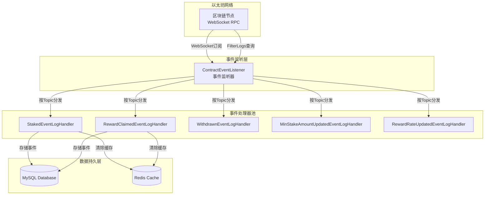
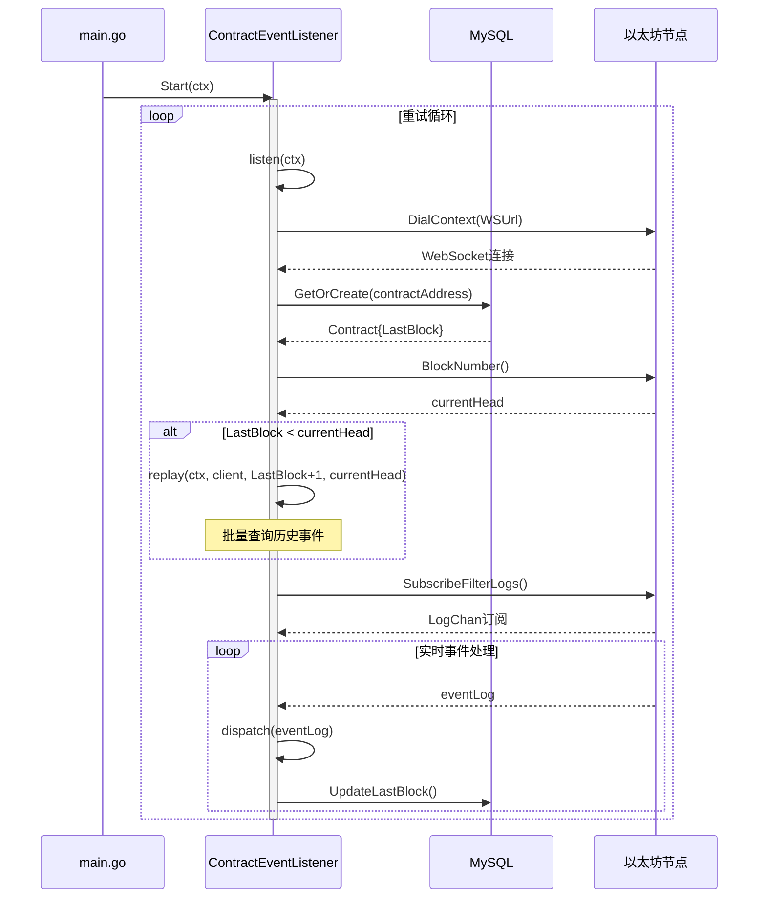
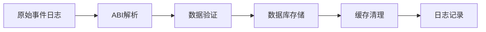
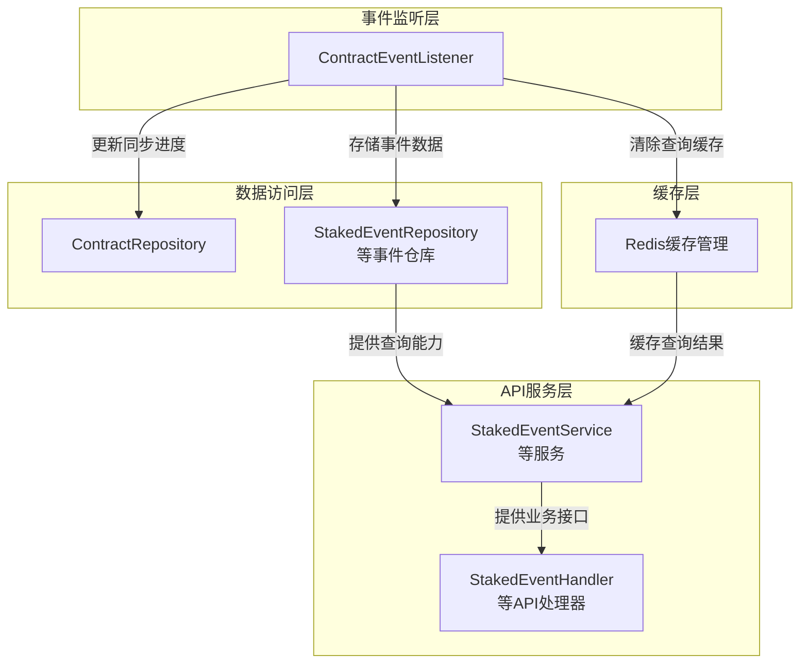

本文档深入解析 Stake Backend 系统的区块链事件监听与回放机制。该系统采用**实时订阅 + 历史回放**的双模式架构，确保合约事件的完整捕获与可靠处理。理解这一机制是掌握系统数据流的关键起点。

## 架构概览

事件监听系统采用**监听器-处理器**模式，由核心监听器 `ContractEventListener` 统一管理多个事件处理器。这种设计实现了关注点分离：监听器专注于事件获取与分发，处理器专注于业务逻辑执行。



Sources: [contract_event_listener.go](internal/listener/contract_event_listener.go#L1-L216), [main.go](main.go#L95-L130)

## 核心组件：ContractEventListener

`ContractEventListener` 是整个事件监听系统的核心，它负责连接以太坊节点、管理事件处理器、执行历史回放和实时订阅。监听器采用**策略模式**设计，通过 `ContractEventHandler` 接口抽象不同事件类型的处理逻辑。

```go
type ContractEventHandler interface {
    EventName() string
    EventID() common.Hash
    Handle(ctx context.Context, eventLog types.Log) error
}
```

监听器的关键配置参数包括：WebSocket URL、合约地址、合约存储库（用于持久化同步进度）和起始区块。这些参数通过配置文件注入，确保了系统的可配置性。

```go
type ContractEventListener struct {
    wsURL        string
    contractAddr common.Address
    handlers     map[common.Hash]ContractEventHandler
    contractRepo *repository.ContractRepository
    startBlock   uint64
}
```

Sources: [contract_event_listener.go](internal/listener/contract_event_listener.go#L30-L50), [config.go](internal/config/config.go#L40-L45)

## 双模式运行机制

监听器采用**先回放后订阅**的执行策略，确保不会遗漏任何事件。系统启动时首先检查合约的最后同步区块，如果落后于链上最新区块，则执行历史回放；回放完成后切换到实时订阅模式。



Sources: [contract_event_listener.go](internal/listener/contract_event_listener.go#L100-L180)

### 历史回放机制

历史回放是确保数据完整性的关键环节。系统采用**批量查询**策略，每批处理 1000 个区块，避免单次查询数据量过大导致超时或内存溢出。回放过程中，系统会逐步更新合约的最后同步区块，即使发生中断也能从断点继续。

```go
func (l *ContractEventListener) replay(ctx context.Context, client *ethclient.Client, fromBlock, toBlock uint64) error {
    const replayBatchSize = 1000

    for from := fromBlock; from <= toBlock; from += replayBatchSize {
        to := from + replayBatchSize - 1
        to = min(to, toBlock)

        query := ethereum.FilterQuery{
            FromBlock: new(big.Int).SetUint64(from),
            ToBlock:   new(big.Int).SetUint64(to),
            Addresses: []common.Address{l.contractAddr},
            Topics:    [][]common.Hash{l.eventIDs()},
        }

        logs, err := client.FilterLogs(ctx, query)
        if err != nil {
            return fmt.Errorf("filter logs block %d-%d: %w", from, to, err)
        }

        for _, eventLog := range logs {
            if eventLog.Removed {
                continue
            }
            l.dispatch(ctx, eventLog)
        }

        if err := l.contractRepo.UpdateLastBlock(ctx, l.contractAddr.Hex(), to); err != nil {
            return fmt.Errorf("update last block to %d: %w", to, err)
        }
    }
    return nil
}
```

回放机制的关键设计特点：

1. **断点续传**：每批处理后更新 `LastBlock`，系统重启后可从断点继续
2. **过滤已移除事件**：跳过 `Removed` 标志为真的事件，避免处理因链重组而失效的事件
3. **批量处理**：减少 RPC 调用次数，提高回放效率

Sources: [contract_event_listener.go](internal/listener/contract_event_listener.go#L140-L175)

### 实时订阅机制

实时订阅通过 WebSocket 实现事件推送，相比轮询方式具有更低的延迟和更少的资源消耗。监听器使用带缓冲的通道（容量 128）接收事件，平衡了内存使用和处理吞吐量。

```go
const listenerLogChanSize = 128

logs := make(chan types.Log, listenerLogChanSize)
sub, err := client.SubscribeFilterLogs(ctx, query, logs)
```

实时处理循环包含三个关键逻辑：

1. **订阅错误处理**：当订阅失败时，外层重试机制会重新建立连接
2. **事件过滤**：跳过 `Removed` 事件，防止处理因链重组而回滚的事件
3. **进度更新**：每个事件处理后立即更新 `LastBlock`，确保进度持久化

Sources: [contract_event_listener.go](internal/listener/contract_event_listener.go#L115-L135)

## 事件处理器实现模式

每个事件处理器实现 `ContractEventHandler` 接口，负责特定事件类型的完整处理流程。以 `StakedEventLogHandler` 为例，处理器遵循统一的模式：ABI 解析 → 数据验证 → 持久化存储 → 缓存清理。



处理器的 `Handle` 方法实现了这一流程：

```go
func (h *StakedEventLogHandler) Handle(ctx context.Context, eventLog types.Log) error {
    event, err := h.parseLog(eventLog)
    if err != nil {
        return err
    }
    if err := h.repo.Create(ctx, event); err != nil {
        return err
    }

    if err := cache.DeleteByPrefix(ctx, h.rdb, "staked:list:"); err != nil {
        log.Printf("cache delete staked list prefix: %v", err)
    }

    log.Printf("staked event inserted: tx=%s index=%d user=%s amount=%s", 
        event.TxHash, event.LogIndex, event.User, event.Amount)
    return nil
}
```

Sources: [staked_event_handler.go](internal/listener/staked_event_handler.go#L60-L75)

### ABI 解析机制

事件数据解析是处理器的核心职责。系统使用 `go-ethereum` 库的 ABI 解析器，将原始日志数据转换为结构化的业务对象。解析过程严格遵循以太坊事件编码规范：

```go
func (h *StakedEventLogHandler) parseLog(eventLog types.Log) (*models.StakedEvent, error) {
    if len(eventLog.Topics) < 2 {
        return nil, fmt.Errorf("Staked log topics length = %d, want at least 2", len(eventLog.Topics))
    }
    if eventLog.Topics[0] != h.stakedEventID {
        return nil, fmt.Errorf("unexpected event topic: %s", eventLog.Topics[0].Hex())
    }

    var unpacked struct {
        Amount *big.Int
    }
    if err := h.contractABI.UnpackIntoInterface(&unpacked, stakedEventName, eventLog.Data); err != nil {
        return nil, fmt.Errorf("unpack Staked log data: %w", err)
    }

    return &models.StakedEvent{
        ContractAddress: eventLog.Address.Hex(),
        User:            common.BytesToAddress(eventLog.Topics[1].Bytes()).Hex(),
        Amount:          unpacked.Amount.String(),
        TxHash:          eventLog.TxHash.Hex(),
        BlockNumber:     eventLog.BlockNumber,
        LogIndex:        eventLog.Index,
        BlockHash:       eventLog.BlockHash.Hex(),
    }, nil
}
```

ABI 解析的关键点：

1. **Topic 验证**：第一个 Topic 必须匹配事件签名哈希
2. **索引参数**：从 Topics 数组中提取（如 `user` 地址）
3. **非索引参数**：从 Data 字段解包（如 `amount` 数值）

Sources: [staked_event_handler.go](internal/listener/staked_event_handler.go#L77-L104), [abi.go](internal/abi/abi.go#L1-L23)

## 事件分发机制

监听器使用 **Topic 到处理器的映射表**实现事件分发。这种设计使得事件处理逻辑完全解耦，新增事件类型只需实现新的处理器并注册即可。

```go
func (l *ContractEventListener) dispatch(ctx context.Context, eventLog types.Log) {
    if len(eventLog.Topics) == 0 {
        log.Printf("ignore contract log without topics: tx=%s index=%d", eventLog.TxHash.Hex(), eventLog.Index)
        return
    }

    handler, ok := l.handlers[eventLog.Topics[0]]
    if !ok {
        log.Printf("ignore unregistered event: topic=%s tx=%s index=%d", eventLog.Topics[0].Hex(), eventLog.TxHash.Hex(), eventLog.Index)
        return
    }
    if err := handler.Handle(ctx, eventLog); err != nil {
        log.Printf("handle %s event failed: tx=%s index=%d err=%v", handler.EventName(), eventLog.TxHash.Hex(), eventLog.Index, err)
    }
}
```

分发机制的特点：

1. **Topic 优先**：使用事件签名哈希作为处理器查找键
2. **静默忽略**：未注册的事件类型会被记录但不会中断流程
3. **错误隔离**：单个事件处理失败不影响其他事件

Sources: [contract_event_listener.go](internal/listener/contract_event_listener.go#L180-L195)

## 容错与可靠性设计

事件监听系统采用了多层次的容错机制，确保在各种异常情况下都能保持稳定运行。

### 自动重试机制

监听器采用**无限重试**策略，每次失败后等待 5 秒再重试。这种设计能够应对临时的网络中断或节点故障：

```go
const listenerRetryDelay = 5 * time.Second

func (l *ContractEventListener) Start(ctx context.Context) {
    for {
        if err := l.listen(ctx); err != nil {
            if ctx.Err() != nil {
                return
            }
            log.Printf("contract event listener stopped: %v; retrying in %s", err, listenerRetryDelay)
        }

        select {
        case <-ctx.Done():
            return
        case <-time.After(listenerRetryDelay):
        }
    }
}
```

### 幂等存储

数据库存储层实现了**幂等性**，通过唯一索引 `(tx_hash, log_index)` 防止重复插入。即使事件被重复处理，也不会产生重复数据：

```go
func (r *StakedEventRepository) Create(ctx context.Context, event *models.StakedEvent) error {
    // ... 验证逻辑 ...
    if err := r.db.WithContext(ctx).Create(event).Error; err != nil {
        if isDuplicateKeyError(err) {
            return nil  // 忽略重复键错误
        }
        return fmt.Errorf("create staked event tx_hash=%s log_index=%d: %w", event.TxHash, event.LogIndex, err)
    }
    return nil
}
```

Sources: [contract_event_listener.go](internal/listener/contract_event_listener.go#L85-L95), [staked_event_repository.go](internal/repository/staked_event_repository.go#L55-L70)

## 配置与初始化

事件监听系统的配置通过 YAML 文件注入，包含以太坊连接参数和合约信息。配置验证在监听器创建时进行，确保所有必要参数都已正确设置。

| 配置项 | 说明 | 示例值 |
|--------|------|--------|
| `eth.ws_url` | 以太坊 WebSocket 端点 | `wss://sepolia.infura.io/ws/v3/XXX` |
| `eth.stake_address` | Stake 合约地址 | `0x0` |
| `eth.start_block` | 合约部署区块 | `10986812` |

监听器的初始化遵循**依赖注入**模式，在 `main.go` 中完成所有依赖的组装：

```go
// 1. 创建监听器实例
contractEventListener, err := listener.NewContractEventListener(
    cfg.ETHConfig.WSUrl, 
    cfg.ETHConfig.StakeAddress, 
    contractRepo, 
    cfg.ETHConfig.StartBlock,
)

// 2. 注册事件处理器
for _, newHandler := range []func() (listener.ContractEventHandler, error){
    func() (listener.ContractEventHandler, error) {
        return listener.NewStakedEventLogHandler(stakedEventRepo, redisClient)
    },
    // ... 其他处理器 ...
} {
    h, err := newHandler()
    if err != nil {
        log.Fatalf("Failed to create event handler: %v", err)
    }
    if err := contractEventListener.Register(h); err != nil {
        log.Fatalf("Failed to register %s event handler: %v", h.EventName(), err)
    }
}

// 3. 启动监听
go contractEventListener.Start(ctx)
```

Sources: [config.yaml.sample](config.yaml.sample#L1-L22), [main.go](main.go#L95-L130)

## 扩展性设计

事件监听系统采用了**开闭原则**设计，新增事件类型只需三个步骤：

1. **定义事件模型**：在 `internal/models/event.go` 中添加数据结构
2. **创建处理器**：在 `internal/listener/` 中实现 `ContractEventHandler` 接口
3. **注册处理器**：在 `main.go` 中添加处理器实例化和注册代码

这种设计使得系统能够轻松支持新的合约事件类型，而无需修改核心监听逻辑。

## 与其他模块的交互

事件监听系统与多个模块紧密协作，形成完整的数据处理链路：



## 总结

事件监听与回放机制是 Stake Backend 系统的数据采集核心，通过**实时订阅 + 历史回放**的双模式架构，确保了区块链事件的完整捕获。系统采用监听器-处理器模式实现了良好的扩展性，通过断点续传、幂等存储、自动重试等机制保证了数据处理的可靠性。

理解这一机制是掌握系统数据流的关键。接下来，您可以深入阅读以下相关内容：

- [数据流处理流程](9-shu-ju-liu-chu-li-liu-cheng)：了解事件数据从采集到 API 展示的完整流程
- [五类合约事件详解](10-wu-lei-he-yue-shi-jian-xiang-jie)：深入理解每种事件的数据结构和业务含义
- [ABI解析与数据提取](12-abijie-xi-yu-shu-ju-ti-qu)：掌握以太坊事件数据的解析原理
- [缓存失效机制](17-huan-cun-shi-xiao-ji-zhi)：理解事件处理与缓存协调的设计