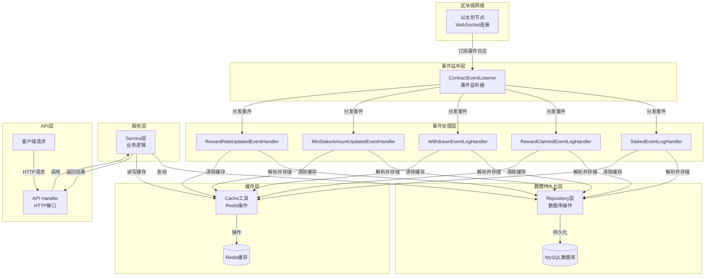
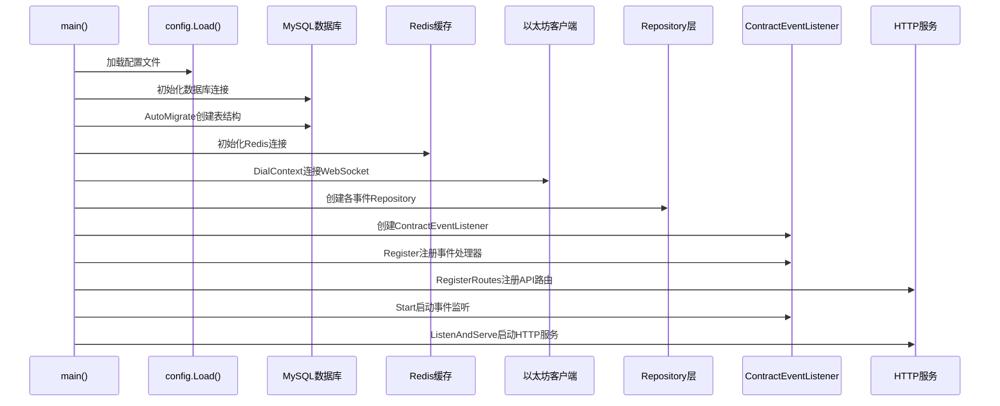
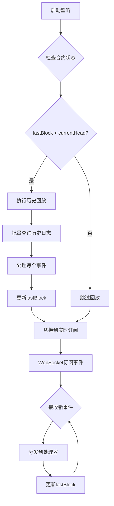
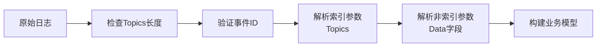
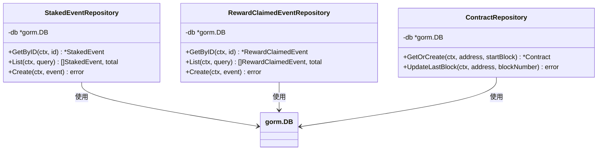
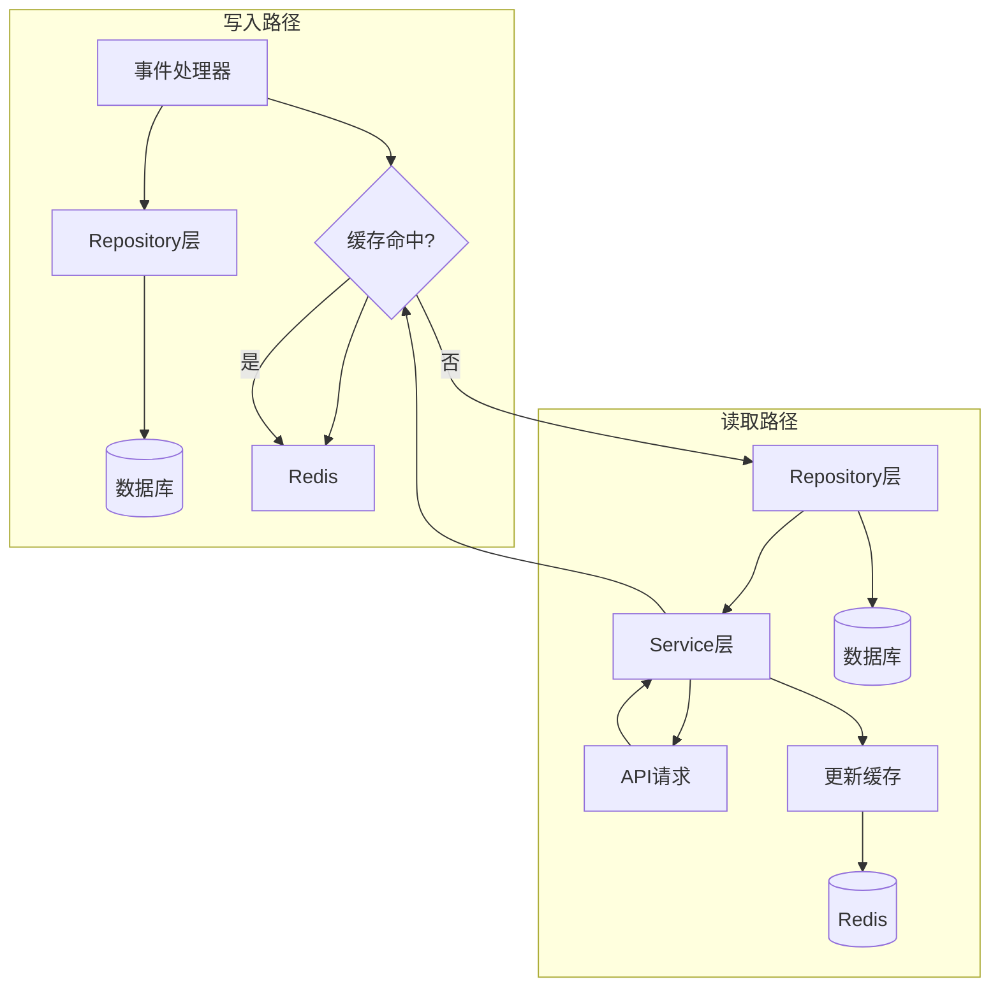
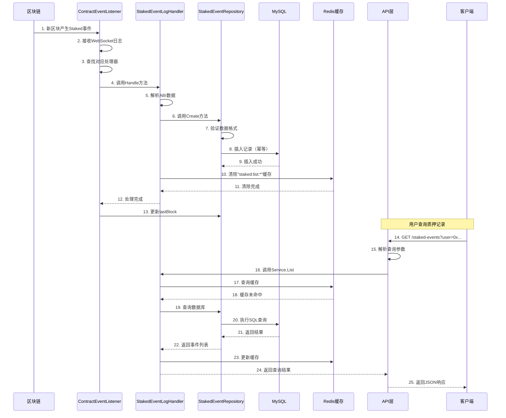

本文档详细解析系统从区块链事件监听到用户API查询的完整数据流处理流程。通过理解这一流程，开发者能够掌握系统如何将链上原始事件转化为可查询的业务数据，并了解各组件间的协作机制。

## 整体架构概览

系统采用**事件驱动架构**，数据流从区块链网络流向最终用户查询，经过五个关键阶段：事件监听、事件解析、数据持久化、缓存管理和API服务。这种分层设计确保了数据处理的可靠性、可扩展性和可维护性。



## 第一阶段：系统初始化与组件装配

数据流处理始于系统启动时的组件初始化。在 `main.go` 中，系统按照依赖顺序依次初始化各个组件，构建完整的数据处理管道。

**初始化顺序**：配置加载 → 数据库连接 → Redis连接 → 以太坊客户端 → 仓库层 → 事件监听器 → API服务。



**关键初始化步骤**：

1. **数据库初始化**：使用GORM连接MySQL，自动迁移创建五类事件表和合约状态表
   Sources: [main.go](main.go#L30-L49)

2. **Redis连接**：建立Redis客户端连接，计算缓存TTL
   Sources: [main.go](main.go#L51-L59)

3. **以太坊客户端**：通过WebSocket连接区块链节点
   Sources: [main.go](main.go#L61-L65)

4. **事件处理器注册**：为五类合约事件创建对应的处理器实例
   Sources: [main.go](main.go#L67-L95)

## 第二阶段：事件监听与区块同步

`ContractEventListener` 是数据流的核心入口，负责监听区块链上的合约事件。它实现了**实时订阅 + 历史回放**的双重机制，确保不遗漏任何事件。

### 2.1 监听器架构

监听器采用**观察者模式**，通过注册机制支持多种事件类型。每个事件处理器实现统一的 `ContractEventHandler` 接口：

```go
type ContractEventHandler interface {
    EventName() string
    EventID() common.Hash
    Handle(ctx context.Context, eventLog types.Log) error
}
```

Sources: [contract_event_listener.go](internal/listener/contract_event_listener.go#L23-L28)

### 2.2 区块同步策略

监听器启动时会检查合约状态表中的 `lastBlock` 字段，与链上最新区块对比，执行必要的历史回放：



**回放机制**：使用批量查询（每批1000个区块）处理历史事件，避免单次请求过大
Sources: [contract_event_listener.go](internal/listener/contract_event_listener.go#L142-L175)

**实时订阅**：通过WebSocket订阅合约事件，实时接收新区块事件
Sources: [contract_event_listener.go](internal/listener/contract_event_listener.go#L106-L140)

### 2.3 事件分发机制

当接收到新的事件日志时，监听器通过事件ID（Topics[0]）查找对应的处理器进行分发：

```go
func (l *ContractEventListener) dispatch(ctx context.Context, eventLog types.Log) {
    handler, ok := l.handlers[eventLog.Topics[0]]
    if !ok {
        // 忽略未注册的事件
        return
    }
    if err := handler.Handle(ctx, eventLog); err != nil {
        // 记录错误日志
    }
}
```

Sources: [contract_event_listener.go](internal/listener/contract_event_listener.go#L178-L192)

## 第三阶段：事件解析与数据转换

每个事件处理器负责将原始日志数据解析为结构化的业务模型。以 `StakedEventLogHandler` 为例，解析过程包含三个关键步骤。

### 3.1 ABI解析

使用嵌入的ABI定义解析事件数据。ABI文件通过 `//go:embed` 指令嵌入到二进制文件中：

```go
//go:embed Stake.abi.json
var StakeABI []byte

func LoadStakeABI() (abi.ABI, error) {
    contractABI, err := abi.JSON(strings.NewReader(string(StakeABI)))
    // ...
}
```

Sources: [abi.go](internal/abi/abi.go#L10-L22)

### 3.2 数据提取流程

事件处理器从原始日志中提取结构化数据：



**Staked事件解析示例**：
- **Topics[0]**：事件签名哈希
- **Topics[1]**：用户地址（indexed参数）
- **Data**：质押金额（非indexed参数）

```go
func (h *StakedEventLogHandler) parseLog(eventLog types.Log) (*models.StakedEvent, error) {
    // 1. 验证Topics长度和事件ID
    // 2. 解析索引参数：用户地址
    // 3. 解析非索引参数：金额
    // 4. 构建业务模型
}
```

Sources: [staked_event_handler.go](internal/listener/staked_event_handler.go#L64-L104)

### 3.3 五类事件的解析模式

系统处理五种合约事件，每种事件的解析逻辑遵循相同模式：

| 事件类型 | 索引参数 | 非索引参数 | 业务含义 |
|---------|---------|-----------|---------|
| Staked | user (address) | amount (uint256) | 用户质押事件 |
| RewardClaimed | user (address) | amount (uint256) | 奖励领取事件 |
| Withdrawn | user (address) | amount (uint256) | 提取质押事件 |
| MinStakeAmountUpdated | - | oldAmount, newAmount (uint256) | 最小质押额更新 |
| RewardRateUpdated | - | oldRate, newRate (uint256) | 奖励率更新 |

**关键解析代码**：
- [staked_event_handler.go](internal/listener/staked_event_handler.go#L64-L104)
- [reward_claimed_event_handler.go](internal/listener/reward_claimed_event_handler.go#L64-L104)
- [withdrawn_event_handler.go](internal/listener/withdrawn_event_handler.go#L64-L104)
- [min_stake_amount_updated_event_handler.go](internal/listener/min_stake_amount_updated_event_handler.go#L64-L104)
- [reward_rate_updated_event_handler.go](internal/listener/reward_rate_updated_event_handler.go#L64-L104)

## 第四阶段：数据持久化与幂等性保证

解析后的事件数据通过Repository层持久化到数据库。Repository层实现了**幂等性保证**和**数据验证**机制。

### 4.1 Repository层架构

每个事件类型都有对应的Repository，提供统一的CRUD操作接口：



### 4.2 幂等性实现

Repository层通过数据库唯一索引实现幂等性，避免重复处理同一事件：

```go
func (r *StakedEventRepository) Create(ctx context.Context, event *models.StakedEvent) error {
    if err := r.db.WithContext(ctx).Create(event).Error; err != nil {
        if isDuplicateKeyError(err) {
            return nil // 忽略重复插入
        }
        return err
    }
    return nil
}
```

**唯一索引设计**：每个事件表都有 `(tx_hash, log_index)` 的复合唯一索引
Sources: [staked_event_repository.go](internal/repository/staked_event_repository.go#L65-L80)

### 4.3 数据验证机制

Repository层在持久化前执行严格的数据验证：

```go
func validateStakedEvent(event models.StakedEvent) error {
    // 1. 验证合约地址格式
    // 2. 验证用户地址格式
    // 3. 验证金额为有效的uint256
    // 4. 验证交易哈希格式
    // 5. 验证区块哈希格式
}
```

Sources: [staked_event_repository.go](internal/repository/staked_event_repository.go#L85-L105)

## 第五阶段：缓存管理与失效策略

系统采用**写穿透**缓存策略，在事件处理时清除相关缓存，在查询时更新缓存。

### 5.1 缓存架构



### 5.2 缓存失效机制

当新事件被处理时，对应的事件处理器会清除相关的缓存前缀：

```go
// 事件处理时清除缓存
if err := cache.DeleteByPrefix(ctx, h.rdb, "staked:list:"); err != nil {
    log.Printf("cache delete staked list prefix: %v", err)
}
```

**缓存键设计**：`{eventType}:list:{queryHash}`，其中queryHash是查询参数的MD5哈希
Sources: [cache.go](internal/cache/cache.go#L65-L82)

### 5.3 查询时的缓存策略

Service层实现**读穿透**模式，先查缓存，未命中则查数据库并更新缓存：

```go
func (s *StakedEventService) List(ctx context.Context, query repository.StakedEventQuery) (*StakedEventListResult, error) {
    key := cache.BuildListKey("staked", query)
    
    // 1. 尝试读缓存
    if result, ok, err := cache.Get[StakedEventListResult](ctx, s.rdb, key); err == nil && ok {
        return &result, nil
    }
    
    // 2. 查数据库
    events, total, err := s.repo.List(ctx, query)
    
    // 3. 写缓存
    if err := cache.Set(ctx, s.rdb, key, result, s.cacheTTL); err != nil {
        log.Printf("cache set staked list: %v", err)
    }
    
    return result, nil
}
```

Sources: [staked_event_service.go](internal/service/staked_event_service.go#L35-L65)

## 第六阶段：API查询与数据返回

API层是数据流的终点，负责接收用户请求并返回查询结果。采用**RESTful设计**和**分页查询**模式。

### 6.1 API路由结构

每个事件类型都有对应的API端点，提供列表查询和详情查询：

```go
func (h *StakedEventHandler) Register(r gin.IRouter) {
    group := r.Group("/staked-events")
    group.GET("", h.List)        // 列表查询
    group.GET("/:id", h.GetByID) // 详情查询
}
```

**API端点汇总**：
- `/staked-events` - 质押事件查询
- `/reward-claimed-events` - 奖励领取事件查询
- `/withdrawn-events` - 提取事件查询
- `/min-stake-amount-updated-events` - 最小质押额更新事件查询
- `/reward-rate-updated-events` - 奖励率更新事件查询

Sources: [router.go](internal/api/router.go#L25-L80)

### 6.2 查询参数处理

API层支持通用的查询参数，通过 `parseStakedEventQuery` 函数解析：

```go
func parseStakedEventQuery(c *gin.Context) (repository.StakedEventQuery, error) {
    var query repository.StakedEventQuery
    
    query.ID, _ = parseOptionalInt64(c, "id")
    query.ContractAddress = c.Query("contract_address")
    query.User = c.Query("user")
    query.TxHash = c.Query("tx_hash")
    query.BlockNumberFrom, _ = parseOptionalUint64Pointer(c, "block_number_from")
    query.BlockNumberTo, _ = parseOptionalUint64Pointer(c, "block_number_to")
    query.Page, _ = parseOptionalInt(c, "page")
    query.PageSize, _ = parseOptionalInt(c, "page_size")
    
    return query, nil
}
```

Sources: [staked_event_handler.go](internal/api/staked_event_handler.go#L50-L88)

### 6.3 错误处理机制

API层实现统一的错误处理机制，将Repository层的错误转换为适当的HTTP状态码：

```go
func respondRepositoryError(c *gin.Context, err error) {
    switch {
    case errors.Is(err, repository.ErrInvalidStakedEvent):
        respondError(c, http.StatusBadRequest, err.Error())
    case errors.Is(err, repository.ErrStakedEventNotFound):
        respondError(c, http.StatusNotFound, err.Error())
    default:
        respondError(c, http.StatusInternalServerError, "internal server error")
    }
}
```

Sources: [common.go](internal/api/common.go#L45-L65)

## 完整数据流示例

以**用户质押100 ETH**为例，展示完整的数据流处理流程：



## 性能优化与可靠性保障

### 7.1 批量处理优化

历史回放采用批量查询模式，每批处理1000个区块的事件，减少RPC调用次数：

```go
const replayBatchSize = 1000

for from := fromBlock; from <= toBlock; from += replayBatchSize {
    to := from + replayBatchSize - 1
    to = min(to, toBlock)
    
    query := ethereum.FilterQuery{
        FromBlock: new(big.Int).SetUint64(from),
        ToBlock:   new(big.Int).SetUint64(to),
        Addresses: []common.Address{l.contractAddr},
        Topics:    [][]common.Hash{l.eventIDs()},
    }
    
    logs, err := client.FilterLogs(ctx, query)
    // ...
}
```

Sources: [contract_event_listener.go](internal/listener/contract_event_listener.go#L142-L175)

### 7.2 重试机制

监听器实现自动重试机制，当连接断开时自动重新连接：

```go
func (l *ContractEventListener) Start(ctx context.Context) {
    for {
        if err := l.listen(ctx); err != nil {
            if ctx.Err() != nil {
                return
            }
            log.Printf("contract event listener stopped: %v; retrying in %s", err, listenerRetryDelay)
        }
        
        select {
        case <-ctx.Done():
            return
        case <-time.After(listenerRetryDelay):
        }
    }
}
```

Sources: [contract_event_listener.go](internal/listener/contract_event_listener.go#L70-L85)

### 7.3 连接池管理

数据库和Redis连接都使用连接池管理，避免频繁建立/断开连接：

- **MySQL连接池**：通过GORM自动管理
- **Redis连接池**：通过go-redis客户端自动管理
- **以太坊客户端**：每个监听周期建立新连接，处理完成后关闭

## 数据一致性保障

### 8.1 最终一致性模型

系统采用**最终一致性**模型，通过以下机制确保数据一致性：

1. **幂等性保证**：通过数据库唯一索引避免重复插入
2. **顺序处理**：每个区块的事件按顺序处理
3. **状态追踪**：通过lastBlock字段追踪同步进度
4. **错误重试**：处理失败时自动重试

### 8.2 事务边界

每个事件的处理是一个原子操作，包含两个步骤：
1. 插入事件记录到数据库
2. 清除相关的缓存

如果步骤2失败，只会影响缓存一致性，不会影响数据持久性。系统会在下次查询时自动重建缓存。

## 扩展性考虑

### 9.1 添加新事件类型

系统设计支持轻松添加新的事件类型，只需以下步骤：

1. 在 `models/event.go` 中定义新的事件模型
2. 在 `internal/listener/` 中创建新的事件处理器
3. 在 `internal/repository/` 中创建新的仓库层
4. 在 `internal/service/` 中创建新的服务层
5. 在 `internal/api/` 中创建新的API处理器
6. 在 `main.go` 中注册新的处理器

**详细指南**：[添加新事件类型指南](22-tian-jia-xin-shi-jian-lei-xing-zhi-nan)

### 9.2 水平扩展

系统支持水平扩展，可以通过以下方式提高处理能力：

1. **多实例部署**：每个实例监听相同的合约事件
2. **分片处理**：按区块范围或事件类型分片处理
3. **读写分离**：查询请求路由到只读副本

## 总结

系统的数据流处理流程体现了**事件驱动架构**的核心优势：

1. **松耦合**：各组件通过接口交互，易于维护和扩展
2. **高可靠性**：通过幂等性、重试机制和状态追踪确保数据一致性
3. **高性能**：通过缓存、批量处理和连接池优化性能
4. **可扩展**：支持添加新事件类型和水平扩展

理解这一流程对于开发、调试和优化系统至关重要。建议开发者按照以下顺序深入学习：
- **事件监听机制**：[事件监听与回放机制](8-shi-jian-jian-ting-yu-hui-fang-ji-zhi)
- **事件处理器模式**：[事件处理器实现模式](11-shi-jian-chu-li-qi-shi-xian-mo-shi)
- **数据存储设计**：[数据库模型设计](13-shu-ju-ku-mo-xing-she-ji)
- **缓存策略**：[Redis缓存策略](16-redishuan-cun-ce-lue)